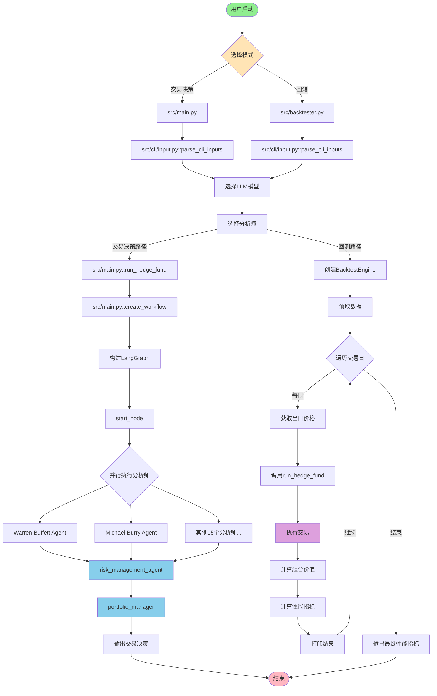
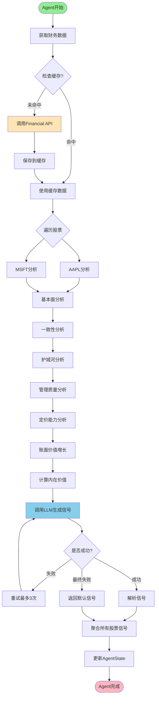
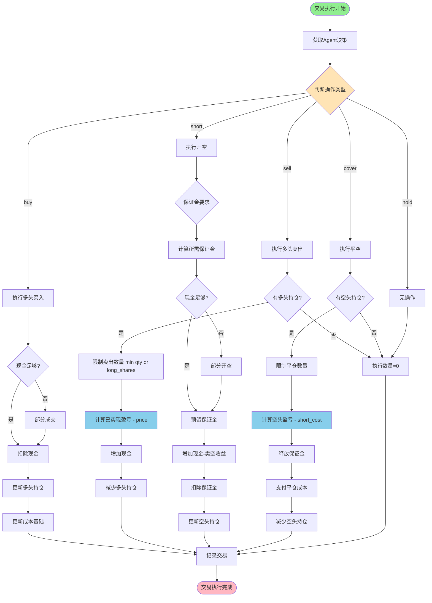
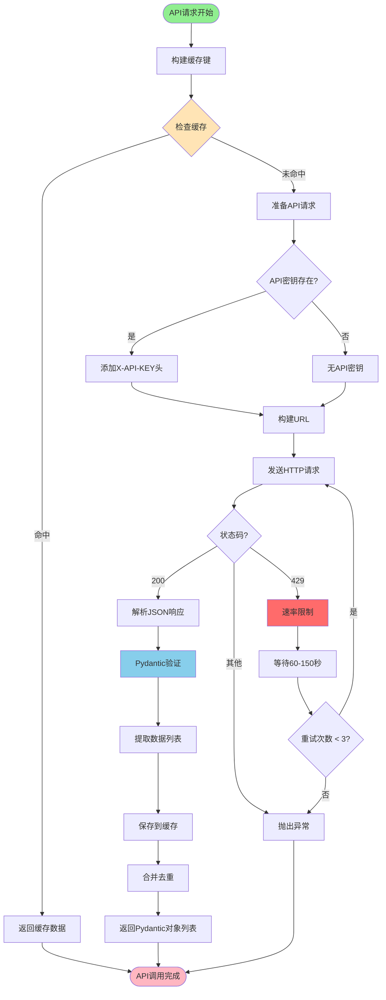
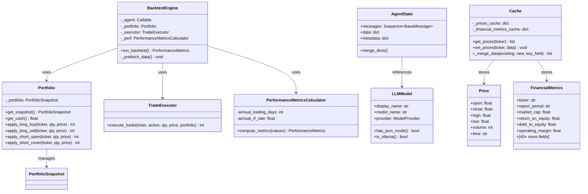
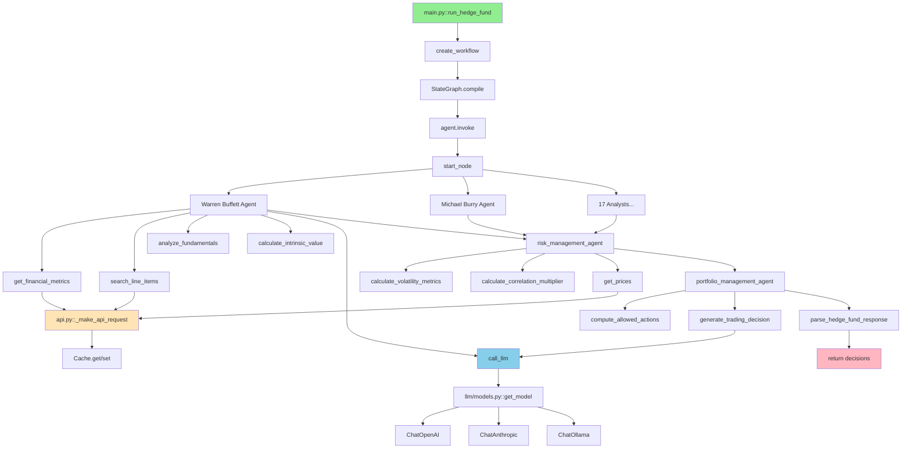
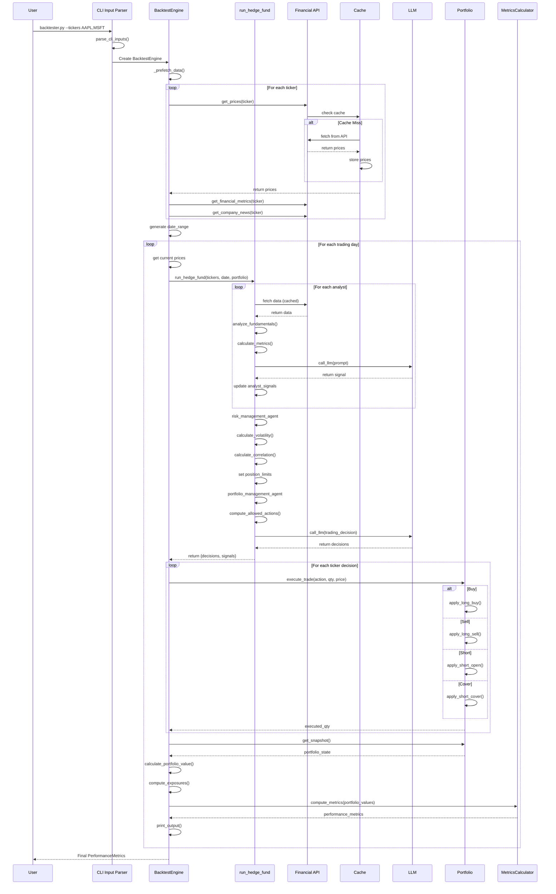
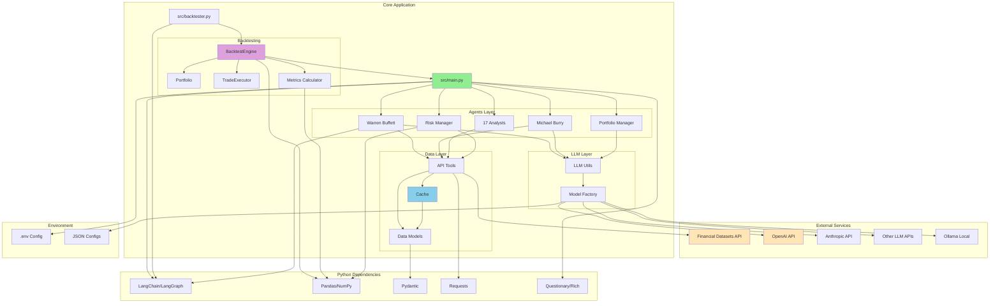

# AI对冲基金系统 - 技术文档

> 版本: 2026.5.14
> 生成日期: 2026-06-16
> 项目: AI Hedge Fund - 教育性质的AI驱动对冲基金系统

---

## 目录

1. [模块概述](#1-模块概述)
2. [架构设计](#2-架构设计)
3. [核心流程图](#3-核心流程图)
4. [关键算法详解](#4-关键算法详解)
5. [数据结构分析](#5-数据结构分析)
6. [配置开关说明](#6-配置开关说明)
7. [外部依赖](#7-外部依赖)
8. [API接口说明](#8-api接口说明)
9. [错误码及异常处理](#9-错误码及异常处理)
10. [部署与运行](#10-部署与运行)

---

## 1. 模块概述

### 1.1 核心功能和设计目标

本系统是一个**AI驱动的对冲基金模拟平台**，设计目标包括：

- **教育目的**：演示如何使用AI进行投资决策，不用于真实交易
- **多Agent协作**：模拟多位知名投资大师的投资策略（Warren Buffett、Michael Burry、Peter Lynch等）
- **回测验证**：支持历史数据回测，评估策略表现
- **风险管理**：内置风险管理和仓位控制机制
- **灵活扩展**：支持添加新的分析师Agent和投资策略

### 1.2 系统职责与协作关系

```
┌─────────────────────────────────────────────────────────────┐
│                        用户层                                │
│  (CLI命令行 / Web前端)                                       │
└────────────────────────┬────────────────────────────────────┘
                         │
                         ▼
┌─────────────────────────────────────────────────────────────┐
│                      主控制层                                │
│  src/main.py (交易决策) │ src/backtester.py (回测)          │
└────────────┬────────────────────────────┬───────────────────┘
             │                            │
             ▼                            ▼
┌────────────────────────┐    ┌──────────────────────────────┐
│   分析师Agent层        │    │    回测引擎层                │
│ - 19个投资分析师       │    │ - BacktestEngine             │
│ - 风险管理Agent        │    │ - Portfolio管理              │
│ - 组合管理Agent        │    │ - 性能指标计算                │
└────────────┬───────────┘    └──────────┬───────────────────┘
             │                           │
             ▼                           ▼
┌─────────────────────────────────────────────────────────────┐
│                      数据服务层                              │
│ - 价格数据API (Financial Datasets)                          │
│ - 财务指标API                                                │
│ - 新闻数据API                                                │
│ - 内部交易数据API                                            │
│ - 缓存管理 (Cache)                                           │
└─────────────────────────────────────────────────────────────┘
             │
             ▼
┌─────────────────────────────────────────────────────────────┐
│                      LLM服务层                               │
│ - OpenAI / Anthropic / DeepSeek / Groq / Ollama            │
│ - 多模型支持和切换                                           │
└─────────────────────────────────────────────────────────────┘
```

### 1.3 输入数据格式与来源

**输入参数**：
```python
{
    "tickers": ["AAPL", "MSFT", "NVDA"],        # 股票代码列表
    "start_date": "2024-01-01",                  # 开始日期
    "end_date": "2024-03-01",                    # 结束日期
    "initial_cash": 100000.0,                    # 初始资金
    "margin_requirement": 0.5,                   # 保证金要求（做空）
    "selected_analysts": ["warren_buffett", ..."], # 选择的分析师
    "model_name": "gpt-4o",                      # LLM模型名称
    "model_provider": "OpenAI"                   # LLM提供商
}
```

**数据来源**：
1. **金融数据**：通过 Financial Datasets API 获取
   - 股票价格（OHLCV）
   - 财务指标（P/E、ROE、Debt/Equity等）
   - 公司新闻
   - 内部交易数据

2. **配置数据**：从 `.env` 文件和命令行参数获取
3. **模型配置**：从 `src/llm/api_models.json` 和 `ollama_models.json` 加载

### 1.4 输出数据格式与流向

**交易决策输出** (`src/main.py`):
```json
{
  "decisions": {
    "AAPL": {
      "action": "buy",
      "quantity": 100,
      "confidence": 85,
      "reasoning": "Strong fundamentals and valuation..."
    },
    "MSFT": {
      "action": "hold",
      "quantity": 0,
      "confidence": 50,
      "reasoning": "Waiting for better entry point..."
    }
  },
  "analyst_signals": {
    "warren_buffett_agent": {
      "AAPL": {"signal": "bullish", "confidence": 90, "reasoning": "..."}
    }
  }
}
```

**回测结果输出** (`src/backtester.py`):
```python
{
    "sharpe_ratio": 1.85,
    "sortino_ratio": 2.34,
    "max_drawdown": -0.15,
    "long_short_ratio": 0.75,
    "gross_exposure": 0.85,
    "net_exposure": 0.45
}
```

### 1.5 子模块与策略组件

系统包含以下主要子模块：

| 模块路径 | 功能职责 | 配置方式 |
|---------|---------|---------|
| `src/agents/` | 19个投资分析师Agent | 通过 `--analysts` 参数选择 |
| `src/agents/risk_manager.py` | 风险管理和仓位限制 | 自动执行，基于波动率和相关性 |
| `src/agents/portfolio_manager.py` | 最终交易决策 | 自动执行 |
| `src/backtesting/` | 回测引擎 | 通过 `src/backtester.py` 启动 |
| `src/tools/api.py` | 外部数据API封装 | 通过 `.env` 配置API密钥 |
| `src/llm/models.py` | LLM模型管理 | 支持多个提供商 |
| `src/data/cache.py` | 数据缓存 | 内存缓存，自动管理 |

**分析师列表**（共19个）：
1. Aswath Damodaran - 估值专家
2. Ben Graham - 价值投资之父
3. Bill Ackman - 激进投资者
4. Cathie Wood - 增长投资女王
5. Charlie Munger - 理性思考者
6. Michael Burry - 逆向投资者
7. Mohnish Pabrai - Dhandho投资者
8. Nassim Taleb - 黑天鹅风险分析师
9. Peter Lynch - 10倍股投资者
10. Phil Fisher - 深度研究投资者
11. Rakesh Jhunjhunwala - 印度股神
12. Stanley Druckenmiller - 宏观投资大师
13. Warren Buffett - 奥马哈先知
14. Technical Analyst - 技术分析师
15. Fundamentals Analyst - 基本面分析师
16. Growth Analyst - 增长分析师
17. News Sentiment Analyst - 新闻情绪分析师
18. Sentiment Analyst - 市场情绪分析师
19. Valuation Analyst - 公司估值专家

### 1.6 版本历史

- **v2026.5.14** (当前版本)
  - 添加 Nassim Taleb 黑天鹅风险分析师Agent
  - 添加 v2/ 高级模块（回测、事件研究、信号、风险等）
  - 更新模型支持（Fable 5, Opus 4.8, Grok 4.3, DeepSeek V4 Pro, GPT-5.5, Kimi K2.6, Gemini 3.1 Pro）
  - 添加 Kimi 提供商支持

- **v0.2.x**
  - 更新模型支持（GPT-4.1）
  - 添加增长分析师Agent
  - 添加新闻情绪分析Agent
  - 修复回测引擎的保证金显示问题

- **v0.1.x**
  - 初始版本
  - 核心Agent框架
  - 回测引擎基础功能

---

## 2. 架构设计

### 2.1 项目文件结构

```
ai-hedge-fund/
├── src/                          # 核心源代码目录
│   ├── agents/                   # 分析师Agent模块
│   │   ├── __init__.py
│   │   ├── warren_buffett.py     # Warren Buffett投资策略
│   │   ├── michael_burry.py      # Michael Burry策略
│   │   ├── peter_lynch.py        # Peter Lynch策略
│   │   ├── nassim_taleb.py       # Nassim Taleb黑天鹅策略
│   │   ├── [其他14个分析师...]
│   │   ├── risk_manager.py       # 风险管理Agent
│   │   └── portfolio_manager.py  # 组合管理Agent
│   ├── backtesting/              # 回测引擎模块
│   │   ├── engine.py             # 回测引擎主逻辑
│   │   ├── portfolio.py          # 组合状态管理
│   │   ├── trader.py             # 交易执行器
│   │   ├── metrics.py            # 性能指标计算
│   │   ├── valuation.py          # 估值计算
│   │   ├── controller.py         # Agent控制器
│   │   ├── output.py             # 输出格式化
│   │   ├── benchmarks.py         # 基准比较
│   │   ├── types.py              # 类型定义
│   │   └── cli.py                # 命令行接口
│   ├── data/                     # 数据模型和缓存
│   │   ├── cache.py              # 内存缓存实现
│   │   └── models.py             # Pydantic数据模型
│   ├── graph/                    # LangGraph状态管理
│   │   ├── state.py              # Agent状态定义
│   │   └── __init__.py
│   ├── llm/                      # LLM模型管理
│   │   ├── models.py             # 模型配置和工厂
│   │   ├── api_models.json       # API模型配置
│   │   └── ollama_models.json    # Ollama模型配置
│   ├── tools/                    # 工具和API
│   │   ├── api.py                # Financial Datasets API封装
│   │   └── __init__.py
│   ├── utils/                    # 工具函数
│   │   ├── analysts.py           # 分析师配置
│   │   ├── visualize.py          # 可视化工具
│   │   ├── progress.py           # 进度显示
│   │   ├── display.py            # 输出显示
│   │   ├── llm.py                # LLM调用工具
│   │   ├── ollama.py             # Ollama工具
│   │   └── api_key.py            # API密钥管理
│   ├── cli/                      # 命令行接口
│   │   ├── input.py              # 输入解析
│   │   └── __init__.py
│   ├── main.py                   # 主程序入口（交易决策）
│   └── backtester.py             # 回测程序入口
├── app/                          # Web应用（前后端）
│   ├── backend/                  # FastAPI后端
│   │   ├── main.py
│   │   ├── routes/               # API路由
│   │   ├── services/             # 业务逻辑
│   │   ├── repositories/         # 数据访问
│   │   ├── models/               # 数据模型
│   │   └── database/             # 数据库配置
│   └── frontend/                 # React前端
│       └── src/
├── v2/                            # 高级量化模块（独立于src/）
│   ├── backtesting/               # 新一代回测系统
│   ├── data/                      # 数据层（行情、基本面数据源）
│   ├── event_study/                # 事件研究系统
│   ├── features/                  # 特征工程
│   ├── pipeline/                  # 数据/信号处理管道
│   ├── portfolio/                 # 组合构建与管理
│   ├── risk/                      # 风险模型
│   ├── signals/                   # 信号生成
│   ├── validation/                # 验证与测试工具
│   └── models.py                  # v2公共数据模型
├── tests/                        # 测试代码
│   └── fixtures/                 # 测试数据
├── docker/                       # Docker配置
│   └── docker-compose.yml
├── pyproject.toml                # Python项目配置
├── .env.example                  # 环境变量示例
└── README.md                     # 项目说明
```

### 2.2 功能模块划分

系统采用**分层架构**和**多Agent协作模式**：

#### 2.2.1 分层设计

1. **表示层** (Presentation Layer)
   - CLI界面：`src/main.py`, `src/backtester.py`
   - Web界面：`app/frontend/` (React)
   - API接口：`app/backend/routes/` (FastAPI)

2. **业务逻辑层** (Business Logic Layer)
   - Agent编排：`src/main.py::create_workflow()`
   - 回测引擎：`src/backtesting/engine.py`
   - 风险管理：`src/agents/risk_manager.py`
   - 组合管理：`src/agents/portfolio_manager.py`

3. **Agent层** (Agent Layer)
   - 19个投资分析师Agent
   - 每个Agent独立分析并生成信号

4. **数据访问层** (Data Access Layer)
   - API封装：`src/tools/api.py`
   - 缓存管理：`src/data/cache.py`
   - 数据模型：`src/data/models.py`

5. **外部服务层** (External Services)
   - Financial Datasets API
   - LLM服务（OpenAI/Anthropic/等）

#### 2.2.2 设计模式应用

**1. 策略模式** (Strategy Pattern)
- 位置：`src/agents/` 目录
- 目的：每个投资大师作为独立策略，可动态选择和组合
- 实现：统一的Agent接口 `(state: AgentState) -> dict`

**2. 工厂模式** (Factory Pattern)
- 位置：`src/llm/models.py::get_model()`
- 目的：根据提供商和模型名称创建不同的LLM实例
- 支持：OpenAI, Anthropic, DeepSeek, Groq, Ollama等

**3. 单例模式** (Singleton Pattern)
- 位置：`src/data/cache.py::get_cache()`
- 目的：全局共享缓存实例，避免重复API调用

**4. 模板方法模式** (Template Method Pattern)
- 位置：各分析师Agent的分析流程
- 实现：统一流程（获取数据 → 分析 → 生成信号 → 返回结果）

**5. 观察者模式** (Observer Pattern)
- 位置：`src/utils/progress.py`
- 目的：实时更新任务进度显示

### 2.3 主流程控制路径

#### 交易决策流程 (`src/main.py`)

```
入口: main.py::run_hedge_fund()
  ↓
1. 创建工作流: create_workflow(selected_analysts)
  ↓
2. 构建LangGraph: StateGraph(AgentState)
  ↓
3. 添加节点:
   - start_node (初始化)
   - 19个分析师Agent (并行执行)
   - risk_management_agent (风险控制)
   - portfolio_manager (最终决策)
  ↓
4. 执行工作流: agent.invoke({messages, data, metadata})
  ↓
5. 解析结果: parse_hedge_fund_response()
  ↓
出口: 返回交易决策和分析师信号
```

#### 回测流程 (`src/backtester.py` + `src/backtesting/engine.py`)

```
入口: backtester.py → BacktestEngine.run_backtest()
  ↓
1. 预取数据: _prefetch_data() (价格、财务、新闻等)
  ↓
2. 生成交易日: pd.date_range(start, end, freq="B")
  ↓
3. 每日循环:
   ├─ 获取当日价格
   ├─ 调用Agent: AgentController.run_agent()
   ├─ 执行交易: TradeExecutor.execute_trade()
   ├─ 计算估值: calculate_portfolio_value()
   ├─ 计算风险敞口: compute_exposures()
   ├─ 更新性能指标: PerformanceMetricsCalculator
   └─ 输出结果: OutputBuilder.print_rows()
  ↓
出口: 返回 PerformanceMetrics
```

### 2.4 数据流动方式

#### 2.4.1 Agent间数据传递

使用 **LangGraph状态管理机制**：

```python
# src/graph/state.py
class AgentState(TypedDict):
    messages: Annotated[Sequence[BaseMessage], operator.add]  # 消息累加
    data: Annotated["dict, merge_dicts"]                        # 数据合并
    metadata: Annotated["dict, merge_dicts"]                    # 元数据合并
```

**数据流转示例**：
```
初始状态 → 分析师Agent1 → 分析师Agent2 → ... → 风险管理 → 组合管理
    ↓           ↓             ↓                    ↓          ↓
  data={}    添加信号1      添加信号2            添加限制    最终决策
```

#### 2.4.2 缓存机制

```python
# src/data/cache.py
class Cache:
    _prices_cache: dict[str, list[dict]]
    _financial_metrics_cache: dict[str, list[dict]]
    _insider_trades_cache: dict[str, list[dict]]
    _company_news_cache: dict[str, list[dict]]
```

**缓存键格式**：`{ticker}_{start_date}_{end_date}_{additional_params}`

**优点**：
- 减少API调用次数和成本
- 提高回测速度（特别是多日期循环）
- 自动去重合并

### 2.5 核心类职责说明

| 类名 | 文件路径 | 职责 |
|-----|---------|------|
| `BacktestEngine` | `src/backtesting/engine.py` | 协调整个回测流程 |
| `Portfolio` | `src/backtesting/portfolio.py` | 管理现金、持仓、保证金 |
| `TradeExecutor` | `src/backtesting/trader.py` | 执行买卖交易并更新持仓 |
| `AgentController` | `src/backtesting/controller.py` | 调用Agent并处理异常 |
| `PerformanceMetricsCalculator` | `src/backtesting/metrics.py` | 计算Sharpe、Sortino、最大回撤 |
| `Cache` | `src/data/cache.py` | 内存缓存管理 |
| `LLMModel` | `src/llm/models.py` | LLM模型配置和工厂 |

### 2.6 可扩展性设计

1. **插件化Agent**
   - 新增分析师：在 `src/agents/` 添加文件，在 `src/utils/analysts.py` 注册
   - 接口标准：`def agent_func(state: AgentState) -> dict`

2. **多LLM支持**
   - 配置文件：`src/llm/api_models.json`
   - 工厂方法：`get_model(model_name, provider)`

3. **数据源扩展**
   - 当前：Financial Datasets API
   - 扩展点：`src/tools/api.py`，只需实现相同接口

4. **指标扩展**
   - 当前：Sharpe、Sortino、最大回撤
   - 扩展点：`src/backtesting/metrics.py`

---

## 3. 核心流程图

### 3.1 系统总体流程图



### 3.2 单个分析师Agent执行流程（以Warren Buffett为例）



### 3.3 风险管理流程

```mermaid
flowchart TB
    Start([风险管理开始]) --> GetTickers[获取股票列表]

    GetTickers --> FetchPrices[获取历史价格数据]

    FetchPrices --> Loop{遍历每只股票}

    Loop --> CalcVol[计算波动率指标]
    CalcVol --> DailyVol[日波动率]
    CalcVol --> AnnualVol[年化波动率]
    CalcVol --> VolPercentile[波动率百分位]

    DailyVol --> VolAdjust[计算波动率调整系数]
    AnnualVol --> VolAdjust

    VolAdjust --> CheckCorr{是否有多只股票?}
    CheckCorr -->|是| CalcCorr[计算相关性矩阵]
    CheckCorr -->|否| SkipCorr[跳过相关性]

    CalcCorr --> CorrMultiplier[计算相关性乘数]
    CorrMultiplier --> CombinedLimit[综合限制]
    SkipCorr --> CombinedLimit

    CombinedLimit --> PortfolioValue[计算组合总价值 - cash + long_value]

    PortfolioValue --> DollarLimit[转换为美元限制]

    DollarLimit --> RemainingLimit[计算剩余限制 - limit]

    RemainingLimit --> MinCash["取最小值]

    MinCash --> StoreResult[存储结果到]

    StoreResult -->|继续| Loop
    Loop -->|结束| UpdateState[更新AgentState]
    UpdateState --> End([风险管理完成])

    style Start fill:#90EE90
    style End fill:#FFB6C1
    style CalcVol fill:#FFE4B5
    style CalcCorr fill:#DDA0DD
    style CombinedLimit fill:#87CEEB
```

### 3.4 组合管理决策流程

```mermaid
flowchart TB
    Start([组合管理开始]) --> GetSignals[获取分析师信号]

    GetSignals --> GetRisk[获取风险限制]

    GetRisk --> Loop{遍历每只股票}

    Loop --> CalcMaxShares[计算最大允许股数]

    CalcMaxShares --> CompressSignals[压缩分析师信号]

    CompressSignals --> CalcAllowed[计算允许操作]

    CalcAllowed --> CheckCash{有足够现金?}
    CheckCash -->|是| AllowBuy[允许: buy + 数量]
    CheckCash -->|否| DisableBuy[禁止: buy]

    AllowBuy --> CheckLong{有多头持仓?}
    DisableBuy --> CheckLong
    CheckLong -->|是| AllowSell[允许: sell + 数量]
    CheckLong -->|否| DisableSell[禁止: sell]

    AllowSell --> CheckMargin{有保证金?}
    DisableSell --> CheckMargin
    CheckMargin -->|是| AllowShort[允许: short + 数量]
    CheckMargin -->|否| DisableShort[禁止: short]

    AllowShort --> CheckShortPos{有空头持仓?}
    DisableShort --> CheckShortPos
    CheckShortPos -->|是| AllowCover[允许: cover + 数量]
    CheckShortPos -->|否| DisableCover[禁止: cover]

    AllowCover --> AlwaysHold[总是允许: hold]
    DisableCover --> AlwaysHold

    AlwaysHold --> OnlyHold{仅hold可用?}
    OnlyHold -->|是| PreFillHold[预填充hold决策]
    OnlyHold -->|否| AddToLLM[添加到LLM请求列表]

    PreFillHold --> Continue
    AddToLLM --> Continue{继续?}

    Continue -->|继续| Loop
    Continue -->|结束| HasLLMTickers{有需要LLM的股票?}

    HasLLMTickers -->|否| ReturnPreFilled[返回预填充决策]
    HasLLMTickers -->|是| BuildPrompt[构建提示]

    BuildPrompt --> CallLLM[调用LLM决策]
    CallLLM --> MergeResults[合并LLM结果和预填充]
    MergeResults --> ValidateQty[验证数量限制]
    ValidateQty --> ReturnDecisions[返回最终决策]
    ReturnPreFilled --> End
    ReturnDecisions --> End([组合管理完成])

    style Start fill:#90EE90
    style End fill:#FFB6C1
    style CalcAllowed fill:#FFE4B5
    style CallLLM fill:#87CEEB
    style ValidateQty fill:#DDA0DD
```



### 3.5 回测引擎交易执行流程



### 3.6 数据API调用与缓存流程



---

*文档未完，继续生成中...*

## 4. 关键算法详解

### 4.1 波动率调整算法（Volatility-Adjusted Position Sizing）

**算法名称**：波动率和相关性调整的仓位限制算法

**位置**：`src/agents/risk_manager.py`
- `calculate_volatility_metrics()` - 行222-267
- `calculate_volatility_adjusted_limit()` - 行270-298
- `calculate_correlation_multiplier()` - 行301-317

**设计原理**：

该算法基于现代投资组合理论（MPT）和风险平价原则，核心思想是：
1. 高波动率资产应分配较小仓位
2. 高相关性资产应减少总体敞口
3. 综合考虑单资产风险和组合风险

**数学模型**：

```python
# 1. 计算日波动率
daily_volatility = daily_returns.std()

# 2. 年化波动率（假设252个交易日）
annualized_volatility = daily_volatility * sqrt(252)

# 3. 波动率调整系数
if annualized_volatility < 0.15:      # 低波动率
    vol_multiplier = 1.25              # 允许更高仓位（25%）
elif annualized_volatility < 0.30:    # 中等波动率
    vol_multiplier = 1.0 - (annualized_volatility - 0.15) * 0.5
elif annualized_volatility < 0.50:    # 高波动率
    vol_multiplier = 0.75 - (annualized_volatility - 0.30) * 0.5
else:                                  # 极高波动率
    vol_multiplier = 0.50              # 最多10%仓位

# 4. 相关性调整
corr_multiplier = {
    >= 0.80: 0.70,   # 高度相关，降低30%
    >= 0.60: 0.85,   # 中度相关，降低15%
    >= 0.40: 1.00,   # 适度相关，不调整
    >= 0.20: 1.05,   # 低相关，增加5%
    <  0.20: 1.10    # 极低相关，增加10%
}

# 5. 最终仓位限制
position_limit = portfolio_value * base_limit * vol_multiplier * corr_multiplier
remaining_limit = position_limit - current_position_value
```

**时间复杂度**：
- 单只股票波动率计算：O(n)，n为历史价格数量（通常60天）
- 相关性矩阵计算：O(m² * n)，m为股票数量
- 总体：O(m² * n)

**空间复杂度**：O(m² + m*n)，主要用于相关性矩阵和价格数据

**优缺点分析**：

✅ **优点**：
- 自动适应市场波动性变化
- 考虑资产间相关性，避免过度集中
- 使用滚动窗口，及时反映最新风险状况
- 参数边界明确（5%-25%），防止极端配置

❌ **缺点**：
- 依赖历史波动率，对"黑天鹅"事件预测能力有限
- 相关性在危机时期可能突然上升（相关性崩溃）
- 未考虑行业/板块因素
- 60天窗口对短期交易可能过长

**边界场景**：
1. **数据不足**：小于2个交易日 → 使用默认5%日波动率
2. **极端波动**：年化波动率>100% → 仍限制在10%仓位
3. **单一资产**：无法计算相关性 → 仅使用波动率调整
4. **全部资产相关性高**：会显著降低总仓位使用率

**核心代码解析**（`calculate_volatility_metrics`）：

```python
def calculate_volatility_metrics(prices_df: pd.DataFrame, lookback_days: int = 60) -> dict:
    if len(prices_df) < 2:
        # 边界处理：数据不足时返回默认值
        return {
            "daily_volatility": 0.05,
            "annualized_volatility": 0.05 * np.sqrt(252),
            "volatility_percentile": 100,
            "data_points": len(prices_df)
        }
    
    # 计算对数收益率（更适合金融数据）
    daily_returns = prices_df["close"].pct_change().dropna()
    
    # 使用滚动窗口（最近60天）
    recent_returns = daily_returns.tail(min(lookback_days, len(daily_returns)))
    
    # 标准差即为波动率
    daily_vol = recent_returns.std()
    annualized_vol = daily_vol * np.sqrt(252)  # 年化转换
    
    # 计算波动率百分位（当前vs历史）
    if len(daily_returns) >= 30:
        rolling_vol = daily_returns.rolling(window=30).std().dropna()
        current_vol_percentile = (rolling_vol <= daily_vol).mean() * 100
    else:
        current_vol_percentile = 50  # 默认中位数
    
    return {
        "daily_volatility": float(daily_vol),
        "annualized_volatility": float(annualized_vol),
        "volatility_percentile": float(current_vol_percentile),
        "data_points": len(recent_returns)
    }
```

**算法变体与优化**：

1. **GARCH模型优化**：使用GARCH(1,1)预测未来波动率
2. **VaR/CVaR替代**：使用风险价值模型替代标准差
3. **动态相关性**：使用DCC-GARCH模型预测动态相关性
4. **因子模型**：考虑市场、行业、风格因子的暴露

---

### 4.2 内在价值估算算法（DCF Intrinsic Valuation）

**算法名称**：三阶段DCF现金流折现模型

**位置**：`src/agents/warren_buffett.py`
- `calculate_intrinsic_value()` - 行508-624
- `calculate_owner_earnings()` - 行380-453
- `estimate_maintenance_capex()` - 行456-505

**设计原理**：

基于Warren Buffett的"Owner Earnings"概念和三阶段增长模型：

1. **Owner Earnings** = 净利润 + 折旧摊销 - 维护性资本支出 - 营运资本变化
2. **三阶段增长**：
   - 阶段1（5年）：高增长期
   - 阶段2（5年）：过渡期
   - 阶段3（永续）：稳定增长期

**计算模型**：

```python
# 1. 计算Owner Earnings
owner_earnings = net_income + depreciation - maintenance_capex - wc_change

# 2. 估算维护性资本支出（保守方法）
method_1 = total_capex * 0.85           # 85%的总资本支出
method_2 = depreciation * 1.00          # 100%的折旧
method_3 = avg_capex_ratio * revenue    # 历史平均比率

maintenance_capex = median(method_1, method_2, method_3)

# 3. 三阶段DCF
# 阶段1：高增长（5年，增长率cap在8%）
stage1_pv = sum(["owner_earnings * (1 + g1)^t / (1 + r)^t for t in 1..5"])

# 阶段2：过渡期（5年，增长率为阶段1的50%，cap在4%）
stage2_pv = sum(["stage1_final * (1 + g2)^t / (1 + r)^(5+t) for t in 1..5"])

# 阶段3：永续增长（Gordon Growth Model）
terminal_value = final_earnings * (1 + g_terminal) / (r - g_terminal)
terminal_pv = terminal_value / (1 + r)^10

# 4. 总内在价值（应用15%保守折扣）
intrinsic_value = (stage1_pv + stage2_pv + terminal_pv) * 0.85
```

**参数说明**：
- `g1`：阶段1增长率，基于历史增长率，cap在8%
- `g2`：阶段2增长率 = g1 * 0.5，cap在4%
- `g_terminal`：永续增长率 = 2.5%（长期GDP增长）
- `r`：折现率 = 10%（保守假设）

**时间复杂度**：O(n)，n为历史财务数据期数（通常5-10期）

**空间复杂度**：O(n)

**优缺点分析**：

✅ **优点**：
- 基于现金流而非会计利润，更准确
- 三阶段模型符合企业生命周期
- 保守假设（15%额外折扣、增长率上限）
- 自动估算维护性资本支出（难以直接获取）

❌ **缺点**：
- 对增长率和折现率敏感（小变化导致大差异）
- 永续增长假设可能不适用于所有公司
- 未考虑财务杠杆和税盾效应
- 维护性资本支出估算仍有误差

**边界场景**：
1. **负增长**：增长率下限为-5%
2. **数据不足**：少于3期数据 → 返回None
3. **负Owner Earnings**：仍计算但标记警告
4. **超高增长**：增长率上限15%，应用70%折扣

**核心代码解析**（`calculate_intrinsic_value`）：

```python
def calculate_intrinsic_value(financial_line_items: list) -> dict[str, any]:
    # 1. 计算Owner Earnings
    earnings_data = calculate_owner_earnings(financial_line_items)
    owner_earnings = earnings_data["owner_earnings"]
    
    # 2. 估算历史增长率（保守）
    historical_earnings = [item.net_income for item in financial_line_items[:5]]
    if oldest_earnings > 0:
        historical_growth = ((latest_earnings / oldest_earnings) ** (1 / years)) - 1
        # 限制在-5%到15%之间
        historical_growth = max(-0.05, min(historical_growth, 0.15))
        # 应用30%保守折扣
        conservative_growth = historical_growth * 0.7
    
    # 3. 设定三阶段增长率
    stage1_growth = min(conservative_growth, 0.08)      # Cap at 8%
    stage2_growth = min(conservative_growth * 0.5, 0.04) # Cap at 4%
    terminal_growth = 0.025                              # 2.5% 长期
    
    discount_rate = 0.10  # 10% 保守折现率
    
    # 4. 阶段1：高增长期（5年）
    stage1_pv = 0
    for year in range(1, 6):
        future_earnings = owner_earnings * (1 + stage1_growth) ** year
        pv = future_earnings / (1 + discount_rate) ** year
        stage1_pv += pv
    
    # 5. 阶段2：过渡期（5年）
    stage2_pv = 0
    stage1_final_earnings = owner_earnings * (1 + stage1_growth) ** 5
    for year in range(1, 6):
        future_earnings = stage1_final_earnings * (1 + stage2_growth) ** year
        pv = future_earnings / (1 + discount_rate) ** (5 + year)
        stage2_pv += pv
    
    # 6. 阶段3：永续价值（Gordon Growth Model）
    final_earnings = stage1_final_earnings * (1 + stage2_growth) ** 5
    terminal_earnings = final_earnings * (1 + terminal_growth)
    terminal_value = terminal_earnings / (discount_rate - terminal_growth)
    terminal_pv = terminal_value / (1 + discount_rate) ** 10
    
    # 7. 总内在价值（应用15%额外安全边际）
    intrinsic_value = stage1_pv + stage2_pv + terminal_pv
    conservative_intrinsic_value = intrinsic_value * 0.85
    
    return {
        "intrinsic_value": conservative_intrinsic_value,
        "raw_intrinsic_value": intrinsic_value,
        "owner_earnings": owner_earnings,
        "assumptions": {...}
    }
```

**算法优化建议**：

1. **蒙特卡洛模拟**：对增长率和折现率进行概率分布模拟
2. **情景分析**：乐观/基准/悲观三种情景
3. **可比公司法辅助**：结合相对估值方法验证
4. **敏感性分析**：显示关键参数变化的影响

---

### 4.3 性能指标计算算法

**算法名称**：Sharpe Ratio、Sortino Ratio、Max Drawdown计算

**位置**：`src/backtesting/metrics.py::PerformanceMetricsCalculator`

**设计原理**：

1. **Sharpe Ratio**：衡量风险调整后收益
   ```
   Sharpe = sqrt(252) * (mean(excess_returns) / std(excess_returns))
   ```
   - excess_returns = daily_returns - risk_free_rate
   - 年化系数：sqrt(252) 假设252个交易日

2. **Sortino Ratio**：仅考虑下行风险
   ```
   Sortino = sqrt(252) * (mean(excess_returns) / std(negative_returns))
   ```
   - 仅使用负收益计算标准差
   - 更符合投资者对损失的关注

3. **Max Drawdown**：最大回撤百分比
   ```
   Drawdown[t] = (Value[t] - CumMax[t]) / CumMax[t]
   Max_Drawdown = min(Drawdown) * 100
   ```

**时间复杂度**：O(n)，n为投资组合价值序列长度

**核心代码**：

```python
def compute_metrics(self, values: Sequence[PortfolioValuePoint]) -> PerformanceMetrics:
    df = pd.DataFrame(values).set_index("Date")
    df["Daily Return"] = df["Portfolio Value"].pct_change()
    clean_returns = df["Daily Return"].dropna()
    
    # 1. Sharpe Ratio
    daily_rf = self.annual_rf_rate / self.annual_trading_days  # 4.34% / 252
    excess = clean_returns - daily_rf
    mean_excess = excess.mean()
    std_excess = excess.std()
    sharpe = float(np.sqrt(self.annual_trading_days) * (mean_excess / std_excess))
    
    # 2. Sortino Ratio（仅负收益）
    negative_excess = excess[excess < 0]
    downside_std = negative_excess.std()
    sortino = float(np.sqrt(self.annual_trading_days) * (mean_excess / downside_std))
    
    # 3. Max Drawdown
    rolling_max = df["Portfolio Value"].cummax()
    drawdown = (df["Portfolio Value"] - rolling_max) / rolling_max
    max_drawdown = float(drawdown.min() * 100.0)
    max_drawdown_date = drawdown.idxmin().strftime("%Y-%m-%d")
    
    return {
        "sharpe_ratio": sharpe,
        "sortino_ratio": sortino,
        "max_drawdown": max_drawdown,
        "max_drawdown_date": max_drawdown_date
    }
```

**优缺点**：

✅ **优点**：
- 业界标准指标，易于比较
- Sortino比Sharpe更关注下行风险
- 最大回撤直观反映最坏情况

❌ **缺点**：
- Sharpe假设收益率正态分布（实际有偏态和尖峰）
- 未考虑资金利用率（可能杠杆影响）
- 短期数据可能不稳定

---

### 4.4 交易执行与持仓管理算法

**算法名称**：多空持仓管理与成本基础追踪

**位置**：`src/backtesting/portfolio.py::Portfolio`

**设计原理**：

支持多头和空头操作，使用加权平均成本法追踪成本基础：

1. **多头买入**：
   ```python
   new_cost_basis = (old_shares * old_cost + new_shares * price) / (old_shares + new_shares)
   cash -= new_shares * price
   ```

2. **多头卖出**：
   ```python
   realized_gain = (sell_price - cost_basis) * shares
   cash += shares * price
   ```

3. **空头开仓**：
   ```python
   margin_required = shares * price * margin_ratio
   cash += shares * price - margin_required
   margin_used += margin_required
   ```

4. **空头平仓**：
   ```python
   realized_gain = (short_cost_basis - cover_price) * shares
   margin_released = portion * short_margin_used
   cash += margin_released - shares * price
   ```

**时间复杂度**：O(1) - 所有操作均为常数时间

**空间复杂度**：O(m)，m为股票数量

**核心代码**（空头开仓示例）：

```python
def apply_short_open(self, ticker: str, quantity: int, price: float) -> int:
    position = self._portfolio["positions"][ticker]
    proceeds = price * quantity
    margin_ratio = self._portfolio["margin_requirement"]
    margin_required = proceeds * margin_ratio
    
    # 检查保证金是否充足
    if margin_required <= self._portfolio["cash"]:
        # 更新空头成本基础（加权平均）
        old_short_shares = position["short"]
        old_cost_basis = position["short_cost_basis"]
        total_shares = old_short_shares + quantity
        
        if total_shares > 0:
            total_old_cost = old_cost_basis * old_short_shares
            total_new_cost = price * quantity
            position["short_cost_basis"] = (total_old_cost + total_new_cost) / total_shares
        
        # 更新持仓和现金
        position["short"] = old_short_shares + quantity
        position["short_margin_used"] += margin_required
        self._portfolio["margin_used"] += margin_required
        self._portfolio["cash"] += proceeds         # 卖空收入
        self._portfolio["cash"] -= margin_required  # 扣除保证金
        
        return quantity
    else:
        # 部分成交
        max_quantity = int(self._portfolio["cash"] / (price * margin_ratio))
        # ... 递归调用
```

**边界处理**：
- 资金不足 → 部分成交（最大可能数量）
- 数量<=0 → 返回0
- 持仓为0时 → 重置成本基础为0

---

### 4.5 LLM调用与重试机制

**算法名称**：带重试和默认值的LLM调用

**位置**：`src/utils/llm.py::call_llm()`

**待确认**：完整实现未在提供的代码中，推测基于调用模式

**推测逻辑**：

```python
def call_llm(prompt, pydantic_model, agent_name, state, default_factory, max_retries=3):
    for attempt in range(max_retries):
        try:
            llm = get_model(state["metadata"]["model_name"], 
                          state["metadata"]["model_provider"])
            
            # 如果模型支持JSON模式，使用structured output
            if model_info.has_json_mode():
                response = llm.with_structured_output(pydantic_model).invoke(prompt)
            else:
                response = llm.invoke(prompt)
                response = pydantic_model.parse_raw(response.content)
            
            return response
        except Exception as e:
            if attempt < max_retries - 1:
                time.sleep(2 ** attempt)  # 指数退避
                continue
            else:
                # 最终失败，返回默认值
                return default_factory()
```

**时间复杂度**：取决于LLM API响应时间，通常1-10秒

**优点**：
- 容错性强，避免单次失败导致整个流程中断
- 指数退避避免过度请求
- 默认值工厂提供合理降级策略

---

## 5. 数据结构分析

### 5.1 核心数据模型（Pydantic）

#### 5.1.1 AgentState（LangGraph状态）

**定义位置**：`src/graph/state.py:15-18`

```python
class AgentState(TypedDict):
    messages: Annotated[Sequence[BaseMessage], operator.add]  # 消息累加
    data: Annotated[dict[str, any], merge_dicts]              # 数据合并
    metadata: Annotated[dict[str, any], merge_dicts]          # 元数据合并
```

**字段说明**：

| 字段 | 类型 | 含义 | 默认值 | 生命周期 |
|-----|------|------|--------|---------|
| `messages` | `Sequence[BaseMessage]` | Agent间传递的消息列表 | `[]` | 整个工作流 |
| `data` | `dict` | 共享数据（股票列表、组合状态、分析师信号等） | `{}` | 整个工作流 |
| `metadata` | `dict` | 元数据（模型名称、是否显示推理等） | `{}` | 整个工作流 |

**data字段结构**：

```python
{
    "tickers": ["AAPL", "MSFT"],
    "portfolio": {...},           # 组合状态字典
    "start_date": "2024-01-01",
    "end_date": "2024-03-01",
    "analyst_signals": {
        "warren_buffett_agent": {
            "AAPL": {"signal": "bullish", "confidence": 85, "reasoning": "..."}
        },
        "risk_management_agent": {
            "AAPL": {"remaining_position_limit": 25000.0, "current_price": 175.50}
        }
    }
}
```

**metadata字段结构**：

```python
{
    "show_reasoning": False,    # 是否显示Agent推理过程
    "model_name": "gpt-4o",     # LLM模型名称
    "model_provider": "OpenAI"  # LLM提供商
}
```

**用途**：
- 在多个Agent之间传递状态
- 使用注解（Annotated）定义合并策略
- `operator.add`：消息追加
- `merge_dicts`：字典合并（相同键覆盖）

**生命周期**：
- 创建：`run_hedge_fund()` 函数初始化
- 修改：每个Agent返回更新后的state
- 销毁：工作流完成后

**性能分析**：
- 内存使用：O(n*m)，n为Agent数量，m为股票数量
- 传递方式：引用传递，高效
- 序列化：Pydantic支持JSON序列化

---

#### 5.1.2 PortfolioSnapshot（组合快照）

**定义位置**：`src/backtesting/types.py:38-49`

```python
class PositionState(TypedDict):
    long: int                    # 多头股数
    short: int                   # 空头股数
    long_cost_basis: float       # 多头成本基础
    short_cost_basis: float      # 空头成本基础
    short_margin_used: float     # 空头占用保证金

class PortfolioSnapshot(TypedDict):
    cash: float                  # 现金余额
    margin_used: float           # 总占用保证金
    margin_requirement: float    # 保证金比率（如0.5 = 50%）
    positions: Dict["str, PositionState"]           # 持仓字典
    realized_gains: Dict["str, TickerRealizedGains"] # 已实现盈亏
```

**字段详解**：

1. **cash**：
   - 类型：float
   - 含义：可用现金（未包含保证金）
   - 更新时机：每次交易执行后
   - 初始值：100000.0（可配置）

2. **margin_used**：
   - 类型：float
   - 含义：被空头持仓占用的保证金总额
   - 计算：sum(position["short_margin_used"] for all tickers)
   - 注意：保证金从cash中扣除但不消失

3. **positions**：
   - 类型：Dict["str, PositionState"]
   - 结构：{ticker: {long, short, long_cost_basis, short_cost_basis, short_margin_used}}
   - 示例：
     ```python
     {
         "AAPL": {
             "long": 100,                 # 持有100股多头
             "short": 0,                  # 无空头
             "long_cost_basis": 175.50,   # 平均成本$175.50
             "short_cost_basis": 0.0,
             "short_margin_used": 0.0
         },
         "MSFT": {
             "long": 0,
             "short": 50,                 # 卖空50股
             "long_cost_basis": 0.0,
             "short_cost_basis": 380.00,  # 卖空均价$380.00
             "short_margin_used": 9500.0  # 50%保证金
         }
     }
     ```

4. **realized_gains**：
   - 类型：Dict["str, {"long": float, "short": float}"]
   - 含义：每只股票的已实现盈亏（分多头和空头）
   - 计算时机：平仓时
   - 公式：
     - 多头：`(sell_price - cost_basis) * shares`
     - 空头：`(cost_basis - cover_price) * shares`

**用途**：
- 回测引擎追踪组合状态
- 传递给Agent进行风险分析
- 计算组合价值和敞口

**内存效率**：
- 紧凑设计，仅存储必要字段
- 字段稀疏性：低（所有字段都有实际意义）
- 嵌套复杂度：2层（positions和realized_gains）

**性能分析**：
- 访问时间：O(1) - 字典查找
- 更新时间：O(1) - 单个持仓更新
- 内存占用：O(m)，m为股票数量

---

#### 5.1.3 Price（价格数据）

**定义位置**：`src/data/models.py:4-11`

```python
class Price(BaseModel):
    open: float      # 开盘价
    close: float     # 收盘价
    high: float      # 最高价
    low: float       # 最低价
    volume: int      # 成交量
    time: str        # 时间戳（ISO 8601格式）
```

**用途**：
- 存储从Financial Datasets API获取的价格数据
- 转换为DataFrame进行技术分析
- 缓存键：`{ticker}_{start_date}_{end_date}`

**示例数据**：
```json
{
    "open": 175.20,
    "close": 176.50,
    "high": 177.00,
    "low": 174.80,
    "volume": 52000000,
    "time": "2024-03-01T00:00:00Z"
}
```

---

#### 5.1.4 FinancialMetrics（财务指标）

**定义位置**：`src/data/models.py:18-62`

```python
class FinancialMetrics(BaseModel):
    ticker: str
    report_period: str              # 报告期（如"2024-Q1"）
    period: str                     # ttm/quarterly/annual
    currency: str                   # USD/CNY等
    
    # 估值指标
    market_cap: float | None
    enterprise_value: float | None
    price_to_earnings_ratio: float | None    # P/E
    price_to_book_ratio: float | None        # P/B
    price_to_sales_ratio: float | None       # P/S
    enterprise_value_to_ebitda_ratio: float | None
    
    # 盈利能力
    gross_margin: float | None
    operating_margin: float | None
    net_margin: float | None
    return_on_equity: float | None           # ROE
    return_on_assets: float | None           # ROA
    return_on_invested_capital: float | None # ROIC
    
    # 运营效率
    asset_turnover: float | None
    inventory_turnover: float | None
    receivables_turnover: float | None
    days_sales_outstanding: float | None
    
    # 流动性
    current_ratio: float | None
    quick_ratio: float | None
    cash_ratio: float | None
    
    # 杠杆
    debt_to_equity: float | None
    debt_to_assets: float | None
    interest_coverage: float | None
    
    # 增长率
    revenue_growth: float | None
    earnings_growth: float | None
    book_value_growth: float | None
    
    # 每股指标
    earnings_per_share: float | None
    book_value_per_share: float | None
    free_cash_flow_per_share: float | None
```

**特点**：
- 所有财务指标字段都是Optional（`float | None`）
- 适应不同公司披露差异
- Pydantic自动验证类型

**用途**：
- Warren Buffett Agent等基本面分析师使用
- 计算投资评分
- 多期比较分析趋势

**缓存策略**：
- 缓存键：`{ticker}_{period}_{end_date}_{limit}`
- 合并逻辑：基于`report_period`去重

---

#### 5.1.5 PerformanceMetrics（性能指标）

**定义位置**：`src/backtesting/types.py:90-103`

```python
class PerformanceMetrics(TypedDict, total=False):
    sharpe_ratio: Optional[float]          # 夏普比率
    sortino_ratio: Optional[float]         # 索提诺比率
    max_drawdown: Optional[float]          # 最大回撤（%）
    max_drawdown_date: Optional[str]       # 最大回撤日期
    long_short_ratio: Optional[float]      # 多空比率
    gross_exposure: Optional[float]        # 总敞口
    net_exposure: Optional[float]          # 净敞口
```

**字段说明**：

1. **sharpe_ratio**：
   - 公式：`sqrt(252) * mean(excess_return) / std(excess_return)`
   - 典型值：1.0（良好）、2.0（优秀）、>3.0（卓越）
   - 解释：每单位风险的超额收益

2. **sortino_ratio**：
   - 公式：`sqrt(252) * mean(excess_return) / std(negative_returns)`
   - 通常 > Sharpe Ratio（因为分母更小）
   - 解释：关注下行风险的调整收益

3. **max_drawdown**：
   - 单位：百分比（-15.5表示-15.5%）
   - 计算：`min((value - cummax) / cummax) * 100`
   - 解释：从峰值到谷底的最大跌幅

4. **long_short_ratio**：
   - 公式：`long_exposure / short_exposure`
   - 示例：1.5表示多头是空头的1.5倍
   - 中性策略：接近1.0

5. **gross_exposure**：
   - 公式：`(long_value + short_value) / portfolio_value`
   - 范围：0-2+ （可能超过1由于杠杆）
   - 解释：总风险敞口

6. **net_exposure**：
   - 公式：`(long_value - short_value) / portfolio_value`
   - 范围：-1到+1
   - 解释：方向性敞口（正=看多，负=看空）

**用途**：
- 回测结果评估
- 策略比较
- 风险监控

---

### 5.2 数据流与序列化

#### 5.2.1 API响应 → Pydantic模型

```python
# 1. API返回JSON
api_response = {
    "ticker": "AAPL",
    "prices": ["{"open": 175.0, "close": 176.0, ...}, ..."]
}

# 2. Pydantic自动验证和解析
price_response = PriceResponse(**api_response)

# 3. 提取数据
prices: list[Price] = price_response.prices

# 4. 缓存（序列化为dict）
cache.set_prices(ticker, [p.model_dump() for p in prices])
```

**优势**：
- 类型安全
- 自动验证（缺失字段、类型错误会抛出异常）
- 支持JSON/dict互转

#### 5.2.2 DataFrame转换

```python
# Price对象 → DataFrame
def prices_to_df(prices: list[Price]) -> pd.DataFrame:
    df = pd.DataFrame([p.model_dump() for p in prices])
    df["Date"] = pd.to_datetime(df["time"])
    df.set_index("Date", inplace=True)
    
    # 确保数值类型
    numeric_cols = ["open", "close", "high", "low", "volume"]
    for col in numeric_cols:
        df[col] = pd.to_numeric(df[col], errors="coerce")
    
    df.sort_index(inplace=True)
    return df
```

**用途**：
- 技术指标计算（MA、RSI等）
- 波动率分析
- 可视化

---

### 5.3 缓存数据结构

**实现**：`src/data/cache.py::Cache`

```python
class Cache:
    _prices_cache: dict[str, list[dict[str, any]]]
    _financial_metrics_cache: dict[str, list[dict[str, any]]]
    _line_items_cache: dict[str, list[dict[str, any]]]
    _insider_trades_cache: dict[str, list[dict[str, any]]]
    _company_news_cache: dict[str, list[dict[str, any]]]
```

**缓存键格式**：
- 价格：`{ticker}_{start_date}_{end_date}`
- 财务指标：`{ticker}_{period}_{end_date}_{limit}`
- 内部交易：`{ticker}_{start_date}_{end_date}_{limit}`
- 新闻：`{ticker}_{start_date}_{end_date}_{limit}`

**合并策略**：

```python
def _merge_data(self, existing: list[dict], new_data: list[dict], key_field: str):
    # 使用集合实现O(1)查找
    existing_keys = {item[key_field] for item in existing}
    
    # 仅添加不存在的项
    merged = existing.copy()
    merged.extend([item for item in new_data if item[key_field] not in existing_keys])
    
    return merged
```

**优点**：
- 避免重复数据
- 支持增量更新
- 内存高效（仅存储必要字段）

**生命周期**：
- 创建：程序启动时（全局单例）
- 存活：整个程序运行期间
- 销毁：程序退出时（内存自动释放）

**待优化**：
- 未实现过期机制（可添加TTL）
- 未实现LRU淘汰（内存可能无限增长）
- 未持久化到磁盘（可用Redis/SQLite）

---


## 6. 配置开关说明

### 6.1 环境变量配置

**配置文件**：`.env` (参考 `.env.example`)

| 配置项 | 类型 | 必需 | 默认值 | 功能描述 | 示例值 |
|-------|------|------|-------|---------|--------|
| `FINANCIAL_DATASETS_API_KEY` | string | 部分† | - | Financial Datasets API密钥，用于获取金融数据 | `fd_abc123...` |
| `OPENAI_API_KEY` | string | 条件‡ | - | OpenAI API密钥（GPT-4o等） | `sk-proj-...` |
| `ANTHROPIC_API_KEY` | string | 条件‡ | - | Anthropic API密钥（Claude等） | `sk-ant-...` |
| `DEEPSEEK_API_KEY` | string | 条件‡ | - | DeepSeek API密钥 | `sk-...` |
| `GROQ_API_KEY` | string | 条件‡ | - | Groq API密钥（加速推理） | `gsk_...` |
| `GOOGLE_API_KEY` | string | 条件‡ | - | Google API密钥（Gemini等） | `AIza...` |
| `XAI_API_KEY` | string | 条件‡ | - | xAI API密钥（Grok等） | `xai-...` |
| `GIGACHAT_API_KEY` | string | 条件‡ | - | GigaChat API密钥 | - |
| `OPENROUTER_API_KEY` | string | 条件‡ | - | OpenRouter API密钥（统一路由） | `sk-or-...` |
| `AZURE_OPENAI_API_KEY` | string | 条件‡ | - | Azure OpenAI API密钥 | - |
| `AZURE_OPENAI_ENDPOINT` | string | 条件‡ | - | Azure OpenAI端点URL | `https://xxx.openai.azure.com/` |
| `AZURE_OPENAI_DEPLOYMENT_NAME` | string | 条件‡ | - | Azure OpenAI部署名称 | `gpt-4o` |
| `OPENAI_API_BASE` | string | 否 | - | 自定义OpenAI API基础URL | `https://api.openai.com/v1` |
| `OLLAMA_HOST` | string | 否 | `localhost` | Ollama服务主机（Docker环境） | `host.docker.internal` |
| `OLLAMA_BASE_URL` | string | 否 | `http://localhost:11434` | Ollama服务完整URL | - |
| `YOUR_SITE_URL` | string | 否 | GitHub仓库 | OpenRouter使用的站点URL | - |
| `YOUR_SITE_NAME` | string | 否 | `AI Hedge Fund` | OpenRouter使用的站点名称 | - |

**注释**：
- †: 仅免费股票（AAPL, GOOGL, MSFT, NVDA, TSLA）无需API密钥，其他股票必需
- ‡: 至少需要配置一个LLM提供商的API密钥

---

### 6.2 命令行参数

#### 6.2.1 通用参数（`src/main.py` 和 `src/backtester.py`）

| 参数 | 简写 | 类型 | 必需 | 默认值 | 功能描述 |
|-----|------|------|------|-------|---------|
| `--tickers` | - | str | 是* | - | 逗号分隔的股票代码列表 |
| `--start-date` | - | str | 否 | 今天-N月† | 开始日期（YYYY-MM-DD） |
| `--end-date` | - | str | 否 | 今天 | 结束日期（YYYY-MM-DD） |
| `--analysts` | - | str | 否 | 交互选择 | 逗号分隔的分析师列表 |
| `--analysts-all` | - | flag | 否 | False | 使用所有19个分析师 |
| `--ollama` | - | flag | 否 | False | 使用Ollama本地推理 |
| `--model` | - | str | 否 | 交互选择 | LLM模型名称 |
| `--initial-cash` | `--initial-capital` | float | 否 | 100000.0 | 初始资金（美元） |
| `--margin-requirement` | - | float | 否 | 0.0 | 做空保证金比率（0.0-1.0） |

*: `src/backtester.py` 可选（默认免费股票）
†: `src/main.py` 无默认，`src/backtester.py` 默认1个月

#### 6.2.2 特定参数（`src/main.py`）

| 参数 | 类型 | 默认值 | 功能描述 |
|-----|------|-------|---------|
| `--show-reasoning` | flag | False | 显示每个Agent的推理过程 |
| `--show-agent-graph` | flag | False | 生成并显示Agent工作流图 |

**示例命令**：

```bash
# 基础交易决策
poetry run python src/main.py --tickers AAPL,MSFT,NVDA

# 指定日期范围和分析师
poetry run python src/main.py \
  --tickers AAPL,MSFT \
  --start-date 2024-01-01 \
  --end-date 2024-03-01 \
  --analysts warren_buffett,michael_burry \
  --show-reasoning

# 使用Ollama本地模型
poetry run python src/main.py \
  --tickers TSLA \
  --ollama \
  --model llama3:70b

# 回测（使用所有分析师）
poetry run python src/backtester.py \
  --tickers AAPL,MSFT,NVDA,GOOGL,TSLA \
  --start-date 2024-01-01 \
  --end-date 2024-06-01 \
  --analysts-all \
  --initial-cash 200000 \
  --margin-requirement 0.5
```

---

### 6.3 模型配置文件

#### 6.3.1 API模型配置（`src/llm/api_models.json`）

```json
[
  {
    "display_name": "Fable 5",
    "model_name": "claude-fable-5",
    "provider": "Anthropic"
  },
  {
    "display_name": "Opus 4.8",
    "model_name": "claude-opus-4-8",
    "provider": "Anthropic"
  },
  {
    "display_name": "Grok 4.3",
    "model_name": "grok-4.3",
    "provider": "xAI"
  },
  {
    "display_name": "DeepSeek V4 Pro",
    "model_name": "deepseek-v4-pro",
    "provider": "DeepSeek"
  },
  {
    "display_name": "GPT-5.5",
    "model_name": "gpt-5.5",
    "provider": "OpenAI"
  },
  {
    "display_name": "Kimi K2.6",
    "model_name": "kimi-k2.6",
    "provider": "Kimi"
  },
  {
    "display_name": "Gemini 3.1 Pro",
    "model_name": "gemini-3.1-pro-preview",
    "provider": "Google"
  }
]
```

**字段说明**：
- `display_name`: 用户界面显示名称
- `model_name`: API调用时使用的模型标识
- `provider`: 提供商枚举值

**添加新模型**：
1. 在 `api_models.json` 添加配置
2. 确保 `src/llm/models.py::ModelProvider` 包含该提供商
3. 在 `get_model()` 函数添加创建逻辑（如果是新提供商）

#### 6.3.2 Ollama模型配置（`src/llm/ollama_models.json`）

类似结构，但 `provider` 都是 `"Ollama"`，`model_name` 是Ollama模型标识（如 `"llama3:70b"`）

---

### 6.4 分析师配置

**配置文件**：`src/utils/analysts.py::ANALYST_CONFIG`

**结构**：

```python
ANALYST_CONFIG = {
    "nassim_taleb": {
        "display_name": "Nassim Taleb",
        "description": "The Black Swan Risk Analyst",
        "investing_style": "Focuses on tail risk, antifragility, and asymmetric payoffs...",
        "agent_func": nassim_taleb_agent,
        "type": "analyst",
        "order": 7,  # 显示顺序
    },
    "warren_buffett": {
        "display_name": "Warren Buffett",
        "description": "The Oracle of Omaha",
        "investing_style": "Seeks companies with strong fundamentals...",
        "agent_func": warren_buffett_agent,
        "type": "analyst",
        "order": 12,  # 显示顺序
    },
    ...
}
```

**添加新分析师**：
1. 在 `src/agents/` 创建新文件（如 `new_analyst.py`）
2. 实现函数签名：`def new_analyst_agent(state: AgentState, agent_id: str) -> dict`
3. 在 `analysts.py` 导入并添加到 `ANALYST_CONFIG`
4. 重启程序后自动可用

---

### 6.5 配置加载顺序与优先级

**优先级**（从高到低）：
1. 命令行参数 `--model gpt-4o`
2. 交互式选择（问答界面）
3. 环境变量 `.env` 文件
4. 系统环境变量
5. 默认值（代码硬编码）

**示例**：
```bash
# 假设 .env 中有 OPENAI_API_KEY=sk-old...
# 命令行可以覆盖模型选择，但API密钥仍使用环境变量

export OPENAI_API_KEY=sk-new...  # 覆盖 .env
poetry run python src/main.py --tickers AAPL --model gpt-4.1
```

---

### 6.6 配置组合对功能的影响

| 配置组合 | 影响 |
|---------|------|
| `--ollama` + `--model llama3:70b` | 使用本地Ollama，速度取决于硬件，无API成本 |
| `--margin-requirement 0.0` | 禁用做空功能，仅允许多头交易 |
| `--analysts-all` | 使用全部19个分析师，运行时间较长但信号更全面 |
| `--initial-cash 10000` + 高价股 | 可能导致部分股票无法建仓（资金不足） |
| `--start-date` 距今很远 | 缓存miss增多，首次运行慢（后续会缓存） |
| `--show-reasoning` | 输出详细，便于调试但影响可读性 |

**待确认**：
- 是否支持热更新配置（当前需要重启）
- 是否有配置文件验证机制（当前依赖Pydantic运行时验证）

---

## 7. 外部依赖

### 7.1 Python依赖包

**依赖管理**：Poetry (`pyproject.toml`)

#### 7.1.1 核心框架依赖

| 包名 | 版本 | 用途 | 引入方式 |
|-----|------|------|---------|
| `langchain` | ^0.3.7 | LLM应用框架，提供链式调用和Agent抽象 | `from langchain_core.messages import HumanMessage` |
| `langgraph` | 0.2.56 | 图结构工作流，管理多Agent协作 | `from langgraph.graph import StateGraph` |
| `pydantic` | ^2.4.2 | 数据验证和序列化 | `from pydantic import BaseModel` |

**影响分析**：
- LangChain版本更新可能影响Agent接口
- LangGraph负责状态管理，核心依赖
- Pydantic v2引入重大变更，需注意兼容性

#### 7.1.2 LLM提供商SDK

| 包名 | 版本 | 提供商 | 选型依据 |
|-----|------|-------|---------|
| `langchain-openai` | ^0.3.5 | OpenAI, Azure OpenAI | 最广泛使用，模型质量高 |
| `langchain-anthropic` | 0.3.5 | Anthropic (Claude) | 长上下文窗口，性价比高 |
| `langchain-deepseek` | ^0.1.2 | DeepSeek | 中国开发的模型，性价比极高 |
| `langchain-groq` | 0.2.3 | Groq | 极快推理速度（硬件加速） |
| `langchain-ollama` | 0.3.6 | Ollama（本地） | 本地部署，无API成本 |
| `langchain-google-genai` | ^2.0.11 | Google (Gemini) | 多模态能力，免费额度大 |
| `langchain-gigachat` | ^0.3.12 | GigaChat | 俄罗斯模型 |
| `langchain-xai` | ^0.2.5 | xAI (Grok) | Elon Musk的新模型 |

**替代方案**：
- 可通过OpenRouter统一访问多个提供商
- 可使用Azure OpenAI代替OpenAI（企业级）

#### 7.1.3 数据处理依赖

| 包名 | 版本 | 用途 | 性能影响 |
|-----|------|------|---------|
| `pandas` | ^2.1.0 | 数据分析和处理 | 内存占用较大，但高效 |
| `numpy` | ^1.24.0 | 数值计算（波动率、相关性） | 核心C扩展，性能优秀 |
| `matplotlib` | ^3.9.2 | 数据可视化（回测图表） | 仅输出时使用 |

#### 7.1.4 工具类依赖

| 包名 | 版本 | 用途 |
|-----|------|------|
| `python-dotenv` | 1.0.0 | 加载 `.env` 环境变量 |
| `requests` | (间接) | HTTP请求（API调用） |
| `tabulate` | ^0.9.0 | 格式化表格输出 |
| `colorama` | ^0.4.6 | 终端彩色输出 |
| `questionary` | ^2.1.0 | 交互式命令行问答 |
| `rich` | ^13.9.4 | 富文本终端显示 |

#### 7.1.5 Web应用依赖（可选）

| 包名 | 版本 | 用途 |
|-----|------|------|
| `fastapi` | ^0.104.0 | Web后端框架 |
| `fastapi-cli` | ^0.0.7 | FastAPI命令行工具 |
| `httpx` | ^0.27.0 | 异步HTTP客户端 |
| `sqlalchemy` | ^2.0.22 | ORM数据库访问 |
| `alembic` | ^1.12.0 | 数据库迁移工具 |

#### 7.1.6 开发依赖

| 包名 | 版本 | 用途 |
|-----|------|------|
| `pytest` | ^7.4.0 | 单元测试框架 |
| `black` | ^23.7.0 | 代码格式化 |
| `isort` | ^5.12.0 | 导入排序 |
| `flake8` | ^6.1.0 | 代码风格检查 |

**安装方式**：

```bash
# 生产环境
poetry install --no-dev

# 开发环境
poetry install

# 仅Web应用
poetry install --with web
```

---

### 7.2 外部服务依赖

#### 7.2.1 Financial Datasets API

**服务提供商**：https://financialdatasets.ai/

**依赖级别**：核心（数据源）

**调用方式**：
```python
# src/tools/api.py
url = "https://api.financialdatasets.ai/prices/"
headers = {"X-API-KEY": api_key}
response = requests.get(url, headers=headers)
```

**数据类型**：
- 股票价格（OHLCV）
- 财务指标（P/E、ROE、Debt/Equity等）
- 公司新闻
- 内部交易数据

**速率限制**：
- 429错误时线性回退（60s, 90s, 120s...）
- 最多重试3次

**稳定性评估**：
- ✅ 有缓存机制，减少依赖
- ✅ 有重试机制
- ⚠️ 无降级策略（API故障时系统无法运行）

**安全性**：
- ✅ 使用HTTPS
- ✅ API密钥在headers中，不在URL
- ⚠️ API密钥明文存储在 `.env`（应加密或使用密钥管理服务）

#### 7.2.2 LLM服务

**提供商列表**：OpenAI, Anthropic, DeepSeek, Groq, Google, xAI等

**依赖级别**：核心（决策引擎）

**调用方式**：
```python
# src/llm/models.py
llm = ChatOpenAI(model="gpt-4o", api_key=api_key)
response = llm.invoke(prompt)
```

**稳定性评估**：
- ✅ 支持多提供商切换
- ✅ 有重试机制（推测）
- ✅ 有默认值降级
- ⚠️ 无离线模式（除Ollama）

**性能影响**：
- 响应时间：1-10秒/请求
- 成本：$0.01-0.10/请求（取决于模型）
- 并发限制：取决于账户级别

**待确认**：
- 是否有API配额预警机制
- 是否支持批量请求优化

---

### 7.3 系统级依赖

#### 7.3.1 运行环境

| 依赖 | 最低版本 | 推荐版本 | 用途 |
|-----|---------|---------|------|
| Python | 3.11 | 3.11+ | 核心运行时 |
| Poetry | - | 最新 | 依赖管理 |
| Git | - | - | 版本控制 |

#### 7.3.2 可选依赖

| 依赖 | 用途 | 安装方式 |
|-----|------|---------|
| Ollama | 本地LLM推理 | https://ollama.ai/ |
| Docker | 容器化部署 | https://docker.com/ |
| Docker Compose | 多容器编排 | 随Docker Desktop |

**Ollama安装验证**（`src/utils/ollama.py`）：

```python
def ensure_ollama_and_model(model_name: str) -> bool:
    # 1. 检查Ollama是否运行
    try:
        response = requests.get(f"{base_url}/api/tags")
        if response.status_code != 200:
            print("Ollama is not running. Please start it.")
            return False
    except:
        print("Cannot connect to Ollama.")
        return False
    
    # 2. 检查模型是否已下载
    models = response.json().get("models", [])
    if model_name not in [m["name"] for m in models]:
        # 3. 提示用户下载
        print(f"Model {model_name} not found. Run: ollama pull {model_name}")
        return False
    
    return True
```

---

## 8. API接口说明

### 8.1 内部函数式接口

系统主要以**函数调用**方式提供接口，而非RESTful API。

#### 8.1.1 主入口函数

**函数签名**：

```python
def run_hedge_fund(
    tickers: list[str],
    start_date: str,
    end_date: str,
    portfolio: dict,
    show_reasoning: bool = False,
    selected_analysts: list[str] = [],
    model_name: str = "gpt-4.1",
    model_provider: str = "OpenAI",
) -> dict:
    """
    运行对冲基金交易决策系统
    
    Args:
        tickers: 股票代码列表，如 ["AAPL", "MSFT"]
        start_date: 开始日期，格式 "YYYY-MM-DD"
        end_date: 结束日期，格式 "YYYY-MM-DD"
        portfolio: 组合状态字典（见 PortfolioSnapshot结构）
        show_reasoning: 是否显示Agent推理过程
        selected_analysts: 选择的分析师列表（空=全部）
        model_name: LLM模型名称
        model_provider: LLM提供商
    
    Returns:
        {
            "decisions": {
                "AAPL": {
                    "action": "buy",
                    "quantity": 100,
                    "confidence": 85,
                    "reasoning": "..."
                }
            },
            "analyst_signals": {
                "warren_buffett_agent": {
                    "AAPL": {"signal": "bullish", "confidence": 90, ...}
                }
            }
        }
    
    Raises:
        ValueError: 参数验证失败
        Exception: API调用或LLM调用失败
    """
```

**调用示例**：

```python
from src.main import run_hedge_fund

portfolio = {
    "cash": 100000.0,
    "margin_requirement": 0.5,
    "margin_used": 0.0,
    "positions": {"AAPL": {"long": 0, "short": 0, ...}},
    "realized_gains": {"AAPL": {"long": 0.0, "short": 0.0}}
}

result = run_hedge_fund(
    tickers=["AAPL", "MSFT"],
    start_date="2024-01-01",
    end_date="2024-03-01",
    portfolio=portfolio,
    selected_analysts=["warren_buffett", "michael_burry"],
    model_name="gpt-4o",
    model_provider="OpenAI"
)

print(result["decisions"]["AAPL"])
```

---

#### 8.1.2 回测引擎接口

**类签名**：

```python
class BacktestEngine:
    def __init__(
        self,
        *,
        agent,                              # run_hedge_fund函数引用
        tickers: list[str],
        start_date: str,
        end_date: str,
        initial_capital: float,
        model_name: str,
        model_provider: str,
        selected_analysts: list[str] | None,
        initial_margin_requirement: float,
    ):
        """初始化回测引擎"""
    
    def run_backtest(self) -> PerformanceMetrics:
        """
        运行回测
        
        Returns:
            {
                "sharpe_ratio": 1.85,
                "sortino_ratio": 2.34,
                "max_drawdown": -15.5,
                "max_drawdown_date": "2024-02-15",
                "long_short_ratio": 0.75,
                "gross_exposure": 0.85,
                "net_exposure": 0.45
            }
        
        Raises:
            KeyboardInterrupt: 用户中断（Ctrl+C）
            Exception: 数据获取或计算错误
        """
```

**调用示例**：

```python
from src.backtesting.engine import BacktestEngine
from src.main import run_hedge_fund

backtester = BacktestEngine(
    agent=run_hedge_fund,
    tickers=["AAPL", "MSFT", "NVDA"],
    start_date="2024-01-01",
    end_date="2024-06-01",
    initial_capital=100000.0,
    model_name="gpt-4o",
    model_provider="OpenAI",
    selected_analysts=["warren_buffett", "michael_burry"],
    initial_margin_requirement=0.5
)

metrics = backtester.run_backtest()
print(f"Sharpe Ratio: {metrics['sharpe_ratio']:.2f}")
```

---

### 8.2 外部API接口（Web应用）

**位置**：`app/backend/routes/`

**待确认**：完整API文档需查看Web应用代码

**推测接口**（基于FastAPI惯例）：

#### 8.2.1 运行交易决策

```http
POST /api/hedge-fund/run
Content-Type: application/json

{
  "tickers": ["AAPL", "MSFT"],
  "start_date": "2024-01-01",
  "end_date": "2024-03-01",
  "initial_cash": 100000.0,
  "selected_analysts": ["warren_buffett", "michael_burry"],
  "model_name": "gpt-4o",
  "model_provider": "OpenAI"
}
```

**响应示例**：

```json
{
  "status": "success",
  "data": {
    "decisions": {
      "AAPL": {
        "action": "buy",
        "quantity": 100,
        "confidence": 85,
        "reasoning": "Strong fundamentals..."
      }
    },
    "analyst_signals": {...}
  }
}
```

#### 8.2.2 运行回测

```http
POST /api/backtest/run
Content-Type: application/json

{
  "tickers": ["AAPL", "MSFT", "NVDA"],
  "start_date": "2024-01-01",
  "end_date": "2024-06-01",
  "initial_capital": 100000.0,
  "selected_analysts": ["warren_buffett"],
  "model_name": "gpt-4o"
}
```

**响应示例**：

```json
{
  "status": "success",
  "data": {
    "performance_metrics": {
      "sharpe_ratio": 1.85,
      "sortino_ratio": 2.34,
      "max_drawdown": -15.5
    },
    "portfolio_values": [...]
  }
}
```

#### 8.2.3 获取可用模型列表

```http
GET /api/models
```

**响应示例**：

```json
{
  "models": ["
    {
      "display_name": "GPT-4.1 (OpenAI)",
      "model_name": "gpt-4.1",
      "provider": "OpenAI"
    },
    ...
  "]
}
```

#### 8.2.4 获取可用分析师列表

```http
GET /api/analysts
```

**响应示例**：

```json
{
  "analysts": ["
    {
      "key": "warren_buffett",
      "display_name": "Warren Buffett",
      "description": "The Oracle of Omaha",
      "investing_style": "...",
      "order": 10
    },
    ...
  "]
}
```

---

### 8.3 API认证授权

**当前状态**：无认证机制（教育项目）

**生产环境建议**：
1. **API密钥认证**：
   ```python
   @app.middleware("http")
   async def verify_api_key(request, call_next):
       api_key = request.headers.get("X-API-Key")
       if api_key != expected_api_key:
           return JSONResponse({"error": "Unauthorized"}, status_code=401)
       return await call_next(request)
   ```

2. **JWT令牌**：
   ```python
   from fastapi.security import HTTPBearer
   security = HTTPBearer()
   ```

3. **OAuth 2.0**：适用于多用户Web应用

---

## 9. 错误码及异常处理

### 9.1 自定义异常类

**待确认**：项目中未定义自定义异常类，主要使用Python标准异常

**建议定义**：

```python
# src/exceptions.py (建议新增)
class HedgeFundException(Exception):
    """基础异常类"""
    pass

class DataFetchError(HedgeFundException):
    """数据获取失败"""
    pass

class InsufficientFundsError(HedgeFundException):
    """资金不足"""
    pass

class InvalidTickerError(HedgeFundException):
    """无效的股票代码"""
    pass

class LLMCallError(HedgeFundException):
    """LLM调用失败"""
    pass
```

---

### 9.2 API错误码（Financial Datasets）

| HTTP状态码 | 含义 | 处理方式 |
|-----------|------|---------|
| 200 | 成功 | 正常处理 |
| 400 | 请求参数错误 | 检查ticker、日期格式 |
| 401 | 未授权（API密钥无效） | 检查 `FINANCIAL_DATASETS_API_KEY` |
| 403 | 禁止访问（超出配额） | 升级订阅或等待配额重置 |
| 404 | 数据不存在 | ticker不存在或日期范围无数据 |
| 429 | 速率限制 | 线性回退重试（60s, 90s, 120s） |
| 500 | 服务器错误 | 重试或联系支持 |

**处理代码**（`src/tools/api.py:26-57`）：

```python
def _make_api_request(url: str, headers: dict, max_retries: int = 3):
    for attempt in range(max_retries + 1):
        response = requests.get(url, headers=headers)
        
        if response.status_code == 429 and attempt < max_retries:
            delay = 60 + (30 * attempt)  # 60s, 90s, 120s
            print(f"Rate limited. Waiting {delay}s...")
            time.sleep(delay)
            continue
        
        return response
```

---

### 9.3 异常处理策略

#### 9.3.1 数据层异常

```python
# src/tools/api.py
try:
    prices = get_prices(ticker, start_date, end_date)
except Exception as e:
    # 记录错误并返回空列表
    print(f"Error fetching prices for {ticker}: {e}")
    return []
```

**策略**：
- ✅ 捕获异常，返回默认值
- ✅ 打印错误信息
- ⚠️ 未使用结构化日志

#### 9.3.2 Agent层异常

```python
# src/agents/*.py (推测)
try:
    llm_output = call_llm(prompt, model, default_factory)
except Exception as e:
    # 使用默认信号
    return default_factory()
```

**策略**：
- ✅ 有降级方案（默认信号）
- ✅ 避免单个Agent失败影响整体
- ⚠️ 可能掩盖严重错误

#### 9.3.3 回测层异常

```python
# src/backtester.py:19-39
def run_backtest(backtester: BacktestEngine):
    try:
        performance_metrics = backtester.run_backtest()
        return performance_metrics
    except KeyboardInterrupt:
        print("Backtest interrupted by user.")
        # 尝试显示部分结果
        try:
            portfolio_values = backtester.get_portfolio_values()
            if len(portfolio_values) > 1:
                print("Partial results available.")
                # 显示基本摘要
        except Exception as e:
            print(f"Could not generate partial results: {e}")
        sys.exit(0)
```

**策略**：
- ✅ 优雅处理用户中断（Ctrl+C）
- ✅ 尝试保存部分结果
- ✅ 清晰的用户提示

---

### 9.4 日志记录机制

**当前实现**：
- 使用 `print()` 输出到标准输出
- 使用 `colorama` 和 `rich` 增强可读性
- 进度跟踪：`src/utils/progress.py`

**日志级别**（推测）：
| 级别 | 用途 | 示例 |
|-----|------|------|
| INFO | 正常流程 | `print("Fetching data for AAPL...")` |
| WARNING | 警告（非致命） | `print("Warning: No price data found")` |
| ERROR | 错误（但继续） | `print(f"Error: {e}")` |
| CRITICAL | 致命错误（退出） | `sys.exit(1)` |

**改进建议**：

```python
import logging

logging.basicConfig(
    level=logging.INFO,
    format='%(asctime)s - %(name)s - %(levelname)s - %(message)s',
    handlers=["
        logging.FileHandler('hedge_fund.log'),
        logging.StreamHandler()
    "]
)

logger = logging.getLogger(__name__)
logger.info("Fetching data for AAPL")
logger.error(f"API call failed: {e}")
```

---

### 9.5 问题排查指南

#### 9.5.1 常见错误及解决方案

| 错误信息 | 原因 | 解决方案 |
|---------|------|---------|
| `ValueError: OpenAI API key not found` | 未设置API密钥 | 配置 `.env` 文件中的 `OPENAI_API_KEY` |
| `Exception: Error fetching data: 401` | API密钥无效 | 检查 `FINANCIAL_DATASETS_API_KEY` |
| `Exception: Error fetching data: 429` | 速率限制 | 等待或升级API订阅 |
| `KeyError: 'AAPL'` | 股票代码不存在 | 检查ticker拼写 |
| `Connection refused` (Ollama) | Ollama未运行 | 运行 `ollama serve` |
| `Model not found` (Ollama) | 模型未下载 | 运行 `ollama pull llama3` |
| `Insufficient data for analysis` | 日期范围过短 | 增加日期范围（建议>60天） |
| `No valid trades available` | 资金或持仓不足 | 检查 `initial_cash` 和 `margin_requirement` |

#### 9.5.2 调试技巧

1. **启用详细输出**：
   ```bash
   poetry run python src/main.py --tickers AAPL --show-reasoning
   ```

2. **检查缓存状态**：
   ```python
   from src.data.cache import get_cache
   cache = get_cache()
   print(cache._prices_cache.keys())
   ```

3. **验证API连接**：
   ```bash
   curl -H "X-API-KEY: your-key" \
        "https://api.financialdatasets.ai/prices/?ticker=AAPL&start_date=2024-01-01&end_date=2024-01-31"
   ```

4. **测试LLM连接**：
   ```python
   from langchain_openai import ChatOpenAI
   llm = ChatOpenAI(model="gpt-4o")
   print(llm.invoke("Hello"))
   ```

---

## 10. 部署与运行

### 10.1 运行环境要求

#### 10.1.1 硬件要求

| 组件 | 最低配置 | 推荐配置 | 说明 |
|-----|---------|---------|------|
| CPU | 2核 | 4核+ | Ollama本地推理需更多核心 |
| 内存 | 4GB | 8GB+ | 回测大量数据时需更多内存 |
| 硬盘 | 10GB | 20GB+ | 包含模型缓存和数据 |
| GPU | 无 | NVIDIA GPU | Ollama加速（可选） |
| 网络 | 稳定 | 高速 | 频繁API调用 |

#### 10.1.2 软件要求

| 软件 | 版本 | 必需 | 安装方式 |
|-----|------|------|---------|
| Python | 3.11+ | 是 | https://python.org/ |
| Poetry | 最新 | 是 | `curl -sSL https://install.python-poetry.org \| python3 -` |
| Git | 任意 | 是 | 系统包管理器 |
| Ollama | 最新 | 否* | https://ollama.ai/ |
| Docker | 20.10+ | 否** | https://docker.com/ |

*: 仅使用本地LLM时需要
**: 仅容器化部署时需要

---

### 10.2 安装步骤

#### 10.2.1 基础安装（CLI模式）

```bash
# 1. 克隆仓库
git clone https://github.com/virattt/ai-hedge-fund.git
cd ai-hedge-fund

# 2. 创建虚拟环境并安装依赖
poetry install

# 3. 配置环境变量
cp .env.example .env
nano .env  # 编辑并填入API密钥

# 4. 验证安装
poetry run python -c "import langchain; print('OK')"

# 5. 运行测试
poetry run python src/main.py --tickers AAPL
```

#### 10.2.2 Ollama本地部署

```bash
# 1. 安装Ollama（MacOS/Linux）
curl -fsSL https://ollama.ai/install.sh | sh

# 2. 启动Ollama服务
ollama serve

# 3. 下载模型（新终端）
ollama pull llama3:70b

# 4. 运行系统
poetry run python src/main.py --tickers AAPL --ollama
```

#### 10.2.3 Web应用部署

```bash
# 1. 安装Node.js依赖（前端）
cd app/frontend
npm install

# 2. 构建前端
npm run build

# 3. 启动后端（根目录）
cd ../..
poetry run uvicorn app.backend.main:app --host 0.0.0.0 --port 8000

# 4. 访问 http://localhost:8000
```

---

### 10.3 启动方式

#### 10.3.1 交易决策模式

```bash
# 交互式运行（推荐新手）
poetry run python src/main.py --tickers AAPL,MSFT

# 完全自动化运行
poetry run python src/main.py \
  --tickers AAPL,MSFT,NVDA \
  --start-date 2024-01-01 \
  --end-date 2024-03-01 \
  --analysts warren_buffett,michael_burry \
  --model gpt-4o \
  --initial-cash 100000 \
  --show-reasoning
```

#### 10.3.2 回测模式

```bash
# 标准回测
poetry run python src/backtester.py \
  --tickers AAPL,MSFT,NVDA \
  --start-date 2024-01-01 \
  --end-date 2024-06-01 \
  --analysts-all

# 使用别名命令（如果配置了）
poetry run backtester --tickers AAPL,MSFT --start-date 2024-01-01
```

---

### 10.4 容器化部署

#### 10.4.1 Docker部署

**Dockerfile**（推测，项目中未包含）：

```dockerfile
FROM python:3.11-slim

WORKDIR /app

# 安装Poetry
RUN pip install poetry

# 复制依赖文件
COPY pyproject.toml poetry.lock ./

# 安装依赖
RUN poetry config virtualenvs.create false \
    && poetry install --no-dev --no-interaction --no-ansi

# 复制代码
COPY . .

# 暴露端口（如果运行Web应用）
EXPOSE 8000

# 启动命令
CMD ["python", "src/main.py", "--tickers", "AAPL"]
```

**构建命令**：

```bash
docker build -t ai-hedge-fund:latest .
```

**运行命令**：

```bash
docker run -it \
  --env-file .env \
  -v $(pwd)/data:/app/data \
  ai-hedge-fund:latest \
  python src/main.py --tickers AAPL,MSFT
```

#### 10.4.2 Docker Compose部署

**docker-compose.yml**（`docker/docker-compose.yml` 存在但内容未提供）：

推测内容：

```yaml
version: '3.8'

services:
  backend:
    build: ..
    ports:
      - "8000:8000"
    env_file:
      - ../.env
    volumes:
      - ../data:/app/data
    command: uvicorn app.backend.main:app --host 0.0.0.0 --port 8000

  frontend:
    image: node:18
    working_dir: /app
    volumes:
      - ../app/frontend:/app
    ports:
      - "5173:5173"
    command: npm run dev

  ollama:
    image: ollama/ollama:latest
    ports:
      - "11434:11434"
    volumes:
      - ollama_data:/root/.ollama

volumes:
  ollama_data:
```

**启动命令**：

```bash
cd docker
docker-compose up -d
```

---

### 10.5 后台运行与进程管理

#### 10.5.1 使用nohup

```bash
nohup poetry run python src/backtester.py \
  --tickers AAPL,MSFT,NVDA \
  --start-date 2024-01-01 \
  --end-date 2024-12-31 \
  > backtest.log 2>&1 &

# 查看进程
ps aux | grep python

# 查看日志
tail -f backtest.log
```

#### 10.5.2 使用systemd（推荐生产）

**服务文件**：`/etc/systemd/system/ai-hedge-fund.service`

```ini
[Unit]
Description=AI Hedge Fund Service
After=network.target

[Service]
Type=simple
User=hedge_fund
WorkingDirectory=/opt/ai-hedge-fund
Environment="PATH=/opt/ai-hedge-fund/.venv/bin"
ExecStart=/opt/ai-hedge-fund/.venv/bin/python src/main.py --tickers AAPL
Restart=on-failure
RestartSec=10

[Install]
WantedBy=multi-user.target
```

**管理命令**：

```bash
sudo systemctl daemon-reload
sudo systemctl start ai-hedge-fund
sudo systemctl enable ai-hedge-fund  # 开机自启
sudo systemctl status ai-hedge-fund
sudo journalctl -u ai-hedge-fund -f  # 查看日志
```

---

### 10.6 健康检查与监控

#### 10.6.1 健康检查脚本

```bash
#!/bin/bash
# health_check.sh

RESPONSE=$(curl -s http://localhost:8000/health)
if [ "$RESPONSE" == '{"status":"ok"}' ]; then
    echo "Service is healthy"
    exit 0
else
    echo "Service is unhealthy"
    exit 1
fi
```

#### 10.6.2 资源监控

```bash
# 监控CPU和内存
watch -n 5 'ps aux | grep python | grep -v grep'

# 使用htop
htop -p $(pgrep -f "python src/main.py")

# 监控网络
sudo iftop -f "port 443"
```

#### 10.6.3 日志监控

```bash
# 实时查看错误
tail -f backtest.log | grep -i error

# 统计错误数量
grep -c "Error" backtest.log

# 查看最近的API调用
grep "api.financialdatasets.ai" backtest.log | tail -20
```

---

### 10.7 持续集成示例

**GitHub Actions**（`.github/workflows/ci.yml` 推测）：

```yaml
name: CI

on: ["push, pull_request"]

jobs:
  test:
    runs-on: ubuntu-latest
    
    steps:
    - uses: actions/checkout@v3
    
    - name: Set up Python
      uses: actions/setup-python@v4
      with:
        python-version: '3.11'
    
    - name: Install Poetry
      run: |
        curl -sSL https://install.python-poetry.org | python3 -
        echo "$HOME/.local/bin" >> $GITHUB_PATH
    
    - name: Install dependencies
      run: poetry install
    
    - name: Run tests
      run: poetry run pytest
    
    - name: Lint
      run: |
        poetry run black --check .
        poetry run flake8 .
```

---

### 10.8 部署检查清单

部署前请确认：

- [ ] 已配置所有必需的API密钥
- [ ] 已测试API连接（Financial Datasets + LLM）
- [ ] 已验证依赖安装完整
- [ ] 已配置足够的磁盘空间（数据缓存）
- [ ] 已设置日志轮转（避免日志文件过大）
- [ ] 已配置防火墙规则（如果运行Web应用）
- [ ] 已设置备份策略（重要决策数据）
- [ ] 已设置监控告警（API配额、系统资源）
- [ ] 已准备应急预案（服务故障恢复）
- [ ] 已完成安全审计（API密钥保护）

---

*文档完成*

---

## 附录：系统总结图表

### A. 核心类图



---

### B. 函数调用关系图



---

### C. 完整执行流程图（回测模式）



---

### D. 系统依赖关系图



---

## 总结

本技术文档全面分析了AI对冲基金系统的：

1. **模块功能**：19个投资分析师Agent + 风险管理 + 组合管理 + 回测引擎
2. **架构设计**：分层架构（表示层、业务层、Agent层、数据层）+ 多Agent协作模式
3. **核心算法**：
   - 波动率和相关性调整的仓位控制
   - DCF三阶段内在价值估算
   - Sharpe/Sortino/最大回撤性能指标
   - 多空持仓管理与成本基础追踪
4. **数据结构**：基于Pydantic的类型安全模型 + 高效缓存机制
5. **配置管理**：环境变量 + 命令行参数 + JSON配置文件
6. **依赖关系**：Python生态 + 外部API + LLM服务
7. **异常处理**：降级策略 + 重试机制 + 日志记录
8. **部署方案**：CLI / Docker / 后台服务 + 监控告警

**关键特点**：
- ✅ 模块化设计，易于扩展新分析师
- ✅ 多LLM支持，灵活切换提供商
- ✅ 完善的风险管理机制
- ✅ 回测功能验证策略有效性
- ✅ 缓存优化减少API调用成本

**改进建议**：
- 引入结构化日志系统（logging）
- 实现配置热重载
- 添加单元测试覆盖
- 优化缓存（TTL + LRU淘汰）
- 增强异常监控告警
- 支持更多技术指标和策略

---

**文档版本**：1.0  
**生成日期**：2025-11-17  
**维护者**：开发团队  
**反馈渠道**：GitHub Issues

*本文档基于代码版本 0.2.0 生成，后续版本可能有所变化。*
