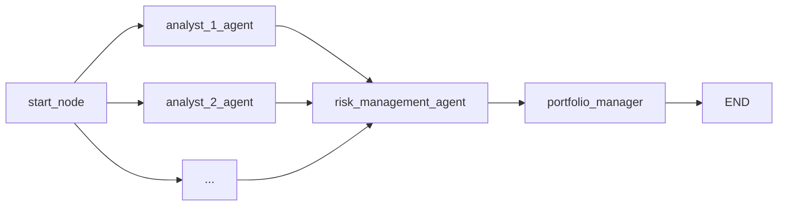

# AI Hedge Fund 系统架构文档

## 1. 模块概述

AI Hedge Fund 是一个基于大语言模型的多智能体对冲基金模拟系统。系统核心思路是让多个模拟著名投资者风格的 AI Agent 并行分析市场数据，再由风险管理和投资组合管理 Agent 依次汇总，最终输出买入/卖出/持有决策。

系统提供两种使用方式：

- **CLI 命令行** (`src/`) -- 基于 LangGraph 的 Python 应用，直接在终端运行
- **Web 应用** (`app/`) -- React 前端 + FastAPI 后端，提供可视化工作流编辑器

### 输入与输出

**输入**：股票代码列表、日期范围、初始资金、所选分析师 Agent、LLM 模型及提供商

**输出**：每只股票的交易决策 JSON，包含 action（buy/sell/short/cover/hold）、quantity、confidence、reasoning

---

## 2. 系统架构

### 目录结构

```
ai-hedge-fund/
├── src/                          # CLI 核心逻辑
│   ├── main.py                   # 工作流创建与 CLI 入口
│   ├── graph/state.py            # AgentState 类型定义
│   ├── agents/                   # 所有 Agent 实现
│   │   ├── portfolio_manager.py  # 投资组合管理 Agent
│   │   ├── risk_manager.py       # 风险管理 Agent
│   │   ├── warren_buffett.py     # 巴菲特风格 Agent
│   │   ├── ben_graham.py         # 格雷厄姆风格 Agent
│   │   └── ...                   # 其他分析师 Agent
│   ├── tools/api.py              # Financial Datasets API 客户端
│   ├── utils/                    # 工具函数模块
│   │   ├── analysts.py           # 分析师注册表（ANALYST_CONFIG）
│   │   ├── llm.py                # LLM 调用封装（call_llm）
│   │   ├── progress.py           # 进度状态更新
│   │   └── ...                   # api_key.py, display.py, ollama.py 等
│   ├── cli/
│   │   └── input.py              # CLI 参数输入处理
│   ├── data/
│   │   ├── cache.py              # 内存缓存
│   │   └── models.py             # Pydantic 数据模型
│   ├── llm/models.py             # LLM 提供商配置
│   ├── backtester.py             # 回测入口
│   └── backtesting/
│       ├── engine.py             # BacktestEngine 回测引擎
│       ├── portfolio.py          # 回测投资组合状态
│       ├── trader.py             # TradeExecutor 交易执行
│       ├── controller.py         # AgentController Agent 工作流调用
│       ├── metrics.py            # 绩效指标计算
│       ├── benchmarks.py         # 基准对比（SPY）
│       ├── output.py             # 回测输出格式化
│       ├── cli.py                # 回测 CLI 参数解析
│       ├── types.py              # 回测类型定义
│       └── valuation.py          # 回测估值工具
├── v2/                           # 对冲基金核心引擎重建（v2，与 v1 并行开发，尚未接入 app/）
│   ├── data/
│   │   ├── client.py             # FDClient（类型化 API 客户端，fail-loud，支持上下文管理器）
│   │   ├── cached.py             # CachedDataClient（磁盘缓存包装器，.v2_cache/data/）
│   │   ├── protocol.py           # DataClient 协议（结构化子类型，解耦具体数据源）
│   │   └── models.py             # Pydantic 数据模型（含 EarningsRecord 等）
│   ├── signals/                  # AlphaModel 接口 + 量化/LLM 分析师实现
│   │   ├── base.py               # AlphaModel（ABC）、QuantModel
│   │   ├── llm_agent.py          # LLMAgent（LLM 投资人 Agent 公共基类）
│   │   ├── buffett.py            # BuffettAgent（Warren Buffett 人格）
│   │   └── pead.py               # PEADModel（盈余公告后漂移量化模型）
│   ├── llm/                      # LLM 提供商层（镜像 data/protocol.py 的解耦方式）
│   │   ├── client.py             # LLMClient 协议 + AnthropicLLM 实现
│   │   └── cache.py              # PromptCache（LLM 决策磁盘缓存，.v2_cache/llm/）
│   ├── features/
│   │   └── snapshot.py           # FundamentalsSnapshot（LLM Agent 的时点正确输入）
│   ├── event_study/
│   │   ├── engine.py             # compute_car() 事件研究主入口
│   │   ├── models.py             # EventCAR, EventStudyResult 等 Pydantic 模型
│   │   ├── stats.py              # fit_market_model, bootstrap_ci 等统计函数
│   │   └── plot.py               # CAR 可视化图表（matplotlib）
│   ├── backtesting/
│   │   ├── engine.py             # BacktestEngine.run_alpha()（Alpha 模型无关回测引擎）
│   │   └── models.py             # Trade, PerformanceMetrics, BacktestResult
│   ├── demo/
│   │   └── backtest.py           # PEAD 回测演示仪表盘（终端实时展示）
│   ├── analyze.py                # CLI：向任意分析师询问某只股票的时点观点
│   └── models.py                 # Signal, QuantSignals 等顶层 Pydantic 模型
├── app/
│   ├── backend/                  # FastAPI 后端
│   │   ├── main.py               # FastAPI 应用入口
│   │   ├── database/             # SQLite + SQLAlchemy
│   │   ├── routes/               # API 路由
│   │   └── services/             # 业务逻辑服务
│   └── frontend/                 # React + Vite 前端
│       └── src/
│           ├── components/nodes/ # React Flow 自定义节点
│           ├── components/ui/    # Shadcn/Radix UI 组件
│           └── contexts/         # React Context 状态管理
```

### 技术栈

- **语言**: Python 3.11+, TypeScript
- **包管理**: Poetry (Python), npm (前端)
- **前端**: React 18, Vite, React Flow, Shadcn/Radix UI, Tailwind CSS
- **后端**: FastAPI, SQLAlchemy, Alembic, SQLite
- **AI 框架**: LangGraph, LangChain
- **数据源**: Financial Datasets API
- **代码规范**: Black (420 字符行宽), isort, flake8, ESLint

### AgentState 定义

所有 Agent 共享的状态类型（`src/graph/state.py`）：

```python
class AgentState(TypedDict):
    messages: Annotated[Sequence[BaseMessage], operator.add]  # 累积消息
    data: Annotated[dict[str, any], merge_dicts]              # tickers, portfolio, analyst_signals, dates
    metadata: Annotated[dict[str, any], merge_dicts]          # show_reasoning, model_name, model_provider
```

- `messages` -- 使用 `operator.add` 合并策略，各 Agent 追加消息
- `data` -- 使用 `merge_dicts`（浅合并）策略，包含股票列表、投资组合、分析师信号、日期
- `metadata` -- 使用 `merge_dicts` 策略，包含模型配置和显示选项

---

## 3. 数据流

### 核心工作流

工作流由 `src/main.py` 中的 `create_workflow()` 函数构建，使用 LangGraph `StateGraph`：

```
start_node → [所有选中的分析师 Agent 并行执行] → risk_management_agent → portfolio_manager → END
```



### 执行流程

1. **start_node** -- 初始化状态，传入 tickers、portfolio、日期范围
2. **分析师 Agent（并行）** -- 每个 Agent 读取市场数据，返回 signal（bullish/bearish/neutral）和 confidence
3. **risk_management_agent** -- 基于波动率和相关性计算仓位限额（纯计算，不使用 LLM）
4. **portfolio_manager** -- 汇总所有分析师信号，通过 LLM 生成最终交易决策（buy/sell/short/cover/hold）

### 风险管理 Agent

`risk_management_agent`（`src/agents/risk_manager.py`）是纯计算逻辑，不调用 LLM：

- 获取价格数据，计算日波动率和年化波动率
- 计算股票间相关性矩阵
- 基于波动率调整仓位上限（低波动率 <15% 允许最高 25%，高波动率 >50% 降至 10%）
- 基于相关性调整乘数（高相关 >=0.8 为 0.7x，低相关 <0.2 为 1.1x）
- 输出每只股票的 `remaining_position_limit`

### 投资组合管理 Agent

`portfolio_management_agent`（`src/agents/portfolio_manager.py`）使用 LLM 做最终决策：

- 汇总所有分析师的 signal 和 confidence
- 确定性计算每只股票允许的操作和最大数量（`compute_allowed_actions`）
- 将信号和约束发送给 LLM，由 LLM 选择操作和数量
- 无固定信号权重表 -- 决策完全由 LLM 根据所有信号综合判断
- 输出 `PortfolioDecision`：action、quantity、confidence、reasoning

---

## 4. Agent 列表

以下是 `ANALYST_CONFIG`（`src/utils/analysts.py`）中注册的全部 19 个分析师 Agent，按 order 排序：

| Order | Key | 显示名 | 描述 | 状态 |
|-------|-----|--------|------|------|
| 0 | `aswath_damodaran` | Aswath Damodaran | The Dean of Valuation | 已实现 |
| 1 | `ben_graham` | Ben Graham | The Father of Value Investing | 已实现 |
| 2 | `bill_ackman` | Bill Ackman | The Activist Investor | 已实现 |
| 3 | `cathie_wood` | Cathie Wood | The Queen of Growth Investing | 已实现 |
| 4 | `charlie_munger` | Charlie Munger | The Rational Thinker | 已实现 |
| 5 | `michael_burry` | Michael Burry | The Big Short Contrarian | 已实现 |
| 6 | `mohnish_pabrai` | Mohnish Pabrai | The Dhandho Investor | 已实现 |
| 7 | `nassim_taleb` | Nassim Taleb | The Black Swan Risk Analyst | 已实现 |
| 8 | `peter_lynch` | Peter Lynch | The 10-Bagger Investor | 已实现 |
| 9 | `phil_fisher` | Phil Fisher | The Scuttlebutt Investor | 已实现 |
| 10 | `rakesh_jhunjhunwala` | Rakesh Jhunjhunwala | The Big Bull Of India | 已实现 |
| 11 | `stanley_druckenmiller` | Stanley Druckenmiller | The Macro Investor | 已实现 |
| 12 | `warren_buffett` | Warren Buffett | The Oracle of Omaha | 已实现 |
| 13 | `technical_analyst` | Technical Analyst | Chart Pattern Specialist | 已实现 |
| 14 | `fundamentals_analyst` | Fundamentals Analyst | Financial Statement Specialist | 已实现 |
| 15 | `growth_analyst` | Growth Analyst | Growth Specialist | 已实现 |
| 16 | `news_sentiment_analyst` | News Sentiment Analyst | News Sentiment Specialist | 已实现 |
| 17 | `sentiment_analyst` | Sentiment Analyst | Market Sentiment Specialist | 已实现 |
| 18 | `valuation_analyst` | Valuation Analyst | Company Valuation Specialist | 已实现 |

另外还有两个始终运行、不可选的管理 Agent：

- **risk_management_agent** -- 波动率和相关性调整的仓位控制（纯计算）
- **portfolio_manager** -- LLM 驱动的最终交易决策

---

## 5. LLM 配置

### 支持的提供商

`ModelProvider` 枚举（`src/llm/models.py`）定义了以下 14 个提供商：

| 提供商 | 枚举值 | 环境变量 | `get_model()` 实例化方式 |
|--------|--------|----------|--------------------------|
| Alibaba | `Alibaba` | - | **无 `get_model()` 分支，调用时抛出 `ValueError`**；模型通过 OpenRouter 提供商使用 |
| Anthropic | `Anthropic` | `ANTHROPIC_API_KEY` | `ChatAnthropic` |
| DeepSeek | `DeepSeek` | `DEEPSEEK_API_KEY` | `ChatDeepSeek` |
| Google | `Google` | `GOOGLE_API_KEY` | `ChatGoogleGenerativeAI` |
| Groq | `Groq` | `GROQ_API_KEY` | `ChatGroq` |
| Kimi | `Kimi` | `MOONSHOT_API_KEY` 或 `KIMI_API_KEY` | `ChatOpenAI`（base_url 为 `MOONSHOT_BASE_URL` 或 `KIMI_BASE_URL`，默认 `https://api.moonshot.ai/v1`） |
| Meta | `Meta` | - | **无 `get_model()` 分支，调用时抛出 `ValueError`**；模型通过 OpenRouter 提供商使用 |
| Mistral | `Mistral` | - | **无 `get_model()` 分支，调用时抛出 `ValueError`**；模型通过 OpenRouter 提供商使用 |
| OpenAI | `OpenAI` | `OPENAI_API_KEY` | `ChatOpenAI` |
| Ollama | `Ollama` | 本地运行，无需 Key | `ChatOllama` |
| OpenRouter | `OpenRouter` | `OPENROUTER_API_KEY` | `ChatOpenAI`（自定义 base_url） |
| GigaChat | `GigaChat` | `GIGACHAT_API_KEY` | `GigaChat` |
| Azure OpenAI | `Azure OpenAI` | `AZURE_OPENAI_API_KEY` | `AzureChatOpenAI` |
| xAI | `xAI` | `XAI_API_KEY` | `ChatXAI` |

Alibaba、Meta、Mistral 在 `ModelProvider` 枚举中定义，但 `get_model()` 函数无对应的 `elif` 分支。若直接以这些提供商调用 `get_model()`，会进入 `else` 分支并抛出 `ValueError("Unsupported model provider: ...")`。这些提供商的模型需通过选择 `OpenRouter` 提供商来间接访问。

Kimi 使用月之暗面（Moonshot）OpenAI 兼容接口，`get_model()` 中通过 `ChatOpenAI` 实例化，API Key 优先读取 `MOONSHOT_API_KEY`，其次读取 `KIMI_API_KEY`。

### 模型配置加载

模型列表从 JSON 文件加载：
- `src/llm/api_models.json` -- API 模型配置
- `src/llm/ollama_models.json` -- Ollama 本地模型配置

默认模型为 `gpt-4.1`（OpenAI），见 `run_hedge_fund()` 函数签名。

**`get_model()` 函数签名**：`get_model(model_name: str, model_provider: ModelProvider, api_keys: dict = None)`，可选的 `api_keys` 参数允许通过字典传入 API 密钥（优先于环境变量），Web 后端使用此机制传递用户存储的密钥。

---

## 6. 数据层

### API 客户端

`src/tools/api.py` 封装了对 Financial Datasets API（`api.financialdatasets.ai`）的调用：

| 函数 | 数据类型 | HTTP 方法 |
|------|----------|-----------|
| `get_prices()` | 日线价格（OHLCV） | GET |
| `get_financial_metrics()` | 财务指标 | GET |
| `search_line_items()` | 财务报表行项目 | POST |
| `get_insider_trades()` | 内部人交易 | GET |
| `get_company_news()` | 公司新闻 | GET |
| `get_market_cap()` | 市值 | GET |

### 速率限制

`_make_api_request()` 函数处理 HTTP 429 速率限制，使用线性退避策略：

- 最大重试次数：3 次（加上首次请求共 4 次尝试）
- 退避公式：`60 + 30 * attempt` 秒（attempt 为当次循环索引，0 对应首次请求）
  - 首次请求失败（attempt=0）：等待 60 秒
  - 第 1 次重试失败（attempt=1）：等待 90 秒
  - 第 2 次重试失败（attempt=2）：等待 120 秒

### 免费股票

无需 `FINANCIAL_DATASETS_API_KEY` 即可访问以下 5 只股票的数据：

**AAPL, GOOGL, MSFT, NVDA, TSLA**

### 内存缓存

`src/data/cache.py` 实现了一个简单的 Python 字典内存缓存，用于减少重复 API 调用：

```python
class Cache:
    def __init__(self):
        self._prices_cache: dict[str, list[dict]] = {}
        self._financial_metrics_cache: dict[str, list[dict]] = {}
        self._line_items_cache: dict[str, list[dict]] = {}
        self._insider_trades_cache: dict[str, list[dict]] = {}
        self._company_news_cache: dict[str, list[dict]] = {}
```

- 缓存存储在进程内存中的 Python dict，进程结束即失效
- 全局单例模式（`get_cache()` 返回模块级 `_cache` 实例）
- 支持数据追加合并（`_merge_data` 方法，基于 key_field 跳过已存在的记录以避免完全重复，但不做深度去重）
- 无 Redis、无文件持久化、无 TTL 过期机制

### Pydantic 数据模型

`src/data/models.py` 定义了以下核心数据模型：

- **Price** -- 价格数据（open, close, high, low, volume, time）
- **FinancialMetrics** -- 财务指标（60+ 字段，涵盖估值、盈利能力、成长性、流动性、杠杆等）
- **LineItem** -- 财务报表行项目（`extra="allow"` 支持动态字段）
- **InsiderTrade** -- 内部人交易记录
- **CompanyNews** -- 公司新闻（ticker, title, source, date, url, sentiment）
- **CompanyFacts** -- 公司基本信息（名称、行业、市值、员工数等）
- **AnalystSignal** -- 分析师信号（signal, confidence, reasoning, max_position_size）
- **PortfolioDecision** -- 交易决策（action, quantity, confidence, reasoning）

---

## 7. 回测系统

### 入口

`src/backtester.py` 是回测的命令行入口，创建 `BacktestEngine` 实例并运行。支持 `KeyboardInterrupt` 优雅退出，可显示部分结果。

### BacktestEngine

`src/backtesting/engine.py` 中的 `BacktestEngine` 类协调回测流程：

1. **数据预取** (`_prefetch_data`) -- 预加载所有股票一年的价格、财务指标、内部人交易、新闻数据，以及 SPY 基准数据
2. **日期遍历** -- 按工作日（`freq="B"`）遍历日期范围
3. **每日执行**：
   - 获取当日收盘价
   - 调用完整的 Agent 工作流获取交易决策
   - 通过 `TradeExecutor` 执行交易
   - 计算投资组合价值和敞口（多头/空头/总/净敞口）
   - 输出每日结果表格，与 SPY 基准对比
4. **绩效指标** -- 在积累足够数据点（>3）后计算 Sharpe Ratio、Sortino Ratio、最大回撤、多空比率

### 核心组件

| 组件 | 文件 | 职责 |
|------|------|------|
| `BacktestEngine` | `engine.py` | 回测主循环协调 |
| `Portfolio` | `portfolio.py` | 投资组合状态管理 |
| `TradeExecutor` | `trader.py` | 交易执行 |
| `AgentController` | `controller.py` | Agent 工作流调用 |
| `PerformanceMetricsCalculator` | `metrics.py` | 绩效指标计算 |
| `BenchmarkCalculator` | `benchmarks.py` | SPY 基准对比 |
| `OutputBuilder` | `output.py` | 输出格式化 |

---

## 8. Web 应用

### 后端 (FastAPI)

- **入口**：`app/backend/main.py`
- **框架**：FastAPI，标题 "AI Hedge Fund API"，版本 0.1.0
- **数据库**：SQLite（文件路径 `app/backend/hedge_fund.db`），通过 SQLAlchemy ORM 访问
- **迁移**：Alembic
- **CORS**：允许来自 `localhost:5173` 和 `127.0.0.1:5173` 的请求

主要数据表：
- `hedge_fund_flows` -- 保存的 React Flow 工作流配置（节点、边、视口）
- `hedge_fund_flow_runs` -- 执行运行记录
- `hedge_fund_flow_run_cycles` -- 运行中的分析周期
- `api_keys` -- 存储的 API 密钥

启动时自动检查 Ollama 可用性（`ollama_service`）。

### 前端 (React)

- **框架**：React 18 + Vite（开发端口 5173）
- **工作流编辑**：React Flow 可视化工作流构建器，自定义节点在 `components/nodes/`
- **UI 组件**：Shadcn/Radix UI（`components/ui/`）
- **布局**：可调节分栏面板
- **状态管理**：React Context（flow, nodes, tabs）

---

## 9. 开发命令

### CLI 运行

```bash
# 基本运行
poetry run python src/main.py --ticker AAPL,MSFT,NVDA

# 使用 Ollama 本地模型
poetry run python src/main.py --ticker AAPL --ollama

# 指定日期范围
poetry run python src/main.py --ticker AAPL --start-date 2024-01-01 --end-date 2024-03-01

# 显示 Agent 推理过程
poetry run python src/main.py --ticker AAPL --show-reasoning

# 运行回测
poetry run python src/backtester.py --ticker AAPL,MSFT,NVDA
```

### v2 CLI（独立于 src/，见 [v2_signals_system.md](v2_signals_system.md)）

```bash
# 向某位分析师询问某只股票的时点观点
poetry run python -m v2.analyze NVDA
poetry run python -m v2.analyze NVDA --date 2024-06-01 --agent pead

# PEAD 回测演示仪表盘（终端实时展示，预热缓存后可离线运行）
poetry run python -m v2.demo.backtest

# PEAD 回测（100 只股票池）
poetry run python -m v2.backtesting

# v2 测试
poetry run pytest v2/
```

### Web 后端

```bash
cd app/backend && poetry run fastapi dev main.py                          # 启动开发服务器
cd app/backend && poetry run alembic upgrade head                         # 运行数据库迁移
cd app/backend && poetry run alembic revision --autogenerate -m "desc"    # 创建新迁移
```

### Web 前端

```bash
cd app/frontend && npm run dev      # 开发服务器（Vite, 端口 5173）
cd app/frontend && npm run build    # 生产构建
cd app/frontend && npm run lint     # ESLint 检查
```

### 全栈启动

```bash
./run.sh    # Mac/Linux（从 app/ 目录）
run.bat     # Windows
```

### 代码质量

```bash
poetry run black .          # 格式化（420 字符行宽）
poetry run isort .          # import 排序
poetry run flake8 .         # Lint 检查
poetry run pytest           # 运行全部测试
poetry run pytest tests/test_api_rate_limiting.py -v   # 单个测试文件
poetry run pytest -k "test_name"                       # 按名称运行测试
```

---

## 10. 环境变量

参考 `.env.example` 文件。最少需要设置一个 LLM 提供商的 API Key。

| 环境变量 | 用途 | 是否必须 |
|----------|------|----------|
| `FINANCIAL_DATASETS_API_KEY` | Financial Datasets API（5 只免费股票外的数据） | 可选 |
| `OPENAI_API_KEY` | OpenAI API | 至少设一个 LLM Key |
| `ANTHROPIC_API_KEY` | Anthropic API | 可选 |
| `DEEPSEEK_API_KEY` | DeepSeek API | 可选 |
| `GROQ_API_KEY` | Groq API | 可选 |
| `GOOGLE_API_KEY` | Google Gemini API | 可选 |
| `XAI_API_KEY` | xAI (Grok) API | 可选 |
| `GIGACHAT_API_KEY` | GigaChat API | 可选 |
| `OPENROUTER_API_KEY` | OpenRouter API | 可选 |
| `MOONSHOT_API_KEY` | Kimi (月之暗面) API（优先） | 可选 |
| `KIMI_API_KEY` | Kimi API（备用，低于 MOONSHOT_API_KEY） | 可选 |
| `MOONSHOT_BASE_URL` | Kimi base URL（优先，默认 `https://api.moonshot.ai/v1`） | 可选 |
| `KIMI_BASE_URL` | Kimi base URL（备用） | 可选 |
| `AZURE_OPENAI_API_KEY` | Azure OpenAI API | 可选 |
| `AZURE_OPENAI_ENDPOINT` | Azure OpenAI 端点 URL | 使用 Azure 时必须 |
| `AZURE_OPENAI_DEPLOYMENT_NAME` | Azure OpenAI 部署名称 | 使用 Azure 时必须 |
| `OPENAI_API_BASE` | OpenAI 自定义 base URL | 可选 |
| `OLLAMA_HOST` | Ollama 主机地址（默认 localhost） | 可选 |
| `OLLAMA_BASE_URL` | Ollama base URL（默认 `http://localhost:11434`） | 可选 |

---

## 11. 文档索引

### 系统架构
- [README.md](README.md) — 本文档（系统总览、架构、数据流、Agent 列表、开发命令）
- [backtest_system.md](backtest_system.md) — src/ 回测系统详细说明

### v2 模块文档
- [v2_data_layer.md](v2_data_layer.md) — v2 数据层（FDClient、FDClientError、CachedDataClient、Pydantic 模型、时点过滤）
- [v2_signals_system.md](v2_signals_system.md) — v2 Alpha 模型与 LLM 投资人系统（AlphaModel、LLMAgent、BuffettAgent、PEADModel、v2/llm/、FundamentalsSnapshot）
- [v2_event_study_system.md](v2_event_study_system.md) — v2 事件研究框架（compute_car、市场模型、统计检验、可视化）
- [v2_backtesting_system.md](v2_backtesting_system.md) — v2 回测引擎（BacktestEngine.run_alpha、绩效指标）

### 分析师 Agent 文档
- [portfolio_manager_agent.md](portfolio_manager_agent.md) — 投资组合管理 Agent
- [risk_manager_agent.md](risk_manager_agent.md) — 风险管理 Agent
- [warren_buffett_agent.md](warren_buffett_agent.md) — Warren Buffett Agent
- [ben_graham_agent.md](ben_graham_agent.md) — Ben Graham Agent
- [bill_ackman_agent.md](bill_ackman_agent.md) — Bill Ackman Agent
- [cathie_wood_agent.md](cathie_wood_agent.md) — Cathie Wood Agent
- [charlie_munger_agent.md](charlie_munger_agent.md) — Charlie Munger Agent
- [michael_burry_agent.md](michael_burry_agent.md) — Michael Burry Agent
- [mohnish_pabrai_agent.md](mohnish_pabrai_agent.md) — Mohnish Pabrai Agent
- [nassim_taleb_agent.md](nassim_taleb_agent.md) — Nassim Taleb Agent
- [peter_lynch_agent.md](peter_lynch_agent.md) — Peter Lynch Agent
- [phil_fisher_agent.md](phil_fisher_agent.md) — Phil Fisher Agent
- [rakesh_jhunjhunwala_agent.md](rakesh_jhunjhunwala_agent.md) — Rakesh Jhunjhunwala Agent
- [stanley_druckenmiller_agent.md](stanley_druckenmiller_agent.md) — Stanley Druckenmiller Agent
- [aswath_damodaran_agent.md](aswath_damodaran_agent.md) — Aswath Damodaran Agent
- [technical_analyst_agent.md](technical_analyst_agent.md) — Technical Analyst Agent
- [fundamentals_agent.md](fundamentals_agent.md) — Fundamentals Analyst Agent
- [valuation_agent.md](valuation_agent.md) — Valuation Analyst Agent
- [sentiment_agent.md](sentiment_agent.md) — Sentiment Analyst Agent
- [news_sentiment_agent.md](news_sentiment_agent.md) — News Sentiment Analyst Agent
- [growth_agent.md](growth_agent.md) — Growth Analyst Agent

---

## 免责声明

本系统仅用于教育和研究目的，不构成投资建议。所有投资决策应基于个人研究和专业建议。
