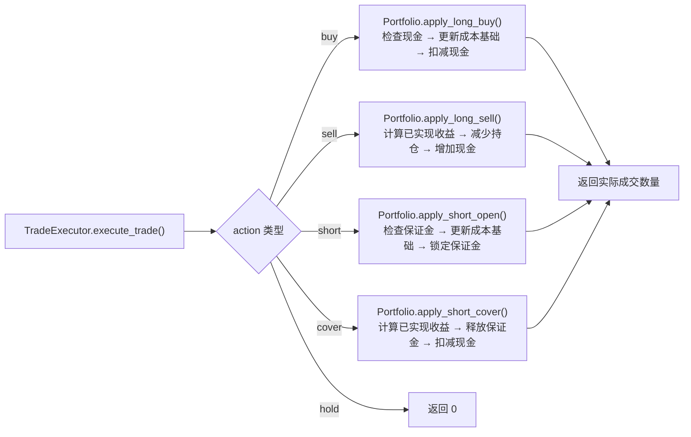
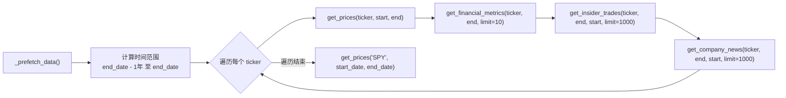

# 回测系统技术文档

## 1. 模块概述

### 1.1 核心功能

回测系统（Backtesting System）是 AI 对冲基金项目的历史模拟引擎，负责在指定的历史时间范围内逐日驱动多智能体（Agent）交易决策流程，模拟组合的买入、卖出、做空、平仓操作，并计算绩效指标与基准对比结果。

### 1.2 设计目标

- 以逐日（按工作日频率）方式驱动 AI Agent 做出交易决策
- 支持多空头寸管理，包括保证金追踪
- 计算 Sharpe、Sortino、最大回撤等核心绩效指标
- 与 SPY 基准收益率进行对比
- 提供终端表格化输出与中断恢复能力

### 1.3 系统角色

回测系统位于 CLI 层与 Agent 层之间，是一个编排器（Orchestrator）。它调用 `src/main.py` 中的 `run_hedge_fund` 函数获取 Agent 的交易决策，再通过自身的交易执行与组合管理模块完成模拟交易。

### 1.4 输入/输出

**输入**：
- 股票代码列表（tickers）
- 起止日期（start_date / end_date）
- 初始资金（initial_capital，默认 100000）
- 保证金要求（margin_requirement，默认 0.0）
- LLM 模型名称与提供商
- 已选分析师列表

**输出**：
- `PerformanceMetrics` TypedDict，包含 `sharpe_ratio`、`sortino_ratio`、`max_drawdown`、`max_drawdown_date`、`long_short_ratio`、`gross_exposure`、`net_exposure`
- 终端实时打印每日交易明细与组合摘要

### 1.5 模块文件清单

| 文件 | 职责 |
|------|------|
| `src/backtester.py` | 旧版入口脚本，包装 `BacktestEngine` 调用 |
| `src/backtesting/__init__.py` | 包导出定义 |
| `src/backtesting/engine.py` | `BacktestEngine` 核心编排类 |
| `src/backtesting/portfolio.py` | `Portfolio` 组合状态管理 |
| `src/backtesting/trader.py` | `TradeExecutor` 交易执行 |
| `src/backtesting/controller.py` | `AgentController` Agent 调用与输出归一化 |
| `src/backtesting/metrics.py` | `PerformanceMetricsCalculator` 绩效指标计算 |
| `src/backtesting/valuation.py` | `calculate_portfolio_value`（模块级函数）及敞口计算 |
| `src/backtesting/benchmarks.py` | `BenchmarkCalculator` SPY 基准收益 |
| `src/backtesting/output.py` | `OutputBuilder` 终端输出构建 |
| `src/backtesting/types.py` | 所有 TypedDict、Enum 类型定义 |
| `src/backtesting/cli.py` | 模块化 CLI 入口 |

---

## 2. 架构设计

### 2.1 分层架构

```
CLI 层 (backtester.py / cli.py)
    |
编排层 (BacktestEngine)
    |
    +-- AgentController     -- 调用 AI Agent 并归一化输出
    +-- TradeExecutor        -- 交易执行逻辑
    +-- Portfolio            -- 组合状态管理（现金、持仓、保证金）
    +-- PerformanceMetricsCalculator -- 绩效计算
    +-- BenchmarkCalculator  -- SPY 基准对比
    +-- OutputBuilder        -- 终端输出格式化
    +-- valuation.py         -- 组合估值（模块级函数）
```

### 2.2 核心类关系

`BacktestEngine` 通过组合模式持有以下组件实例：

```python
self._portfolio = Portfolio(...)
self._executor = TradeExecutor()
self._agent_controller = AgentController()
self._perf = PerformanceMetricsCalculator()
self._results = OutputBuilder(initial_capital=self._initial_capital)
self._benchmark = BenchmarkCalculator()
```

### 2.3 设计模式

- **组合模式**：`BacktestEngine` 通过组合而非继承将各职责委托给独立组件
- **快照模式**：`Portfolio.get_snapshot()` 返回深拷贝副本传递给 Agent，防止外部篡改内部状态
- **只读视图**：`Portfolio.get_positions()` 返回 `MappingProxyType` 只读映射
- **策略模式**：Agent 函数作为 callable 注入 `BacktestEngine`，可替换不同的交易策略
- **归一化层**：`AgentController` 负责将 Agent 输出标准化为统一的 `AgentOutput` 格式

### 2.4 关键设计决策

1. **所有构造函数参数均为关键字参数**：`BacktestEngine.__init__` 使用 `*` 强制关键字，首参数名为 `agent`（不是 `graph`）
2. **同步执行**：仅提供 `run_backtest()` 同步方法，无异步变体
3. **无交易成本**：当前实现不包含佣金或滑点模型
4. **回溯窗口**：每日决策使用 `relativedelta(months=1)` 作为回溯起点，而非固定 30 天
5. **返回类型**：`run_backtest()` 返回 `PerformanceMetrics` TypedDict，而非复合字典

---

## 3. 核心流程图

```mermaid
flowchart LR
    A[CLI 解析参数] --> B["创建 BacktestEngine<br/>(engine.py)"]
    B --> C["_prefetch_data()<br/>预加载价格/财务/新闻/SPY数据"]
    C --> D["pd.date_range(freq='B')<br/>生成工作日序列"]
    D --> E{遍历每个交易日}
    E --> F["获取当日收盘价<br/>get_price_data()"]
    F --> G{价格数据缺失?}
    G -- 是 --> E
    G -- 否 --> H["AgentController.run_agent()<br/>(controller.py)<br/>调用 AI Agent 获取决策"]
    H --> I["TradeExecutor.execute_trade()<br/>(trader.py)<br/>对每个 ticker 执行交易"]
    I --> J["calculate_portfolio_value()<br/>(valuation.py)<br/>计算组合总值"]
    J --> K["compute_exposures()<br/>(valuation.py)<br/>计算多空敞口"]
    K --> L["BenchmarkCalculator.get_return_pct()<br/>(benchmarks.py)<br/>获取 SPY 基准收益"]
    L --> M["OutputBuilder.build_day_rows()<br/>(output.py)<br/>构建输出行"]
    M --> N["OutputBuilder.print_rows()<br/>打印结果表"]
    N --> O{portfolio_values > 3?}
    O -- 是 --> P["PerformanceMetricsCalculator<br/>.compute_metrics()<br/>(metrics.py)"]
    P --> E
    O -- 否 --> E
    E -- 遍历结束 --> Q["返回 PerformanceMetrics"]
```



### 3.1 交易执行子流程



### 3.2 数据预取子流程



---

## 4. 关键算法详解

### 4.1 Sharpe 比率

**位置**：`src/backtesting/metrics.py` 第 39-46 行

**公式**：

```
daily_rf = annual_rf_rate / annual_trading_days
excess = daily_return - daily_rf
sharpe = sqrt(252) * mean(excess) / std(excess)
```

**参数默认值**：
- `annual_trading_days = 252`
- `annual_rf_rate = 0.0434`（4.34% 年化无风险利率）

**代码实现**：

```python
daily_rf = self.annual_rf_rate / self.annual_trading_days
excess = clean_returns - daily_rf
mean_excess = excess.mean()
std_excess = excess.std()

if std_excess > 1e-12:
    sharpe = float(np.sqrt(self.annual_trading_days) * (mean_excess / std_excess))
else:
    sharpe = 0.0
```

当超额收益标准差接近零（`<= 1e-12`）时返回 `0.0`，避免除零。

### 4.2 Sortino 比率

**位置**：`src/backtesting/metrics.py` 第 49-55 行

**核心区别**：Sortino 比率使用**目标下行偏差（Target Downside Deviation）**替代标准差。计算方式为：对超额收益与零逐元素取最小值，然后计算 `sqrt(mean(squared))`。这与「仅对负收益求标准差」的方法不同 -- 此处将所有非负超额收益视为零参与均值计算。

**公式**：

```
downside_diff = min(excess, 0)                    # 逐元素取 excess 与 0 的最小值
downside_dev  = sqrt(mean(downside_diff ^ 2))     # 目标下行偏差
sortino       = sqrt(252) * mean(excess) / downside_dev
```

**代码实现**：

```python
downside_diff = np.minimum(excess, 0)
downside_dev = float(np.sqrt(np.mean(downside_diff**2)))
if downside_dev > 1e-12:
    sortino = float(np.sqrt(self.annual_trading_days) * (mean_excess / downside_dev))
else:
    sortino = float("inf") if mean_excess > 0 else 0.0
```

当无下行波动时：若 `mean_excess > 0` 则返回 `inf`，否则返回 `0.0`。

### 4.3 最大回撤

**位置**：`src/backtesting/metrics.py` 第 57-68 行

**公式**：

```
rolling_max  = cummax(portfolio_value)
drawdown     = (portfolio_value - rolling_max) / rolling_max
max_drawdown = min(drawdown) * 100     # 乘以 100 转为百分比
```

**代码实现**：

```python
rolling_max = df["Portfolio Value"].cummax()
drawdown = (df["Portfolio Value"] - rolling_max) / rolling_max
if len(drawdown) > 0:
    min_dd = float(drawdown.min())
    max_drawdown = float(min_dd * 100.0)           # 注意：乘以 100
    if min_dd < 0:
        max_drawdown_date = drawdown.idxmin().strftime("%Y-%m-%d")
    else:
        max_drawdown_date = None
else:
    max_drawdown = 0.0
    max_drawdown_date = None
```

返回值为负百分比（例如 `-15.3` 表示 15.3% 的回撤），同时记录回撤最深处的日期 `max_drawdown_date`。

### 4.4 组合估值

**位置**：`src/backtesting/valuation.py` 模块级函数 `calculate_portfolio_value()`

这是一个**独立的模块级函数**，不是任何类的方法。

**公式**：

```
total_value = cash + sum(long_shares * price) - sum(short_shares * price)
```

**函数签名**：

```python
def calculate_portfolio_value(portfolio: Portfolio, current_prices: Mapping[str, float]) -> float:
```

### 4.5 敞口计算

**位置**：`src/backtesting/valuation.py` 函数 `compute_exposures()`

| 指标 | 公式 |
|------|------|
| Long Exposure | `sum(long_shares * price)` |
| Short Exposure | `sum(short_shares * price)` |
| Gross Exposure | `long_exposure + short_exposure` |
| Net Exposure | `long_exposure - short_exposure` |
| Long/Short Ratio | `long_exposure / short_exposure`，空头 < 1e-9 时返回 `inf` |

### 4.6 加权平均成本基础

**位置**：`src/backtesting/portfolio.py` 的 `apply_long_buy()` / `apply_short_open()`

买入或开空时使用加权平均法更新成本基础：

```python
new_cost_basis = (old_cost_basis * old_shares + price * new_shares) / total_shares
```

资金不足时自动降为最大可买数量：`max_quantity = int(cash / price)`。

### 4.7 SPY 基准收益

**位置**：`src/backtesting/benchmarks.py` `BenchmarkCalculator.get_return_pct()`

**公式**：

```
return_pct = (last_close / first_close - 1) * 100
```

获取 SPY 在回测期间的买入持有收益百分比，在每个交易日与组合收益率进行对比显示。

### 4.8 保证金管理

**位置**：`src/backtesting/portfolio.py` 的 `apply_short_open()` / `apply_short_cover()`

**开空保证金计算**：

```python
margin_required = price * quantity * margin_requirement
available_cash = max(0.0, cash - margin_used)
```

开空时：收到卖空所得（`cash += proceeds`），但扣除保证金锁定（`cash -= margin_required`）。

**平仓保证金释放**：

```python
portion = quantity / total_short_shares
margin_to_release = portion * short_margin_used
```

按比例释放保证金至可用现金。

---

## 5. 数据结构分析

### 5.1 Action 枚举

**位置**：`src/backtesting/types.py` 第 10-15 行

```python
class Action(str, Enum):
    BUY = "buy"
    SELL = "sell"
    SHORT = "short"
    COVER = "cover"
    HOLD = "hold"
```

继承 `str` 和 `Enum`，共 **5 个枚举值**。同时定义了 `ActionLiteral = Literal["buy", "sell", "short", "cover", "hold"]` 类型别名用于向后兼容。

### 5.2 PositionState

**位置**：`src/backtesting/types.py` 第 21-29 行

```python
class PositionState(TypedDict):
    long: int                # 多头持仓股数
    short: int               # 空头持仓股数
    long_cost_basis: float   # 多头加权平均成本
    short_cost_basis: float  # 空头加权平均成本
    short_margin_used: float # 该 ticker 空头占用的保证金
```

类型名称为 `PositionState`，每个 ticker 对应一个实例。

### 5.3 PortfolioSnapshot

**位置**：`src/backtesting/types.py` 第 38-49 行

```python
class PortfolioSnapshot(TypedDict):
    cash: float
    margin_used: float
    margin_requirement: float
    positions: Dict[str, PositionState]
    realized_gains: Dict[str, TickerRealizedGains]
```

由 `Portfolio.get_snapshot()` 返回的深拷贝快照，传递给 Agent 使用，确保 Agent 无法直接修改组合状态。

### 5.4 TickerRealizedGains

**位置**：`src/backtesting/types.py` 第 31-36 行

```python
class TickerRealizedGains(TypedDict):
    long: float    # 多头已实现收益
    short: float   # 空头已实现收益
```

### 5.5 PerformanceMetrics

**位置**：`src/backtesting/types.py` 第 90-103 行

```python
class PerformanceMetrics(TypedDict, total=False):
    sharpe_ratio: Optional[float]
    sortino_ratio: Optional[float]
    max_drawdown: Optional[float]
    max_drawdown_date: Optional[str]      # 最大回撤发生日期
    long_short_ratio: Optional[float]
    gross_exposure: Optional[float]
    net_exposure: Optional[float]
```

使用 `total=False` 允许渐进式填充。此类型是 `run_backtest()` 的返回值类型。

### 5.6 PortfolioValuePoint

**位置**：`src/backtesting/types.py` 第 75-87 行

使用函数式 TypedDict 定义（因键名包含空格）：

```python
PortfolioValuePoint = TypedDict(
    "PortfolioValuePoint",
    {
        "Date": datetime,
        "Portfolio Value": float,
        "Long Exposure": float,
        "Short Exposure": float,
        "Gross Exposure": float,
        "Net Exposure": float,
        "Long/Short Ratio": float,
    },
    total=False,
)
```

### 5.7 AgentOutput / AgentDecision

**位置**：`src/backtesting/types.py` 第 56-72 行

```python
class AgentDecision(TypedDict):
    action: ActionLiteral
    quantity: float

AgentDecisions = Dict[str, AgentDecision]

class AgentOutput(TypedDict):
    decisions: AgentDecisions
    analyst_signals: AgentSignals
```

### 5.8 Portfolio 类

**位置**：`src/backtesting/portfolio.py`

| 方法 | 签名 | 说明 |
|------|------|------|
| `__init__` | `(*, tickers, initial_cash, margin_requirement)` | 关键字参数初始化 |
| `get_snapshot` | `() -> PortfolioSnapshot` | 返回深拷贝快照 |
| `get_cash` | `() -> float` | 当前现金余额 |
| `get_margin_used` | `() -> float` | 已使用保证金 |
| `get_margin_requirement` | `() -> float` | 保证金比例 |
| `get_positions` | `() -> Mapping[str, PositionState]` | 返回 `MappingProxyType` 只读视图 |
| `get_realized_gains` | `() -> Mapping[str, TickerRealizedGains]` | 返回已实现收益只读视图 |
| `apply_long_buy` | `(ticker, quantity, price) -> int` | 执行多头买入，返回实际成交数量 |
| `apply_long_sell` | `(ticker, quantity, price) -> int` | 执行多头卖出，计算已实现收益 |
| `apply_short_open` | `(ticker, quantity, price) -> int` | 执行空头开仓，锁定保证金 |
| `apply_short_cover` | `(ticker, quantity, price) -> int` | 执行空头平仓，释放保证金 |

资金不足时 `apply_long_buy` 自动降为 `int(cash / price)` 的最大可买数量。保证金不足时 `apply_short_open` 按可用余额计算最大开仓量：`max_quantity = int(available_cash / (price * margin_ratio)) if margin_ratio > 0 and price > 0 else 0`。卖出/平仓数量自动限制为不超过当前持仓。

---

## 6. 配置开关说明

本系统**不存在集中配置字典**（无 `BACKTEST_CONFIG`、`PERFORMANCE_CONFIG` 或 `DATA_CONFIG`）。所有可配置项通过构造函数参数和 CLI 标志传入。

### 6.1 BacktestEngine 构造参数

| 参数 | 类型 | 默认值 | 说明 |
|------|------|--------|------|
| `agent` | `Callable` | 必填 | 交易决策函数（通常为 `run_hedge_fund`） |
| `tickers` | `list[str]` | 必填 | 股票代码列表 |
| `start_date` | `str` | 必填 | 起始日期 `YYYY-MM-DD` |
| `end_date` | `str` | 必填 | 结束日期 `YYYY-MM-DD` |
| `initial_capital` | `float` | 必填 | 初始资金 |
| `model_name` | `str` | 必填 | LLM 模型名称 |
| `model_provider` | `str` | 必填 | LLM 提供商 |
| `selected_analysts` | `list[str] \| None` | 必填 | 选择的分析师列表 |
| `initial_margin_requirement` | `float` | 必填 | 空头保证金比例（0.0-1.0） |

### 6.2 PerformanceMetricsCalculator 参数

| 参数 | 类型 | 默认值 | 说明 |
|------|------|--------|------|
| `annual_trading_days` | `int` | `252` | 年化交易天数 |
| `annual_rf_rate` | `float` | `0.0434` | 年化无风险利率（4.34%） |

### 6.3 CLI 标志

**旧版入口** (`src/backtester.py`) 使用 `src/cli/input.py` 的通用解析器：

| 标志 | 说明 |
|------|------|
| `--ticker` | 逗号分隔的股票代码 |
| `--start-date` | 起始日期（默认：当前日期前 1 个月） |
| `--end-date` | 结束日期（默认：当前日期） |
| `--initial-cash` / `--initial-capital` | 初始资金（默认 100000.0），两个标志互为别名 |
| `--margin-requirement` | 保证金比例（默认 0.0） |
| `--ollama` | 使用本地 Ollama 模型 |

**模块化入口** (`src/backtesting/cli.py`)：

| 标志 | 说明 |
|------|------|
| `--tickers` / `--ticker` | 逗号分隔的股票代码 |
| `--start-date` | 起始日期（默认：当前日期前 1 个月） |
| `--end-date` | 结束日期（默认：当前日期） |
| `--initial-capital` | 初始资金（默认 100000） |
| `--margin-requirement` | 保证金比例（默认 0.0） |
| `--analysts` | 逗号分隔的分析师名称 |
| `--analysts-all` | 选择所有分析师 |
| `--ollama` | 使用 Ollama 本地推理 |

---

## 7. 外部依赖

### 7.1 Python 包依赖

| 依赖 | 用途 | 所在文件 |
|------|------|----------|
| `pandas` | 日期范围生成（`date_range`）、DataFrame 操作、收益率计算 | engine.py, metrics.py |
| `numpy` | 数值计算（Sharpe、Sortino、回撤） | metrics.py |
| `python-dateutil` | `relativedelta` 用于月度回溯窗口和默认日期计算 | engine.py, cli.py |
| `colorama` | 终端彩色输出 | backtester.py, cli.py |
| `questionary` | 交互式终端选择（分析师、模型选择） | cli.py |

### 7.2 内部模块依赖

| 模块 | 用途 | 调用方 |
|------|------|--------|
| `src.tools.api` | Financial Datasets API 客户端（价格、财务指标、新闻、内部交易） | engine.py, benchmarks.py |
| `src.main.run_hedge_fund` | LangGraph 多智能体交易决策函数 | backtester.py, cli.py |
| `src.utils.display` | 终端表格格式化（`format_backtest_row`, `print_backtest_results`） | output.py |
| `src.utils.analysts` | `ANALYST_ORDER` 分析师列表 | cli.py |
| `src.llm.models` | `LLM_ORDER`、`OLLAMA_LLM_ORDER`、`get_model_info` | cli.py |
| `src.cli.input` | `parse_cli_inputs` 通用 CLI 解析 | backtester.py |

### 7.3 运行环境

- **Python 版本**：3.11+（使用了 `X | Y` 联合类型语法）
- **包管理器**：Poetry

---

## 8. API 接口说明

### 8.1 BacktestEngine

**位置**：`src/backtesting/engine.py`

```python
class BacktestEngine:
    def __init__(
        self,
        *,                                          # 强制关键字参数
        agent,                                      # Callable，交易决策函数
        tickers: list[str],
        start_date: str,
        end_date: str,
        initial_capital: float,
        model_name: str,
        model_provider: str,
        selected_analysts: list[str] | None,
        initial_margin_requirement: float,
    ) -> None: ...

    def run_backtest(self) -> PerformanceMetrics: ...
    def get_portfolio_values(self) -> Sequence[PortfolioValuePoint]: ...
```

- `run_backtest()` 是**同步方法**，执行完整回测循环并返回 `PerformanceMetrics` TypedDict
- `get_portfolio_values()` 返回组合价值时间序列的拷贝，可用于中断后查看部分结果
- `_prefetch_data()` 为**私有方法**（下划线前缀），在 `run_backtest()` 内部自动调用，不应从外部调用

### 8.2 TradeExecutor

**位置**：`src/backtesting/trader.py`

```python
class TradeExecutor:
    def execute_trade(
        self,
        ticker: str,
        action: ActionLiteral,
        quantity: float,
        current_price: float,
        portfolio: Portfolio,           # 必需参数
    ) -> int: ...
```

`execute_trade` 是 `TradeExecutor` 类的方法（不是 `BacktestEngine` 的方法），需要传入 `portfolio` 参数。返回实际成交数量（整数）。内部将 `action` 字符串转换为 `Action` 枚举后分发到 `Portfolio` 的对应方法。

### 8.3 AgentController

**位置**：`src/backtesting/controller.py`

```python
class AgentController:
    def run_agent(
        self,
        agent: Callable[..., AgentOutput],
        *,
        tickers: Sequence[str],
        start_date: str,
        end_date: str,
        portfolio: Portfolio | PortfolioSnapshot,
        model_name: str,
        model_provider: str,
        selected_analysts: Sequence[str] | None,
    ) -> AgentOutput: ...
```

归一化处理包括：
- 将 `Portfolio` 对象转换为 `PortfolioSnapshot` 字典后传给 Agent
- 对 `action` 进行 `Action` 枚举验证，无效值回退为 `hold`
- 对 `quantity` 进行 `float` 强制转换，失败时回退为 `0.0`
- 对缺失的 ticker 决策补充 `{"action": "hold", "quantity": 0.0}` 默认值

### 8.4 PerformanceMetricsCalculator

**位置**：`src/backtesting/metrics.py`

```python
class PerformanceMetricsCalculator:
    def __init__(self, *, annual_trading_days: int = 252, annual_rf_rate: float = 0.0434) -> None: ...
    def compute_metrics(self, values: Sequence[PortfolioValuePoint]) -> PerformanceMetrics: ...
    def update_metrics(self, metrics: PerformanceMetrics, values: Sequence[PortfolioValuePoint]) -> None: ...
```

- `compute_metrics()` 返回新的 `PerformanceMetrics` 字典
- `update_metrics()` 已标记为 Deprecated，直接修改传入的字典
- `compute_metrics()` 有三个早期退出路径，均返回仅含 `sharpe_ratio`、`sortino_ratio`、`max_drawdown` 三个键（值均为 `None`）的字典，**不包含 `max_drawdown_date` 等其余字段**：
  1. `if not values` — 传入空序列
  2. `if df.empty or "Portfolio Value" not in df` — DataFrame 为空或缺少价格列
  3. `if len(clean_returns) < 2` — 有效日收益率数据点不足 2 个
- **注意**：`BacktestEngine.__init__` 中初始化的 `_performance_metrics` 字典也不包含 `max_drawdown_date` 键，该键仅在 `compute_metrics()` 计算后通过 `.update()` 合入，因此当组合价值数据点不足时，最终返回的 `PerformanceMetrics` 可能缺少 `max_drawdown_date` 键
- 在 `run_backtest()` 主循环中，当 `portfolio_values` 数据点超过 3 个时才开始计算

### 8.5 BenchmarkCalculator

**位置**：`src/backtesting/benchmarks.py`

```python
class BenchmarkCalculator:
    def get_return_pct(self, ticker: str, start_date: str, end_date: str) -> float | None: ...
```

在回测循环中每日调用，传入 `"SPY"` 作为基准代码，计算从回测起始日到当前日的 SPY 买入持有收益率。返回百分比值，数据不可用时返回 `None`。

### 8.6 组合估值函数（模块级）

**位置**：`src/backtesting/valuation.py`

```python
def calculate_portfolio_value(portfolio: Portfolio, current_prices: Mapping[str, float]) -> float: ...
def compute_exposures(portfolio: Portfolio, current_prices: Mapping[str, float]) -> Dict[str, float]: ...
def compute_portfolio_summary(
    *,
    portfolio: Portfolio,
    total_value: float,
    initial_value: float | None,
    performance_metrics: Mapping[str, float | None],
) -> Dict[str, float | None]: ...
```

这三个函数均为 `valuation.py` 中的**模块级函数**，不属于任何类。

### 8.7 OutputBuilder

**位置**：`src/backtesting/output.py`

```python
class OutputBuilder:
    def __init__(self, *, initial_capital: float | None = None) -> None: ...
    def build_day_rows(
        self,
        *,
        date_str: str,
        tickers: Sequence[str],
        agent_output: AgentOutput,
        executed_trades: Mapping[str, int],
        current_prices: Mapping[str, float],
        portfolio: Portfolio,
        performance_metrics: Mapping[str, float | None],
        total_value: float,
        benchmark_return_pct: float | None = None,
    ) -> List[list]: ...
    def print_rows(self, rows: List[list]) -> None: ...
```

无状态设计：调用者提供所有输入，方法返回行数据。内部调用 `src.utils.display` 中的 `format_backtest_row` 和 `print_backtest_results` 完成格式化输出。

---

## 9. 错误码及异常处理

### 9.1 异常处理策略

本系统**不定义任何自定义异常类**。所有错误处理使用裸 `except` 或 `except Exception` 捕获。

### 9.2 引擎层错误处理

**价格数据缺失**（`engine.py` 第 114-130 行）：

```python
try:
    price_data = get_price_data(ticker, previous_date_str, current_date_str)
    if price_data.empty:
        missing_data = True
        break
    current_prices[ticker] = float(price_data.iloc[-1]["close"])
except Exception:
    missing_data = True
    break
```

任一 ticker 价格不可用时，标记 `missing_data = True` 并跳过当日全部交易（`continue`）。外层还有一个 `except Exception: continue` 作为兜底，确保单日异常不会中断整个回测。

### 9.3 用户中断处理

**位置**：`src/backtester.py` 第 19-39 行

捕获 `KeyboardInterrupt`，尝试通过 `get_portfolio_values()` 输出部分结果（初始值、最终值、总收益率），然后调用 `sys.exit(0)` 优雅退出。部分结果输出本身也被 `try/except Exception` 包裹，防止二次异常。

### 9.4 AgentController 归一化容错

**位置**：`src/backtesting/controller.py` 第 44-58 行

- `action` 无法转为 `Action` 枚举时：`except Exception` 捕获后回退为 `Action.HOLD.value`
- `quantity` 无法转为 `float` 时：`except Exception` 捕获后回退为 `0.0`
- Agent 返回值不是 `dict` 时：使用空字典 `{}` 作为默认值

### 9.5 TradeExecutor 容错

**位置**：`src/backtesting/trader.py` 第 18-25 行

- `quantity` 为 `None` 或 `<= 0` 时直接返回 `0`
- `action` 无法转为 `Action` 枚举时回退为 `Action.HOLD`，返回 `0`

### 9.6 BenchmarkCalculator 容错

**位置**：`src/backtesting/benchmarks.py` 第 14-30 行

整个 `get_return_pct` 方法被 `try/except Exception` 包裹，处理以下边界条件：
- DataFrame 为空
- `first_close` 为 `None` 或 `NaN`
- `last_close` 为 `None` 或 `NaN`（尝试回退到最后一个有效值）
- 任何其他异常

所有异常情况均返回 `None`。

### 9.7 PerformanceMetricsCalculator 容错

**位置**：`src/backtesting/metrics.py`

当输入数据不足时返回 `{"sharpe_ratio": None, "sortino_ratio": None, "max_drawdown": None}`：
- `values` 为空
- DataFrame 为空或缺少 `Portfolio Value` 列
- 有效日收益率数据点少于 2 个

---

## 10. 部署与运行

### 10.1 环境要求

- **Python**: 3.11+
- **包管理器**: Poetry
- **操作系统**: Linux / macOS / Windows
- **网络**: 需要稳定网络连接（调用 Financial Datasets API 和 LLM 服务）

### 10.2 安装步骤

```bash
# 克隆仓库
git clone <repo-url>
cd ai-hedge-fund

# 安装依赖
poetry install
```

### 10.3 环境变量

在 `.env` 文件中至少配置一个 LLM 提供商密钥：

```bash
OPENAI_API_KEY=sk-...
# 或
ANTHROPIC_API_KEY=...
# 或其他支持的提供商

# 可选：用于访问更多股票数据
FINANCIAL_DATASETS_API_KEY=...
```

免费可用的股票代码（无需 Financial Datasets API Key）：`AAPL`、`GOOGL`、`MSFT`、`NVDA`、`TSLA`。

### 10.4 启动命令

**旧版入口**（交互式选择分析师和模型）：

```bash
poetry run python src/backtester.py --ticker AAPL,MSFT,NVDA
```

**带完整参数**：

```bash
poetry run python src/backtester.py \
    --ticker AAPL,MSFT \
    --start-date 2024-01-01 \
    --end-date 2024-06-01 \
    --initial-capital 200000 \
    --margin-requirement 0.5
```

**使用本地 Ollama 模型**：

```bash
poetry run python src/backtester.py --ticker AAPL --ollama
```

**模块化入口**（非交互式）：

```bash
poetry run python -m src.backtesting.cli \
    --tickers AAPL,MSFT \
    --initial-capital 100000 \
    --analysts-all
```

**模块化入口**（交互式，不传 --analysts 和模型参数时会弹出交互选择）：

```bash
poetry run python -m src.backtesting.cli --tickers AAPL
```

### 10.5 数据预取机制

`BacktestEngine` 在 `run_backtest()` 开始时调用私有方法 `_prefetch_data()`，预加载以下数据到内存缓存（`src/data/cache.py`）：

| 数据类型 | API 函数 | 时间范围 |
|----------|----------|----------|
| 价格数据 | `get_prices()` | end_date 前 1 年至 end_date |
| 财务指标 | `get_financial_metrics()` | 截止 end_date，限制 10 条 |
| 内部交易 | `get_insider_trades()` | start_date 至 end_date，限制 1000 条 |
| 公司新闻 | `get_company_news()` | start_date 至 end_date，限制 1000 条 |
| SPY 价格 | `get_prices("SPY", ...)` | start_date 至 end_date |

预取完成后，后续回测循环中对同一数据的请求将命中内存缓存，避免重复 API 调用。

### 10.6 回测执行时序

1. 预取数据并缓存
2. 生成工作日序列 `pd.date_range(start, end, freq="B")`
3. 初始化组合价值列表（首个数据点为初始资金）
4. 逐日循环：
   - 回溯窗口起点 = 当前日期 - `relativedelta(months=1)`（月度相对偏移，非固定 30 天）
   - 获取所有 ticker 当日收盘价（使用 `previous_date` 到 `current_date` 范围）
   - 任一 ticker 价格缺失则跳过当天
   - 通过 `AgentController` 调用 Agent 获取交易决策
   - 通过 `TradeExecutor` 对每个 ticker 执行交易
   - 调用 `calculate_portfolio_value()` 和 `compute_exposures()` 计算组合状态
   - 获取 SPY 基准收益
   - 构建并打印输出行（最新日在顶部，`rows + self._table_rows` 实现）
   - 当数据点超过 3 个时调用 `compute_metrics()` 更新绩效指标
5. 返回 `PerformanceMetrics` TypedDict

### 10.7 终端输出

终端输出包含每日交易明细表，每个交易日显示：
- 日期、股票代码、操作（buy/sell/short/cover/hold）、实际成交数量、价格
- 多头股数、空头股数、净持仓市值
- 摘要行：组合总值、收益率、现金余额、持仓总值、Sharpe、Sortino、最大回撤、SPY 基准收益

最新日期的数据始终显示在表格顶部（通过 `self._table_rows = rows + self._table_rows` 实现前插）。
