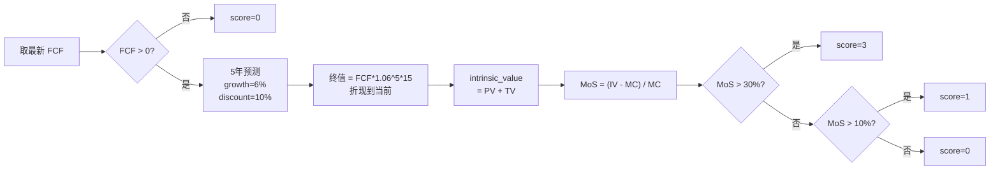
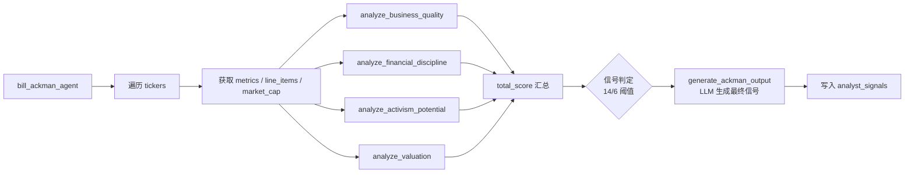

# Bill Ackman Agent 技术文档

## 1. 模块概述

Bill Ackman Agent 是 AI 对冲基金系统中的激进主义价值投资分析代理，模拟 Bill Ackman（Pershing Square Capital）的投资理念。该模块分析企业质量、财务纪律、激进投资潜力和内在价值折扣，最终通过 LLM 生成 Ackman 风格的投资信号。

**源文件**: `src/agents/bill_ackman.py`

**输入**: `AgentState` 类型字典，关键字段：
- `state["data"]["tickers"]` - 股票代码列表 (`list[str]`)
- `state["data"]["end_date"]` - 截止日期 (`str`, YYYY-MM-DD)
- `state["metadata"]["show_reasoning"]` - 是否展示推理 (`bool`)

**输出**: `dict`，包含：
- `"messages"` - 含一条 `HumanMessage` 的列表（内容为 JSON 序列化的分析结果）
- `"data"` - 更新后的 `state["data"]`，其中 `analyst_signals["bill_ackman_agent"]` 写入每只股票的信号

每只股票的最终信号结构：
```python
{
    "signal": "bullish" | "bearish" | "neutral",
    "confidence": float,  # 0-100
    "reasoning": str
}
```

**数据模型 `BillAckmanSignal`**: 仅有三个字段 `signal`、`confidence`、`reasoning`。不存在 `score_breakdown`、`key_metrics` 或其他扩展字段。

**不存在的基础设施**: 本模块内不包含 `BILL_ACKMAN_CONFIG`、`FINANCIAL_THRESHOLDS`、`LLM_CONFIG`、`PERFORMANCE_CONFIG` 等配置字典，不包含 `DataCache`、自定义异常类、性能监控类。

## 2. 核心函数

### 2.1 `bill_ackman_agent(state: AgentState, agent_id: str = "bill_ackman_agent") -> dict`

主入口函数。对 `state["data"]["tickers"]` 中每只股票循环执行以下流程：

1. `get_financial_metrics(ticker, end_date, period="annual", limit=5, api_key=api_key)` 获取最近 5 年年度财务指标
2. `search_line_items(ticker, [...], end_date, period="annual", limit=5, api_key=api_key)` 获取 8 项财务行数据：revenue, operating_margin, debt_to_equity, free_cash_flow, total_assets, total_liabilities, dividends_and_other_cash_distributions, outstanding_shares
3. `get_market_cap(ticker, end_date, api_key=api_key)` 获取市值
4. 调用四个子分析函数
5. 四项得分直接相加，与硬编码的 `max_possible_score = 20` 比较生成初步信号
6. `generate_ackman_output(...)` 通过 LLM 生成最终信号
7. 将 LLM 输出写入 `state["data"]["analyst_signals"][agent_id]`

**返回值**: `{"messages": [message], "data": state["data"]}`

### 2.2 `analyze_business_quality(metrics: list, financial_line_items: list) -> dict`

评估企业质量。参数顺序：先 `metrics`，后 `financial_line_items`。不接受 `ticker` 参数。

**返回值**: `{"score": int, "details": str}`

**评分明细**（实际最高 7 分）：

| 评分项 | 条件 | 得分 |
|--------|------|------|
| 营收增长 | 累计增长率 > 50% | +2 |
| 营收增长 | 累计增长率 > 0% 且 <= 50% | +1 |
| 经营利润率 | 多数期间 operating_margin > 15% | +2 |
| 自由现金流 | 多数期间 FCF > 0 | +1 |
| ROE（仅取最新 metrics[0]） | return_on_equity > 15% | +2 |

营收增长使用 `revenues[-1]`（最早）和 `revenues[0]`（最近）计算简单累计增长率，非年化 CAGR。"多数"定义为 `count >= len // 2 + 1`。

### 2.3 `analyze_financial_discipline(metrics: list, financial_line_items: list) -> dict`

评估财务纪律。参数：`(metrics, financial_line_items)`。

**返回值**: `{"score": int, "details": str}`

**评分明细**（实际最高 4 分）：

| 评分项 | 条件 | 得分 |
|--------|------|------|
| 债务权益比 | 多数期间 debt_to_equity < 1.0 | +2 |
| 负债/资产比（备用） | 多数期间 total_liabilities/total_assets < 50% | +2 |
| 股息支付 | 多数期间 dividends_and_other_cash_distributions < 0 | +1 |
| 股份回购 | shares[0] < shares[-1]（新 < 旧） | +1 |

debt_to_equity 数据可用时使用第一项评分；不可用时退化到 total_liabilities/total_assets。两项互斥。

### 2.4 `analyze_activism_potential(financial_line_items: list) -> dict`

评估激进投资潜力。**仅接受 `financial_line_items` 一个参数**，不接受 `ticker` 或 `metrics`。

**返回值**: `{"score": int, "details": str}`

**评分逻辑**（最高 2 分）：
- 若营收累计增长 > 15% **且** 平均 operating_margin < 10%：+2（有增长但利润率低，存在激进改善空间）
- 否则：0

### 2.5 `analyze_valuation(financial_line_items: list, market_cap: float) -> dict`

DCF 估值。参数：`(financial_line_items, market_cap)`。**不接受 `ticker` 参数**。

**返回值**: `{"score": int, "details": str, "intrinsic_value": float | None, "margin_of_safety": float}`

> **注意**: 当 FCF <= 0 时，早期退出路径返回 `{"score": 0, "details": ..., "intrinsic_value": None}`，**不含** `margin_of_safety` 键。

DCF 模型参数：
- 增长率 `growth_rate = 0.06`
- 折现率 `discount_rate = 0.10`
- 终值倍数 `terminal_multiple = 15`
- 预测年数 `projection_years = 5`

**估值评分**（最高 3 分，非 5 分）：

| 条件 | 得分 |
|------|------|
| margin_of_safety > 0.3 | +3 |
| margin_of_safety > 0.1 | +1 |
| 其他 | 0 |

安全边际计算：`(intrinsic_value - market_cap) / market_cap`

若 FCF <= 0，直接返回 score=0。

### 2.6 `generate_ackman_output(ticker, analysis_data, state, agent_id) -> BillAckmanSignal`

LLM 推理生成。使用 `ChatPromptTemplate` 构造系统提示词（强调品牌、护城河、FCF、杠杆、估值、激进主义），调用 `call_llm(...)` 获取结构化输出。

解析失败时通过 `default_factory` 返回默认值：
```python
BillAckmanSignal(signal="neutral", confidence=0.0, reasoning="Error in analysis, defaulting to neutral")
```

## 3. 分析算法

### 3.1 总分与信号阈值

```python
total_score = quality["score"] + balance_sheet["score"] + activism["score"] + valuation["score"]
max_possible_score = 20  # 硬编码
```

**信号判定**：
- `total_score >= 0.7 * 20 = 14` -> `"bullish"`
- `total_score <= 0.3 * 20 = 6` -> `"bearish"`
- 其余 -> `"neutral"`

**各子分析实际最高分**：

| 子分析 | 实际最高分 |
|--------|-----------|
| analyze_business_quality | 7 |
| analyze_financial_discipline | 4 |
| analyze_activism_potential | 2 |
| analyze_valuation | 3 |
| **合计** | **16** |

max_possible_score 硬编码为 20，但实际可达最高分为 16，意味着达到 bullish（14分）需要在几乎所有维度获得满分。

### 3.2 DCF 估值流程



### 3.3 主流程



## 4. 信号生成

初步信号由评分系统生成后，连同全部分析数据一起传递给 LLM。LLM 拥有最终决定权，可覆盖初步信号。LLM 输出的 `BillAckmanSignal` 即为该股票的最终分析结果。

**LLM 系统提示词关键指令**：
1. 寻找具有持久竞争优势的高质量业务
2. 优先看重持续 FCF 和长期增长潜力
3. 强调财务纪律（合理杠杆、高效资本配置）
4. 以安全边际定位内在价值
5. 考虑管理改善或运营改进可释放的激进投资上行空间
6. 集中投资少数高确信标的

LLM 输出格式：`{"signal": ..., "confidence": 0-100, "reasoning": ...}`

## 5. 依赖关系

### 内部模块

| 导入路径 | 导入内容 | 用途 |
|---------|---------|------|
| `src.graph.state` | `AgentState`, `show_agent_reasoning` | 状态类型、推理展示 |
| `src.tools.api` | `get_financial_metrics`, `get_market_cap`, `search_line_items` | 金融数据获取 |
| `src.utils.progress` | `progress` | 进度状态更新 |
| `src.utils.llm` | `call_llm` | LLM 统一调用 |
| `src.utils.api_key` | `get_api_key_from_state` | API 密钥提取 |

### 外部包

| 包 | 导入内容 | 用途 |
|---|---------|------|
| `langchain_core.prompts` | `ChatPromptTemplate` | LLM 提示词模板 |
| `langchain_core.messages` | `HumanMessage` | 消息对象 |
| `pydantic` | `BaseModel` | 数据模型 |
| `typing_extensions` | `Literal` | 类型约束 |
| `json` | 标准库 | JSON 序列化 |

注意：不依赖 `numpy`、`asyncio`、`logging`、`statistics` 等包。状态模块路径为 `src.graph.state`，非 `src.agents.state`。
