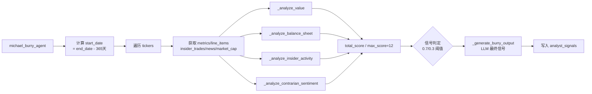

# Michael Burry Agent 技术文档

## 1. 模块概述

Michael Burry Agent 是 AI 对冲基金系统中的深度价值逆向投资分析代理，模拟 Michael Burry 的投资框架：聚焦深度价值（FCF yield、EV/EBIT）、重视资产负债表健康度、利用内部人交易作为硬催化剂、将负面市场情绪视为逆向投资机会。

**源文件**: `src/agents/michael_burry.py`

**输入**: `AgentState` 类型字典，关键字段：
- `state["data"]["tickers"]` - 股票代码列表 (`list[str]`)
- `state["data"]["end_date"]` - 截止日期 (`str`, YYYY-MM-DD)
- `state["metadata"]["show_reasoning"]` - 是否展示推理（通过 `.get("show_reasoning")` 访问）

注意：`start_date` 不从 state 获取，而是由 `end_date` 回溯 365 天动态计算：
```python
start_date = (datetime.fromisoformat(end_date) - timedelta(days=365)).date().isoformat()
```

**输出**: `dict`，包含：
- `"messages"` - 含一条 `HumanMessage` 的列表（JSON 序列化的分析结果）
- `"data"` - 更新后的 `state["data"]`，其中 `analyst_signals["michael_burry_agent"]` 写入信号

每只股票最终信号结构（`MichaelBurrySignal`）：
```python
{
    "signal": "bullish" | "bearish" | "neutral",  # Literal 类型
    "confidence": float,  # 0-100
    "reasoning": str
}
```

**`MichaelBurrySignal(BaseModel)`**: 仅三个字段 `signal`（`Literal["bullish","bearish","neutral"]`）、`confidence`（`float`, 0-100）、`reasoning`（`str`）。不存在 `score_breakdown`、`key_metrics` 或其他扩展字段。

**不存在的基础设施**: 本模块不包含 `MICHAEL_BURRY_CONFIG`、`SCORING_CONFIG`、`SIGNAL_CONFIG` 等配置字典，不包含 `DataCache`、自定义异常类（`DataValidationError`、`CalculationError`、`LLMGenerationError`）或性能监控类。

## 2. 核心函数

### 2.1 `michael_burry_agent(state: AgentState, agent_id: str = "michael_burry_agent") -> dict`

主入口函数。对每只 ticker 循环执行：

1. `get_financial_metrics(ticker, end_date, period="ttm", limit=5, api_key=api_key)` -- 注意使用 `period="ttm"`
2. `search_line_items(ticker, [...], end_date, api_key=api_key)` -- 获取 8 项行数据：free_cash_flow, net_income, total_debt, cash_and_equivalents, total_assets, total_liabilities, outstanding_shares, issuance_or_purchase_of_equity_shares。注意：**未传入 period 和 limit 参数**（使用默认值）
3. `get_insider_trades(ticker, end_date=end_date, start_date=start_date)` -- **无 api_key 参数**
4. `get_company_news(ticker, end_date=end_date, start_date=start_date, limit=250)` -- limit=250
5. `get_market_cap(ticker, end_date, api_key=api_key)`
6. 调用四个子分析函数
7. 动态计算 `max_score` 为各子分析 `max_score` 之和
8. 初步信号判定
9. `_generate_burry_output(...)` LLM 生成最终信号

**返回值**: `{"messages": [message], "data": state["data"]}`

### 2.2 `_latest_line_item(line_items: list)`

辅助函数，返回 `line_items[0]`（最新一期），列表为空时返回 `None`。

### 2.3 `_analyze_value(metrics, line_items, market_cap) -> dict`

深度价值分析。**max_score = 6**（FCF yield 4 分 + EV/EBIT 2 分）。

**返回值**: `{"score": int, "max_score": 6, "details": str}`

**FCF yield 评分**（最高 4 分）：

| 条件 | 得分 |
|------|------|
| fcf_yield >= 15% | +4 |
| fcf_yield >= 12% | +3 |
| fcf_yield >= 8% | +2 |
| 其他 | 0 |

注意：阈值为 15%/12%/8%，不存在 10%/5% 档位。

**EV/EBIT 评分**（最高 2 分）：

| 条件 | 得分 |
|------|------|
| ev_to_ebit < 6 | +2 |
| ev_to_ebit < 10 | +1 |
| 其他 | 0 |

EV/EBIT 从 `metrics[0].ev_to_ebit` 属性获取（使用 `getattr`）。

### 2.4 `_analyze_balance_sheet(metrics, line_items) -> dict`

资产负债表健康度分析。**max_score = 3**。

**返回值**: `{"score": int, "max_score": 3, "details": str}`

**评分明细**：

| 评分项 | 条件 | 得分 |
|--------|------|------|
| 债务权益比（来自 metrics[0].debt_to_equity） | < 0.5 | +2 |
| 债务权益比 | < 1.0 | +1 |
| 净现金头寸 | cash_and_equivalents > total_debt | +1 |

### 2.5 `_analyze_insider_activity(insider_trades) -> dict`

内部人交易催化剂分析。**max_score = 2**。

**返回值**: `{"score": int, "max_score": 2, "details": str}`

**关键实现细节**：使用 `transaction_shares` 的正负号判断买卖方向，**不使用 `transaction_type` 字段**：
```python
shares_bought = sum(t.transaction_shares or 0 for t in insider_trades if (t.transaction_shares or 0) > 0)
shares_sold = abs(sum(t.transaction_shares or 0 for t in insider_trades if (t.transaction_shares or 0) < 0))
net = shares_bought - shares_sold
```

**评分逻辑**：
- `net > 0` 且 `net / max(shares_sold, 1) > 1`：+2（净买入量超过卖出量）
- `net > 0` 但比率 <= 1：+1
- `net <= 0`：0（净卖出）

### 2.6 `_analyze_contrarian_sentiment(news) -> dict`

逆向情绪分析。**max_score = 1**。

**返回值**: `{"score": int, "max_score": 1, "details": str}`

**关键实现细节**：检查新闻对象的 `n.sentiment` **属性**（非字典 `.get()`），然后调用 `.lower()` 比较：
```python
sentiment_negative_count = sum(
    1 for n in news if n.sentiment and n.sentiment.lower() in ["negative", "bearish"]
)
```

匹配的负面关键词为 `["negative", "bearish"]`（检查 sentiment 属性值，不是标题关键词）。

**评分逻辑**：
- `sentiment_negative_count >= 5`：+1（越被厌恶，逆向机会越大）
- 否则：0

### 2.7 `_generate_burry_output(ticker, analysis_data, state, agent_id) -> MichaelBurrySignal`

LLM 推理生成。系统提示词指导 LLM 以 Burry 简洁、数据驱动的风格输出。

默认回退信号：
```python
MichaelBurrySignal(signal="neutral", confidence=0.0, reasoning="Parsing error – defaulting to neutral")
```

## 3. 分析算法

### 3.1 动态 max_score 与信号阈值

```python
total_score = value["score"] + balance_sheet["score"] + insider["score"] + contrarian["score"]
max_score = value["max_score"] + balance_sheet["max_score"] + insider["max_score"] + contrarian["max_score"]
# max_score = 6 + 3 + 2 + 1 = 12
```

**信号判定**（基于动态 max_score）：
- `total_score >= 0.7 * max_score = 8.4` -> `"bullish"`
- `total_score <= 0.3 * max_score = 3.6` -> `"bearish"`
- 其余 -> `"neutral"`

### 3.2 各子分析得分汇总

| 子分析 | max_score | 主要指标 |
|--------|-----------|---------|
| _analyze_value | 6 | FCF yield (4), EV/EBIT (2) |
| _analyze_balance_sheet | 3 | D/E (2), 净现金 (1) |
| _analyze_insider_activity | 2 | 净买入股数比 |
| _analyze_contrarian_sentiment | 1 | 负面情绪新闻计数 |
| **合计** | **12** | |

### 3.3 主流程



## 4. 信号生成

初步信号基于评分系统生成后，全部分析数据（包括 market_cap）传入 LLM。LLM 以 Burry 的简洁、数据驱动风格生成最终 `MichaelBurrySignal`。

**LLM 提示词关键要求**：
1. 以关键指标开头（FCF yield、EV/EBIT）
2. 引用具体数值
3. 突出风险因素及其可接受性
4. 提及内部人交易或逆向机会
5. 使用 Burry 的直接、数字导向风格，措辞精炼

## 5. 依赖关系

### 内部模块

| 导入路径 | 导入内容 | 用途 |
|---------|---------|------|
| `src.graph.state` | `AgentState`, `show_agent_reasoning` | 状态类型、推理展示 |
| `src.tools.api` | `get_company_news`, `get_financial_metrics`, `get_insider_trades`, `get_market_cap`, `search_line_items` | 金融数据获取 |
| `src.utils.llm` | `call_llm` | LLM 统一调用 |
| `src.utils.progress` | `progress` | 进度状态更新 |
| `src.utils.api_key` | `get_api_key_from_state` | API 密钥提取 |

### 外部包

| 包 | 导入内容 | 用途 |
|---|---------|------|
| `__future__` | `annotations` | 延迟类型注解求值 |
| `datetime` | `datetime`, `timedelta` | 日期计算 |
| `json` | 标准库 | JSON 序列化 |
| `typing_extensions` | `Literal` | 类型约束 |
| `langchain_core.messages` | `HumanMessage` | 消息对象 |
| `langchain_core.prompts` | `ChatPromptTemplate` | 提示词模板 |
| `pydantic` | `BaseModel` | 数据模型 |

注意：不依赖 `statistics`、`numpy`、`asyncio`、`logging`。状态模块路径为 `src.graph.state`，非 `src.agents.state` 或 `src.agents.models`。
