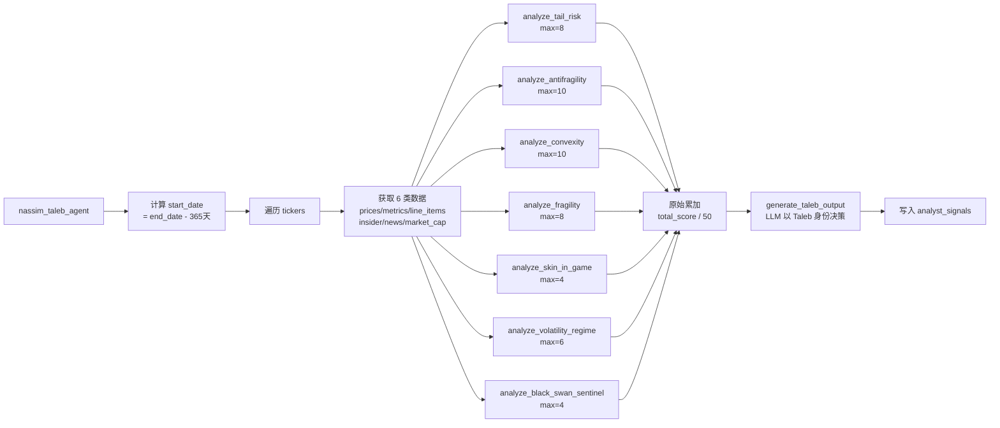

# Nassim Taleb Agent 技术文档

## 1. 模块概述

Nassim Taleb Agent 是 AI 对冲基金系统中的尾部风险与反脆弱性投资分析代理，模拟 Nassim Taleb 的投资理念：追求反脆弱性（Antifragility）、尾部风险管理、非对称收益（凸性）、通过否定法（Via Negativa）回避脆弱企业，以及强调利益相关者的"风险共担"（Skin in the Game）。

**源文件**: `src/agents/nassim_taleb.py`

**输入**: `AgentState` 类型字典，关键字段：
- `state["data"]["tickers"]` - 股票代码列表 (`list[str]`)
- `state["data"]["end_date"]` - 截止日期 (`str`, YYYY-MM-DD)
- `state["metadata"]["show_reasoning"]` - 是否展示推理（直接索引访问，非 `.get()`）

**注意**：本 Agent **不使用** `state["data"]["start_date"]`，而是在函数内部自动计算 `start_date = end_date - 365 天`。

**输出**: `dict`，包含：
- `"messages"` - 含一条 `HumanMessage` 的列表（JSON 序列化的分析结果）
- `"data"` - 更新后的 `state["data"]`，其中 `analyst_signals["nassim_taleb_agent"]` 写入信号

每只股票最终信号结构（`NassimTalebSignal`）：
```python
{
    "signal": "bullish" | "bearish" | "neutral",
    "confidence": int,  # 0-100
    "reasoning": str
}
```

**`NassimTalebSignal(BaseModel)`**：三个字段 `signal`（Literal）、`confidence`（`int`）、`reasoning`（`str`）。

**不存在的基础设施**：本模块不包含任何配置字典、`DataCache`、自定义异常类或性能监控类。

---

## 2. 核心函数

### 2.1 `nassim_taleb_agent(state: AgentState, agent_id: str = "nassim_taleb_agent") -> dict`

主入口函数。函数签名含 `agent_id` 参数，默认值 `"nassim_taleb_agent"`。返回类型为 `dict`。

**start_date 计算**（内部计算，非来自 state）：
```python
start_date = (datetime.fromisoformat(end_date) - timedelta(days=365)).date().isoformat()
```

对每只 ticker 循环执行：
1. `get_prices(ticker, start_date, end_date, api_key=api_key)`
   - 若无数据：`prices_df = pd.DataFrame()`（空 DataFrame，不跳过 ticker）
2. `get_financial_metrics(ticker, end_date, period="ttm", limit=10, api_key=api_key)`
3. `search_line_items(ticker, [...11项...], end_date, period="ttm", limit=5, api_key=api_key)`
4. `get_insider_trades(ticker, end_date=end_date, start_date=start_date)` — 传入 start_date（过去365天）
5. `get_company_news(ticker, end_date=end_date, start_date=start_date, limit=100)` — limit=100，传入 start_date
6. `get_market_cap(ticker, end_date, api_key=api_key)`
7. 依次调用七个子分析函数
8. 原始累加所有子分析得分（无归一化）
9. `generate_taleb_output(...)` LLM 生成最终信号

`search_line_items` 请求的 11 个字段：
```python
["free_cash_flow", "net_income", "total_debt", "cash_and_equivalents",
 "total_assets", "total_liabilities", "revenue", "operating_income",
 "research_and_development", "capital_expenditure", "outstanding_shares"]
```

**信号聚合方式**（区别于其他 Agent）：
```python
total_score = sum([各子分析 score])
max_possible_score = sum([各子分析 max_score])
# 不归一化到 0-10，不设置信号阈值
# 将 total_score / max_possible_score 作为事实直接传给 LLM
```

总 max_possible_score = 8 + 10 + 10 + 8 + 4 + 6 + 4 = **50**

---

## 3. 子分析函数

### 3.0 `safe_float(value, default=0.0) -> float`

辅助函数。安全地将值转换为 float，处理 NaN 和类型错误；转换失败时返回 `default`（默认 `0.0`）。

---

### 3.1 `analyze_tail_risk(prices_df: pd.DataFrame) -> dict`

尾部风险分析。参数：`(prices_df)`。

**前置条件**：`prices_df.empty or len(prices_df) < 20` 时返回 `{"score": 0, "max_score": 8, ...}`。

**返回值**：`{"score": int, "max_score": 8, "details": str}`

**四个维度**（各最高 2 分，合计最高 8 分）：

**1. 超额峰度（Excess Kurtosis）**：
- 若 `len(returns) >= 63`：使用 63 日滚动峰度末值；否则使用全序列峰度

| 条件 | 得分 |
|------|------|
| kurtosis > 5 | +2（极胖尾） |
| kurtosis > 2 | +1（中等胖尾） |
| 其他 | 0（近高斯，"可疑的细尾"） |

**2. 偏度（Skewness）**：
- 若 `len(returns) >= 63`：使用 63 日滚动偏度末值；否则使用全序列偏度

| 条件 | 得分 |
|------|------|
| skew > 0.5 | +2（正偏度，利好多头凸性） |
| skew > -0.5 | +1（对称分布） |
| 其他 | 0（负偏度，易崩盘） |

**3. 尾部比率（Tail Ratio）**：
- 需要 `len(positive_returns) > 20 and len(negative_returns) > 20`
- `right_tail = np.percentile(positive_returns, 95)`
- `left_tail = abs(np.percentile(negative_returns, 5))`
- `tail_ratio = right_tail / left_tail`

| 条件 | 得分 |
|------|------|
| tail_ratio > 1.2 | +2（上行不对称） |
| tail_ratio > 0.8 | +1（尾部平衡） |
| 其他 | 0（下行不对称） |

**4. 最大回撤（Max Drawdown）**：
- 使用累积收益率序列计算全期最大回撤

| 条件 | 得分 |
|------|------|
| max_dd > -15% | +2（韧性强） |
| max_dd > -30% | +1（中等回撤） |
| 其他 | 0（严重回撤，脆弱） |

---

### 3.2 `analyze_antifragility(metrics: list, line_items: list, market_cap: float | None) -> dict`

反脆弱性分析（从无序中受益）。

**前置条件**：`not metrics and not line_items` 时返回 `{"score": 0, "max_score": 10, ...}`。

**返回值**：`{"score": int, "max_score": 10, "details": str}`

**四个维度（合计最高 10 分）**：

**1. 净现金仓位**（最高 3 分）：
| 条件 | 得分 |
|------|------|
| net_cash > 0 且 cash > 20% market_cap | +3（弹药库） |
| net_cash > 0 | +2（净现金为正） |
| debt < 30% total_assets | +1（可管理的净债务） |
| 其他 | 0（高杠杆，非反脆弱） |

**2. 债务权益比**（最高 2 分）：使用 `debt_to_equity` 指标
| 条件 | 得分 |
|------|------|
| D/E < 0.3 | +2（Taleb 认可的低杠杆） |
| D/E < 0.7 | +1 |
| 其他 | 0 |

**3. 营业利润率稳定性**（最高 3 分）：使用变异系数 CV（需要 >= 3 期历史数据）
```python
cv = std(operating_margins) / abs(mean(operating_margins))
```
| 条件 | 得分 |
|------|------|
| CV < 0.15 且 avg > 15% | +3（稳定高利润率，反脆弱定价权） |
| CV < 0.30 且 avg > 10% | +2 |
| CV < 0.30 | +1 |
| 其他 | 0（利润率波动大，脆弱） |

**4. 自由现金流一致性**（最高 2 分）：遍历所有 line_items
| 条件 | 得分 |
|------|------|
| 全部期间 FCF > 0 | +2 |
| 多数期间 FCF > 0 | +1 |
| 其他 | 0 |

---

### 3.3 `analyze_convexity(metrics: list, line_items: list, prices_df: pd.DataFrame, market_cap: float | None) -> dict`

凸性分析（非对称收益潜力）。

**前置条件**：`not metrics and not line_items and prices_df.empty` 时返回 `{"score": 0, "max_score": 10, ...}`。

**返回值**：`{"score": int, "max_score": 10, "details": str}`

**四个维度（合计最高 10 分）**：

**1. R&D 期权性**（最高 3 分）：`rd_ratio = abs(research_and_development) / revenue`
| 条件 | 得分 |
|------|------|
| rd_ratio > 15% | +3（重大嵌入期权性） |
| rd_ratio > 8% | +2 |
| rd_ratio > 3% | +1 |
| 其他 | 0（非 R&D 行业不扣分） |

**2. 涨跌幅非对称比**（最高 2 分）：需要 `len(prices_df) >= 20`，`len(upside) > 10 and len(downside) > 10`
```python
up_down_ratio = avg_gain / abs(avg_loss)
```
| 条件 | 得分 |
|------|------|
| up_down_ratio > 1.3 | +2（凸性收益分布） |
| up_down_ratio > 1.0 | +1（轻微正不对称） |
| 其他 | 0（凹性，不利） |

**3. 现金期权性（cash / market_cap）**（最高 3 分）：
| 条件 | 得分 |
|------|------|
| cash_ratio > 30% | +3（现金是未来机会的看涨期权） |
| cash_ratio > 15% | +2 |
| cash_ratio > 5% | +1 |
| 其他 | 0 |

**4. 自由现金流收益率（FCF Yield）**（最高 2 分）：
- 优先用 `free_cash_flow / market_cap` 计算；若无数据则从 `FinancialMetrics.free_cash_flow_yield` 获取
| 条件 | 得分 |
|------|------|
| fcf_yield > 10% | +2 |
| fcf_yield > 5% | +1 |
| 其他 | 0 |

---

### 3.4 `analyze_fragility(metrics: list, line_items: list) -> dict`

脆弱性分析（否定法）。**高分 = 非脆弱**。

**前置条件**：`not metrics` 时返回 `{"score": 0, "max_score": 8, ...}`。

**返回值**：`{"score": int, "max_score": 8, "details": str}`（末尾 `score = max(score, 0)` 防止负分）

**四个维度（合计最高 8 分）**：

**1. 财务杠杆脆弱性**（最高 3 分）：
| 条件 | 得分 |
|------|------|
| D/E <= 0.5 | +3（低杠杆，非脆弱） |
| 0.5 < D/E <= 1.0 | +2（中等杠杆） |
| 1.0 < D/E <= 2.0 | +1（偏高杠杆） |
| D/E > 2.0 | 0（极度脆弱资产负债表） |

**2. 利息覆盖率**（最高 2 分）：
| 条件 | 得分 |
|------|------|
| interest_coverage > 10 | +2（债务无关紧要） |
| interest_coverage > 5 | +1 |
| 其他 | 0（对利率变化脆弱） |

**3. 盈利波动性**（最高 2 分）：使用 `earnings_growth` 字段的标准差，需要 >= 3 期历史
| 条件 | 得分 |
|------|------|
| std < 0.20 | +2（稳定盈利，强韧性） |
| std < 0.50 | +1（中等波动） |
| 其他 | 0（高波动，脆弱） |

**4. 净利润率缓冲**（最高 1 分）：
| 条件 | 得分 |
|------|------|
| net_margin > 15% | +1（厚利润率缓冲冲击） |
| 5% <= net_margin <= 15% | 0 |
| net_margin < 5% | 0（薄利润率，单次冲击即亏损） |

---

### 3.5 `analyze_skin_in_game(insider_trades: list) -> dict`

风险共担分析。

**默认值（无数据）**：`{"score": 1, "max_score": 4, "details": "No insider trade data — neutral assumption"}`（返回 1 而非 0）

**返回值**：`{"score": int, "max_score": 4, "details": str}`

**计算方式**：按股数（非笔数）统计净买入
```python
shares_bought = sum(正数 transaction_shares)
shares_sold = abs(sum(负数 transaction_shares))
net = shares_bought - shares_sold
buy_sell_ratio = net / max(shares_sold, 1)
```

| 条件 | 得分 |
|------|------|
| net > 0 且 buy_sell_ratio > 2.0 | 4（强烈风险共担） |
| net > 0 且 buy_sell_ratio > 0.5 | 3（中等内部人信念） |
| net > 0 | 2（净买入） |
| net <= 0 | 0（内部人在卖出，无风险共担） |

---

### 3.6 `analyze_volatility_regime(prices_df: pd.DataFrame) -> dict`

波动率状态分析。Taleb 核心洞察：低波动是危险的（火鸡问题）。

**前置条件**：`prices_df.empty or len(prices_df) < 30` 时返回 `{"score": 0, "max_score": 6, ...}`。

**返回值**：`{"score": int, "max_score": 6, "details": str}`

**历史波动率计算**：21 日滚动标准差年化：`hist_vol = returns.rolling(21).std() * sqrt(252)`

**波动率状态比**：
- 若 `len(hist_vol.dropna()) >= 63`：`vol_regime = current_vol / rolling_63d_mean_vol`
- 若 >= 21：`vol_regime = current_vol / overall_mean_vol`（降级）
- 否则：返回 `{"score": 0, "max_score": 6, ...}`

**波动率状态评分**（最高 4 分）：
| vol_regime 范围 | 得分 | 含义 |
|----------------|------|------|
| < 0.7 | 0 | 危险的低波动率（火鸡问题） |
| 0.7 ~ 0.9 | +1 | 低于均值（接近自满） |
| 0.9 ~ 1.3 | +3 | 正常波动状态（合理定价） |
| 1.3 ~ 2.0 | +4 | 较高波动（反脆弱者的机会） |
| > 2.0 | +2 | 极端波动（危机模式） |

**波动率的波动率（Vol-of-Vol）评分**（最高 2 分）：需要 `len(hist_vol.dropna()) >= 42`
```python
vol_of_vol = hist_vol.rolling(21).std()
```
| 条件 | 得分 |
|------|------|
| current_vov > 2 × median_vov | +2（高度不稳定，状态切换信号） |
| current_vov > median_vov | +1（偏高 vol-of-vol） |
| 其他 | 0 |

---

### 3.7 `analyze_black_swan_sentinel(news: list, prices_df: pd.DataFrame) -> dict`

黑天鹅信号监控。

**默认得分为 2**（非 0），代表正常条件。

**返回值**：`{"score": int, "max_score": 4, "details": str}`

**新闻情绪分析**：使用 `n.sentiment` 属性（不是关键词搜索 title），检查 `n.sentiment.lower() in ["negative", "bearish"]`

**成交量突刺检测**（需要 `not prices_df.empty and len(prices_df) >= 10`）：
```python
recent_vol = prices_df["volume"].iloc[-5:].mean()
avg_vol = prices_df["volume"].iloc[-63:].mean() if len(prices_df) >= 63 else prices_df["volume"].mean()
volume_spike = recent_vol / avg_vol if avg_vol > 0 else 1.0
```

> **注意**：当 `prices_df.empty or len(prices_df) < 10` 时，`volume_spike` 保持默认值 `1.0`，`recent_return` 保持 `0.0`，评分逻辑仍会执行（仅基于新闻情绪）。

**近期价格变动**（需要 `len(prices_df) >= 5`）：`recent_return = close[-1] / close[-5] - 1`

**评分逻辑**（优先级从高到低）：
| 条件 | score | 含义 |
|------|-------|------|
| neg_ratio > 70% 且 volume_spike > 2.0 | 0 | 黑天鹅警告 |
| neg_ratio > 50% 或 volume_spike > 2.5 | 1 | 高压力信号 |
| neg_ratio > 30% 且 \|recent_return\| > 10% | 1 | 中等压力+价格错位 |
| neg_ratio < 30% 且 volume_spike < 1.5 | 3 | 无黑天鹅信号 |
| 其他 | 2（维持默认） | 正常条件 |

**逆向加成**：若 `neg_ratio > 40% and volume_spike < 1.5 and score < 4`，则 `score = min(score + 1, 4)`（负面情绪但无恐慌性抛售 = 逆向机会）

---

## 4. 信号生成

### 4.1 `generate_taleb_output(ticker, analysis_data, state, agent_id) -> NassimTalebSignal`

LLM 以 Nassim Taleb 身份做决策。

**传入 LLM 的事实**（精简字典）：
```python
facts = {
    "score": total_score,
    "max_score": max_possible_score,
    "tail_risk": tail_risk_analysis["details"],
    "antifragility": antifragility_analysis["details"],
    "convexity": convexity_analysis["details"],
    "fragility": fragility_analysis["details"],
    "skin_in_game": skin_in_game_analysis["details"],
    "volatility_regime": volatility_regime_analysis["details"],
    "black_swan": black_swan_analysis["details"],
    "market_cap": market_cap,
}
```

**LLM 信号规则**：
- **Bullish**：反脆弱业务 + 凸性收益 + 非脆弱
- **Bearish**：脆弱业务（高杠杆、薄利润率、盈利波动大）或无风险共担
- **Neutral**：混合信号，或数据不足

**置信度范围**：
- 90-100%：真正反脆弱且有强凸性和风险共担
- 70-89%：低脆弱性有合理期权性
- 50-69%：混合脆弱性信号
- 30-49%：检测到一定脆弱性
- 10-29%：明显脆弱或危险波动状态

**LLM 提示词**：要求使用 Taleb 词汇（antifragile, convexity, skin in the game, via negativa, barbell, turkey problem, Lindy effect），reasoning 限制在 150 个字符内。

**JSON 格式**：`json.dumps(facts, separators=(",", ":"), ensure_ascii=False)`

**默认回退**：
```python
NassimTalebSignal(signal="neutral", confidence=50, reasoning="Insufficient data")
```

---

## 5. 分析算法总览

### 5.1 评分汇总

```python
total_score = (
    tail_risk_analysis["score"]       # max 8
    + antifragility_analysis["score"] # max 10
    + convexity_analysis["score"]     # max 10
    + fragility_analysis["score"]     # max 8
    + skin_in_game_analysis["score"]  # max 4
    + volatility_regime_analysis["score"]  # max 6
    + black_swan_analysis["score"]    # max 4
)
max_possible_score = 50
```

**隐式权重**：各子分析的 max_score 即为其隐式权重，无显式百分比权重分配。

| 维度 | max_score | 隐式权重 |
|------|-----------|---------|
| 尾部风险 | 8 | 16% |
| 反脆弱性 | 10 | 20% |
| 凸性 | 10 | 20% |
| 脆弱性（否定法） | 8 | 16% |
| 风险共担 | 4 | 8% |
| 波动率状态 | 6 | 12% |
| 黑天鹅哨兵 | 4 | 8% |
| **合计** | **50** | **100%** |

### 5.2 主流程



### 5.3 与其他 Agent 的主要差异

| 特性 | Nassim Taleb Agent | 其他典型 Agent |
|------|-------------------|---------------|
| start_date 来源 | 内部计算（end_date - 365天） | 来自 state["data"]["start_date"] |
| 价格无数据处理 | 使用空 DataFrame，不跳过 | 通常直接跳过 ticker |
| 评分汇总 | 原始累加，不归一化至 0-10 | 各维度归一化至 0-10 后加权 |
| 信号阈值 | 无（直接传 score/max_score 给 LLM） | 有固定阈值（如 7.5/4.5） |
| 新闻情绪检测 | 使用 n.sentiment 属性 | 使用 news.title 关键词匹配 |
| confidence 类型 | `int` | `float`（大多数 Agent） |
| 无数据默认 confidence | 50 | 0.0 |
| insider 无数据默认 score | 1（中性假设） | 通常 0 或 5 |

---

## 6. 依赖关系

### 内部模块

| 导入路径 | 导入内容 | 用途 |
|---------|---------|------|
| `src.graph.state` | `AgentState`, `show_agent_reasoning` | 状态类型、推理展示 |
| `src.tools.api` | `get_company_news`, `get_financial_metrics`, `get_insider_trades`, `get_market_cap`, `get_prices`, `prices_to_df`, `search_line_items` | 金融数据获取（7 个函数） |
| `src.utils.llm` | `call_llm` | LLM 统一调用 |
| `src.utils.progress` | `progress` | 进度状态更新 |
| `src.utils.api_key` | `get_api_key_from_state` | API 密钥提取 |

### 外部包

| 包 | 导入内容 | 用途 |
|---|---------|------|
| `langchain_core.prompts` | `ChatPromptTemplate` | LLM 提示词模板 |
| `langchain_core.messages` | `HumanMessage` | 消息对象 |
| `pydantic` | `BaseModel`, `Field` | 数据模型 |
| `typing_extensions` | `Literal` | 类型约束 |
| `json` | 标准库 | JSON 序列化 |
| `math` | `math.sqrt` | 年化波动率计算 |
| `datetime` | `datetime`, `timedelta` | start_date 计算 |
| `numpy` | `np.percentile`, `np.isnan` | 尾部比率、NaN 处理 |
| `pandas` | `pd.DataFrame` | 价格数据处理 |

注意：本 Agent 是所有分析师中导入依赖最多的，同时使用了 `math`、`datetime`、`numpy` 和 `pandas`。
