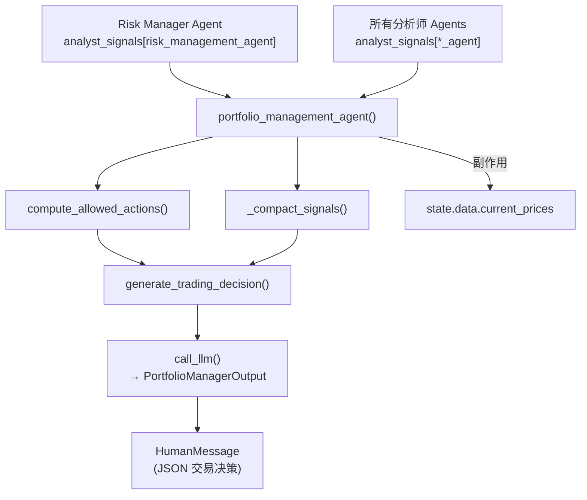

# Portfolio Manager Agent 模块技术文档

## 第1章 模块概述

### 核心功能和设计目标

Portfolio Manager Agent 是 AI 对冲基金系统的最终决策层，负责汇总所有分析师信号并生成具体的交易指令。该模块的核心架构决策：

1. **确定性约束先行**：通过 `compute_allowed_actions()` 在 LLM 调用之前确定性地计算每只股票的所有允许操作和最大数量，LLM 只需在预定义的动作空间中选择
2. **无交易标的预填充**：只有 `{"hold": 0}` 可选的标的被直接填充为 hold 决策（confidence=100），不发送给 LLM，节省 token 和延迟
3. **信号压缩**：通过 `_compact_signals()` 将 `"signal"/"confidence"` 键压缩为 `"sig"/"conf"`，减少 prompt 体积
4. **多实例支持**：通过 agent_id 后缀机制支持多个 Portfolio Manager 实例，每个实例自动关联对应的 Risk Manager

### 模块职责与协作关系

- **上游依赖**：从 `analyst_signals` 读取所有分析师信号和对应 Risk Manager 的仓位约束
- **核心职责**：生成具体的交易指令（action、quantity、confidence、reasoning）
- **下游输出**：通过 HumanMessage 输出 JSON 格式的交易决策；同时将 `current_prices` 作为副作用写入 `state["data"]`

### 输入数据格式

```python
{
    "data": {
        "tickers": ["AAPL", "MSFT"],
        "portfolio": {
            "cash": 100000.0,
            "margin_requirement": 0.5,           # 保证金比例
            "margin_used": 15000.0,              # 已使用保证金
            # 注意：equity 不是 PortfolioSnapshot 的字段，portfolio_manager.py 以
            # portfolio.get("equity", cash) 读取，无此键时回退为 cash 值
            "positions": {
                "AAPL": {
                    "long": 50, "short": 0,
                    "long_cost_basis": 150.0, "short_cost_basis": 0.0
                }
            }
        },
        "analyst_signals": {
            "warren_buffett_agent": {
                "AAPL": {"signal": "bullish", "confidence": 85}
            },
            "risk_management_agent": {           # Risk Manager 输出
                "AAPL": {
                    "remaining_position_limit": 15000.0,
                    "current_price": 178.50
                }
            }
        }
    },
    "metadata": {
        "show_reasoning": True,
        "model_name": "gpt-5.5",
        "model_provider": "OpenAI"
    }
}
```

### 输出数据格式

```python
# HumanMessage.content 中的 JSON（每只 ticker 一个 PortfolioDecision）
{
    "AAPL": {
        "action": "buy",                    # "buy"|"sell"|"short"|"cover"|"hold"
        "quantity": 85,                     # 交易股数（int，非 float）
        "confidence": 78,                   # 决策置信度（int，0-100）
        "reasoning": "Strong bullish consensus across analysts"
    },
    "MSFT": {
        "action": "hold",
        "quantity": 0,
        "confidence": 100,                  # 预填充的 hold 决策置信度为 100
        "reasoning": "No valid trade available"
    }
}
```

**注意**：
- `confidence` 字段类型为 `int`，不是 `float`
- 预填充的 hold 决策 reasoning 为 `"No valid trade available"`
- LLM 失败时的默认 hold 决策 reasoning 为 `"Default decision: hold"`，confidence 为 0

---

## 第2章 核心函数

### 2.1 PortfolioDecision（数据模型）

**文件**：`src/agents/portfolio_manager.py`，第 13-17 行

```python
class PortfolioDecision(BaseModel):
    action: Literal["buy", "sell", "short", "cover", "hold"]
    quantity: int = Field(description="Number of shares to trade")
    confidence: int = Field(description="Confidence 0-100")
    reasoning: str = Field(description="Reasoning for the decision")
```

**关键字段类型**：
- `action`：Literal 限制为 5 种操作
- `quantity`：`int`（非 float）
- `confidence`：`int`（非 float），范围 0-100

### 2.2 PortfolioManagerOutput（数据模型）

**文件**：`src/agents/portfolio_manager.py`，第 20-21 行

```python
class PortfolioManagerOutput(BaseModel):
    decisions: dict[str, PortfolioDecision] = Field(description="Dictionary of ticker to trading decisions")
```

### 2.3 portfolio_management_agent()

**文件**：`src/agents/portfolio_manager.py`，第 25-93 行

```python
def portfolio_management_agent(state: AgentState, agent_id: str = "portfolio_manager") -> dict:
    """Makes final trading decisions and generates orders for multiple tickers"""
```

**参数**：

| 参数 | 类型 | 默认值 | 说明 |
|------|------|--------|------|
| `state` | `AgentState` | - | LangGraph 状态对象 |
| `agent_id` | `str` | `"portfolio_manager"` | 支持多实例后缀 |

**返回值**：
```python
{
    "messages": state["messages"] + [HumanMessage(content=json_decisions, name=agent_id)],
    "data": state["data"]   # 注意：current_prices 已作为副作用写入
}
```

**核心逻辑**：
1. 解析 risk_manager_id（见下方多实例机制）
2. 遍历 tickers：从 risk_data 提取 `position_limits` 和 `current_prices`，计算 `max_shares`
3. 遍历 tickers：压缩分析师信号为 `{agent: {"sig": ..., "conf": ...}}` 格式（过滤 risk_management_agent 前缀）
4. **副作用**：将 `current_prices` 写入 `state["data"]["current_prices"]`
5. 调用 `generate_trading_decision()` 获取决策
6. 序列化决策为 JSON 消息

**Risk Manager ID 多实例解析**（第 40-44 行）：
```python
if agent_id.startswith("portfolio_manager_"):
    suffix = agent_id.split('_')[-1]           # 提取最后一个 _ 后的部分
    risk_manager_id = f"risk_management_agent_{suffix}"
else:
    risk_manager_id = "risk_management_agent"   # CLI 模式的默认值
```

**show_reasoning 标签**：`"Portfolio Manager"`

---

### 2.4 compute_allowed_actions()

**文件**：`src/agents/portfolio_manager.py`，第 96-157 行

```python
def compute_allowed_actions(
        tickers: list[str],
        current_prices: dict[str, float],
        max_shares: dict[str, int],
        portfolio: dict[str, float],
) -> dict[str, dict[str, int]]:
    """Compute allowed actions and max quantities for each ticker deterministically."""
```

**这是模块的核心架构决策**：在 LLM 调用之前，确定性地计算每只股票所有允许的操作及其最大数量。

**参数**：

| 参数 | 类型 | 说明 |
|------|------|------|
| `tickers` | `list[str]` | 目标股票列表 |
| `current_prices` | `dict[str, float]` | 当前价格（来自 Risk Manager） |
| `max_shares` | `dict[str, int]` | Risk Manager 限额对应的最大股数 |
| `portfolio` | `dict` | 组合状态（cash, positions, margin_requirement, margin_used, equity） |

**返回值**：`dict[str, dict[str, int]]` -- 每只 ticker 的允许操作及最大数量

**每种操作的计算逻辑**：

| 操作 | 计算公式 | 条件 |
|------|---------|------|
| `buy` | `min(max_qty_from_risk, int(cash // price))` | `cash > 0 and price > 0` |
| `sell` | `long_shares`（当前多头持仓数） | `long_shares > 0` |
| `short` | `min(max_qty, int(available_margin // price))` | `price > 0 and max_qty > 0` |
| `cover` | `short_shares`（当前空头持仓数） | `short_shares > 0` |
| `hold` | `0`（始终存在） | 无条件 |

**做空保证金计算**：
```python
available_margin = max(0.0, (equity / margin_requirement) - margin_used)
max_short = min(max_qty, int(available_margin // price))
```

当 `margin_requirement <= 0.0` 时，不做保证金约束，`max_short = max_qty`。

**输出裁剪**：值为 0 的操作（除 hold 外）被移除以减少 token 消耗。例如：
- 有多头持仓且可买入：`{"buy": 50, "sell": 100, "hold": 0}`
- 只能持有：`{"hold": 0}`

---

### 2.5 _compact_signals()

**文件**：`src/agents/portfolio_manager.py`，第 160-174 行

```python
def _compact_signals(signals_by_ticker: dict[str, dict]) -> dict[str, dict]:
    """Keep only {agent: {sig, conf}} and drop empty agents."""
```

**功能**：进一步压缩信号字典，确保键名统一为 `"sig"` 和 `"conf"`（而非 `"signal"` 和 `"confidence"`）。

**输入示例**（`"signal"/"confidence"` 格式）：
```python
{"AAPL": {"warren_buffett_agent": {"signal": "bullish", "confidence": 85}}}
```

**输出示例**（标准化为 `"sig"/"conf"`）：
```python
{"AAPL": {"warren_buffett_agent": {"sig": "bullish", "conf": 85}}}
```

**兼容性**：同时支持 `"sig"/"conf"` 和 `"signal"/"confidence"` 两种键名输入（第 169-170 行）。若输入已是 `"sig"/"conf"` 格式则为无操作传递。

---

### 2.6 generate_trading_decision()

**文件**：`src/agents/portfolio_manager.py`，第 177-262 行

```python
def generate_trading_decision(
        tickers: list[str],
        signals_by_ticker: dict[str, dict],
        current_prices: dict[str, float],
        max_shares: dict[str, int],
        portfolio: dict[str, float],
        agent_id: str,
        state: AgentState,
) -> PortfolioManagerOutput:
    """Get decisions from the LLM with deterministic constraints and a minimal prompt."""
```

**核心流程**：

1. **计算允许操作**：调用 `compute_allowed_actions()` 获取所有标的的约束
2. **预填充 hold 决策**：遍历 tickers，若 `set(allowed.keys()) == {"hold"}`，直接创建 hold 决策（confidence=100, reasoning="No valid trade available"），不发送给 LLM
3. **提前返回**：若所有标的都被预填充，直接返回，不调用 LLM
4. **压缩信号**：对需要 LLM 决策的标的调用 `_compact_signals()`
5. **构建 prompt**：使用 `ChatPromptTemplate` 构建最小化英文 prompt
6. **调用 LLM**：通过 `call_llm()` 获取结构化输出
7. **合并结果**：将预填充的 hold 决策与 LLM 返回的决策合并

**LLM Prompt**（英文，第 212-233 行）：

System message:
```
You are a portfolio manager.
Inputs per ticker: analyst signals and allowed actions with max qty (already validated).
Pick one allowed action per ticker and a quantity <= the max.
Keep reasoning very concise (max 100 chars). No cash or margin math. Return JSON only.
```

Human message:
```
Signals:
{signals}

Allowed:
{allowed}

Format:
{
  "decisions": {
    "TICKER": {"action":"...","quantity":int,"confidence":int,"reasoning":"..."}
  }
}
```

**Prompt 变量**：
- `{signals}`：`json.dumps(compact_signals, separators=(",", ":"), ensure_ascii=False)` -- 紧凑 JSON，保留非 ASCII 字符
- `{allowed}`：`json.dumps(compact_allowed, separators=(",", ":"), ensure_ascii=False)` -- 紧凑 JSON

**默认工厂函数**（LLM 失败时）：
```python
def create_default_portfolio_output():
    decisions = dict(prefilled_decisions)       # 保留预填充的 hold
    for t in tickers_for_llm:
        decisions[t] = PortfolioDecision(
            action="hold", quantity=0, confidence=0.0, reasoning="Default decision: hold"
        )
    return PortfolioManagerOutput(decisions=decisions)
```

注意：默认工厂中 confidence 写为 `0.0`，但 PortfolioDecision.confidence 类型为 `int`，Pydantic 会自动转换。

---

## 第3章 处理流程

```mermaid
flowchart LR
    A["portfolio_management_agent()"] --> B["解析 risk_manager_id\n（多实例后缀）"]
    B --> C["遍历 tickers:\n提取 position_limits,\ncurrent_prices, max_shares"]
    C --> D["遍历 tickers:\n压缩分析师信号\n过滤 risk_management_agent"]
    D --> E["副作用: 写入\nstate.data.current_prices"]
    E --> F["generate_trading_decision()"]
    F --> G["compute_allowed_actions()\n确定性计算约束"]
    G --> H{"每个 ticker:\nallowed == hold only?"}
    H -->|是| I["预填充 hold 决策\nconfidence=100\nreasoning='No valid trade available'"]
    H -->|否| J["加入 tickers_for_llm"]
    I --> K{所有 ticker\n都预填充?}
    J --> K
    K -->|是| L["直接返回\n不调用 LLM"]
    K -->|否| M["_compact_signals()\n压缩 sig/conf"]
    M --> N["构建英文 prompt\nsignals + allowed"]
    N --> O["call_llm()\nPortfolioManagerOutput"]
    O --> P["合并: prefilled + LLM 结果"]
    P --> Q["序列化为 HumanMessage\n返回 messages + data"]
    L --> Q
```



### 关键流程细节

**1. 信号压缩流程**（第 57-64 行）

在 `portfolio_management_agent()` 中首次压缩信号时：
- 过滤掉所有 `agent.startswith("risk_management_agent")` 的信号
- 将 `"signal"` 键改为 `"sig"`，`"confidence"` 键改为 `"conf"`
- 忽略 signal 或 confidence 为 None 的信号

在 `_compact_signals()` 中二次压缩时：
- 兼容处理 `"sig"/"conf"` 和 `"signal"/"confidence"` 两种键名
- 对无 agent 信号的 ticker，保留 ticker 键但值为空字典 `{}`（不丢弃 ticker 本身）

**2. 预填充优化**（第 194-205 行）

这是关键的性能优化：如果一只股票除了 hold 之外没有其他可用操作，就不需要 LLM 来判断，直接填充 hold。这种情况出现在：
- 没有现金可买入
- 没有持仓可卖出/平仓
- 没有保证金可做空
- Risk Manager 不允许新增仓位（remaining_position_limit <= 0）

**3. LLM 调用最小化**

Prompt 设计刻意简洁：
- 明确告诉 LLM "No cash or margin math"，所有约束已预计算
- 要求 reasoning 不超过 100 字符
- 使用 `separators=(",", ":")` 紧凑 JSON 格式
- 只发送需要 LLM 决策的标的

---

## 第4章 决策逻辑

### 4.1 约束空间计算

`compute_allowed_actions()` 为每只股票构建一个确定性的动作空间，LLM 只能在这个空间内选择。这确保了：

- **买入约束**：数量不超过 `min(risk_manager_limit, cash_can_afford)`
- **卖出约束**：数量等于当前多头持仓（全部卖出或不卖）
- **做空约束**：数量不超过 `min(risk_manager_limit, margin_can_afford)`
- **平仓约束**：数量等于当前空头持仓（全部平仓或不平）
- **持有**：始终可用

### 4.2 决策分类

| 决策来源 | action | confidence | reasoning | 何时触发 |
|---------|--------|-----------|-----------|---------|
| 预填充 | hold | 100 | "No valid trade available" | `allowed == {"hold": 0}` |
| LLM 正常返回 | any | 0-100 | LLM 生成 | LLM 成功解析 |
| LLM 失败默认 | hold | 0 | "Default decision: hold" | LLM 调用或解析失败 |

### 4.3 多实例架构

当系统运行多个 Portfolio Manager 实例时（例如 Web 应用中）：

```
agent_id = "portfolio_manager_abc123"
    → suffix = "abc123"
    → risk_manager_id = "risk_management_agent_abc123"
```

这确保每个 Portfolio Manager 读取自己对应的 Risk Manager 输出。CLI 模式下使用默认的 `"risk_management_agent"`。

### 4.4 current_prices 副作用

第 66 行 `state["data"]["current_prices"] = current_prices` 是一个显式副作用，将从 Risk Manager 获取的价格数据暴露到 state 中供下游使用（如回测引擎或前端展示）。

---

## 第5章 依赖关系

### 外部库

| 依赖 | 导入 | 用途 |
|------|------|------|
| `langchain-core` | `HumanMessage` | 构造 LangGraph 消息 |
| `langchain-core` | `ChatPromptTemplate` | 构建 LLM prompt |
| `pydantic` | `BaseModel`, `Field` | 数据模型定义和验证 |
| `typing-extensions` | `Literal` | 限定 action 的合法值 |
| `json` | `json.dumps` | 序列化决策和 prompt 数据 |
| `time` | - | 已导入但当前代码未直接使用 |

### 内部模块

| 模块路径 | 导入对象 | 用途 |
|---------|---------|------|
| `src.graph.state` | `AgentState` | 状态类型定义 |
| `src.graph.state` | `show_agent_reasoning` | 打印推理信息 |
| `src.utils.progress` | `progress` | 进度状态更新 |
| `src.utils.llm` | `call_llm` | 统一 LLM 调用接口（含重试、结构化输出、default_factory） |

### 数据流依赖图



### 与 Risk Manager 的耦合关系

Portfolio Manager 从 Risk Manager 输出中读取以下字段：
- `remaining_position_limit`：用于计算 `max_shares`（`int(limit // price)`）
- `current_price`：用于所有价格相关计算

其他 Risk Manager 输出字段（`volatility_metrics`、`correlation_metrics`、`reasoning`）不被 Portfolio Manager 直接使用。
