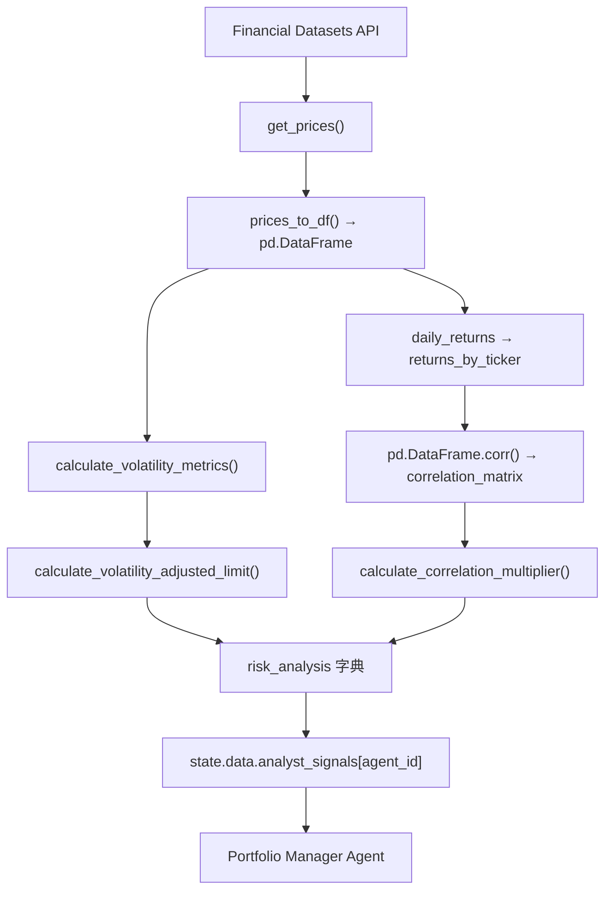

# Risk Management Agent 模块技术文档

## 第1章 模块概述

### 核心功能和设计目标

Risk Management Agent 是 AI 对冲基金系统的风险控制核心模块，负责基于**波动率 + 相关性**双因子模型动态计算每只股票的仓位上限。该模块的设计目标：

1. **波动率自适应仓位管理**：根据每只股票的年化波动率动态调整允许的最大仓位占比（范围约 5%~25%）
2. **相关性分散化约束**：当持仓标的之间高度相关时，自动压缩仓位上限以降低集中风险
3. **组合净清算价值计算**：基于最新市价计算组合总价值（现金 + 多头市值 - 空头市值）
4. **缺失数据降级处理**：在无价格数据时采用高风险假设（日波动率 5%、波动率百分位 100）

**关键设计决策**：仓位上限并非固定的 20%，而是 `vol_adjusted_limit_pct * corr_multiplier * total_portfolio_value`，实际范围约为组合价值的 **5% ~ 27.5%**。

**Docstring**：`"Controls position sizing based on volatility-adjusted risk factors for multiple tickers."`

### 模块职责与协作关系

- **上游依赖**：从 `AgentState` 接收股票代码列表、日期范围、组合持仓信息；通过 `get_api_key_from_state` 获取 Financial Datasets API key
- **核心职责**：为每只股票计算剩余可用仓位额度（`remaining_position_limit`）
- **下游输出**：通过 `state["data"]["analyst_signals"][agent_id]` 向 Portfolio Manager 提供风险约束数据

在 LangGraph 工作流中，Risk Manager 在所有分析师 agent 并行执行完成后运行，其输出作为 Portfolio Manager 的决策约束条件。

### 输入数据格式

```python
# AgentState 输入结构
{
    "data": {
        "tickers": ["AAPL", "MSFT", "NVDA"],        # 目标股票代码列表
        "start_date": "2024-01-01",                  # 价格数据起始日期
        "end_date": "2024-12-31",                    # 价格数据截止日期
        "portfolio": {                                # 当前组合状态
            "cash": 100000.0,
            "positions": {
                "AAPL": {"long": 50, "short": 0},
                "MSFT": {"long": 0, "short": 20}
            }
        },
        "analyst_signals": {}                         # 其他分析师信号（已填充）
    },
    "metadata": {
        "show_reasoning": True                        # 是否显示推理过程
    }
}
```

### 输出数据格式

```python
# 每只股票的风险分析结果（写入 analyst_signals[agent_id]）
{
    "AAPL": {
        "remaining_position_limit": 12500.0,          # 剩余可用仓位额度（美元），取 min(remaining_limit, cash)
        "current_price": 178.50,                      # 当前价格
        "volatility_metrics": {                       # 波动率指标
            "daily_volatility": 0.018,                # 日波动率（收益率标准差）
            "annualized_volatility": 0.286,           # 年化波动率 = daily_vol * sqrt(252)
            "volatility_percentile": 65.0,            # 当前波动率在历史 30 日滚动波动率中的百分位
            "data_points": 60                         # 用于计算的数据点数量
        },
        "correlation_metrics": {                      # 相关性指标
            "avg_correlation_with_active": 0.45,      # 与活跃持仓的平均相关性
            "max_correlation_with_active": 0.72,      # 与活跃持仓的最大相关性
            "top_correlated_tickers": [               # 前 3 个最相关标的
                {"ticker": "MSFT", "correlation": 0.72},
                {"ticker": "NVDA", "correlation": 0.58}
            ]
        },
        "reasoning": {                                # 推理详情
            "portfolio_value": 150000.0,              # 组合净清算价值
            "current_position_value": 8925.0,         # 当前持仓绝对敞口 = abs(long_val - short_val)
            "base_position_limit_pct": 0.175,         # 波动率调整后仓位比例
            "correlation_multiplier": 1.0,            # 相关性乘数
            "combined_position_limit_pct": 0.175,     # 综合仓位比例 = base * corr_mult
            "position_limit": 26250.0,                # 仓位上限（美元）= combined_pct * portfolio_value
            "remaining_limit": 17325.0,               # 扣除现有持仓后的剩余 = position_limit - current_exposure
            "available_cash": 100000.0,               # 可用现金
            "risk_adjustment": "Volatility x Correlation adjusted: 17.5% (base 17.5%)"
        }
    }
}
```

**注意**：
- 最终 `remaining_position_limit = min(remaining_limit, available_cash)`
- 当 `remaining_position_limit` 为负数时，表示当前持仓已超过限额，不允许增加仓位
- 无有效价格数据时输出 `remaining_position_limit=0`，reasoning 包含 `"error": "Missing price data for risk calculation"`

---

## 第2章 核心函数

### 2.1 risk_management_agent()

**文件**：`src/agents/risk_manager.py`，第 11-219 行

```python
def risk_management_agent(state: AgentState, agent_id: str = "risk_management_agent") -> dict:
    """Controls position sizing based on volatility-adjusted risk factors for multiple tickers."""
```

**参数**：

| 参数 | 类型 | 默认值 | 说明 |
|------|------|--------|------|
| `state` | `AgentState` | - | LangGraph 状态对象，包含 data、messages、metadata |
| `agent_id` | `str` | `"risk_management_agent"` | agent 标识符，支持多实例后缀（如 `"risk_management_agent_1"`） |

**返回值**：
```python
{
    "messages": [...],  # 原消息列表 + 新的 HumanMessage（content 为 risk_analysis 的 JSON 字符串）
    "data": data        # 更新后的 data dict，其中 analyst_signals[agent_id] 已被写入
}
```

**核心逻辑步骤**：
1. 从 state 提取 `portfolio`、`tickers`，通过 `get_api_key_from_state` 获取 API key
2. 计算 `all_tickers = set(tickers) | set(portfolio["positions"].keys())`（确保已持仓标的也被分析）
3. 遍历 `all_tickers`：获取价格数据、调用 `calculate_volatility_metrics()`、存储日收益率序列
4. 构建相关性矩阵：`pd.DataFrame(returns_by_ticker).dropna(how="any").corr()`（需 >= 2 列且 >= 5 行）
5. 确定 `active_positions`：`abs(long - short) > 0` 的标的集合
6. 计算 `total_portfolio_value = cash + sum(long*price) - sum(short*price)`
7. 对每只目标 ticker：计算波动率调整限额、相关性乘数、综合仓位上限、剩余额度

**副作用**：
- 写入 `state["data"]["analyst_signals"][agent_id]`
- 当 `show_reasoning=True` 时调用 `show_agent_reasoning(risk_analysis, "Volatility-Adjusted Risk Management Agent")`

---

### 2.2 calculate_volatility_metrics()

**文件**：`src/agents/risk_manager.py`，第 222-267 行

```python
def calculate_volatility_metrics(prices_df: pd.DataFrame, lookback_days: int = 60) -> dict:
    """Calculate comprehensive volatility metrics from price data."""
```

**参数**：

| 参数 | 类型 | 默认值 | 说明 |
|------|------|--------|------|
| `prices_df` | `pd.DataFrame` | - | 包含 `close` 列的价格 DataFrame |
| `lookback_days` | `int` | `60` | 波动率计算回溯天数 |

**返回值**：

```python
{
    "daily_volatility": float,        # 日收益率标准差（近 60 天）
    "annualized_volatility": float,   # 年化波动率 = daily_vol * sqrt(252)
    "volatility_percentile": float,   # 当前波动率在历史 30 日滚动波动率中的百分位排名
    "data_points": int                # 用于计算的数据点数量
}
```

**计算逻辑**：
1. 计算日收益率：`prices_df["close"].pct_change().dropna()`
2. 取最近 `lookback_days`（默认 60）天的收益率：`daily_returns.tail(min(60, len))`
3. 日波动率 = `recent_returns.std()`
4. 年化波动率 = `daily_vol * np.sqrt(252)`（假设 252 个交易日）
5. 波动率百分位：
   - 需要 >= 30 个历史数据点
   - 计算 30 日滚动波动率序列：`daily_returns.rolling(window=30).std().dropna()`
   - 百分位 = `(rolling_vol <= daily_vol).mean() * 100`
   - 数据不足时默认 50（中位数）

**降级处理**：当 `len(prices_df) < 2` 或 `len(daily_returns) < 2` 时返回高风险默认值：
```python
{"daily_volatility": 0.05, "annualized_volatility": 0.05 * sqrt(252) ≈ 0.794, "volatility_percentile": 100, "data_points": ...}
```

**NaN 防护**：返回值中对 `daily_vol`、`annualized_vol`、`current_vol_percentile` 使用 `np.isnan()` 检查，分别降级为 0.025、0.25、50.0。

---

### 2.3 calculate_volatility_adjusted_limit()

**文件**：`src/agents/risk_manager.py`，第 270-298 行

```python
def calculate_volatility_adjusted_limit(annualized_volatility: float) -> float:
```

**功能**：根据年化波动率将仓位限额百分比映射为组合占比。基准限额 `base_limit = 0.20`（20%）。

**参数**：

| 参数 | 类型 | 说明 |
|------|------|------|
| `annualized_volatility` | `float` | 年化波动率（如 0.25 表示 25%） |

**返回值**：`float` -- 仓位限额占组合比例（范围 0.05 ~ 0.25）

**映射逻辑**：

| 年化波动率范围 | vol_multiplier 计算 | multiplier 值 | 最终限额 (base=0.20) |
|---------------|---------------------|---------------|---------------------|
| < 15% | 1.25（固定） | 1.25 | 25% |
| 15% ~ 30% | `1.0 - (vol - 0.15) * 0.5` | 1.0 -> 0.925 | 20% -> 18.5% |
| 30% ~ 50% | `0.75 - (vol - 0.30) * 0.5` | 0.75 -> 0.65 | 15% -> 13% |
| >= 50% | 0.50（固定） | 0.50 | 10% |

**边界约束**：`vol_multiplier = max(0.25, min(1.25, vol_multiplier))`，确保最终结果在 `0.20 * 0.25 = 5%` 到 `0.20 * 1.25 = 25%` 之间。

**注意**：docstring 中描述的范围（"Medium: 15-20%"、"High: 10-15%"、"Very high: Max 10%"）是近似说明，实际值由上述公式精确计算。例如 vol=29.9% 时（接近 15%-30% 区间上界）multiplier≈0.925，对应限额≈18.5%；而 vol 恰好为 30% 时，条件 `< 0.30` 不满足，落入 30%-50% 区间，multiplier=0.75，限额=15%。

---

### 2.4 calculate_correlation_multiplier()

**文件**：`src/agents/risk_manager.py`，第 301-317 行

```python
def calculate_correlation_multiplier(avg_correlation: float) -> float:
```

**功能**：将平均相关性映射为仓位调整乘数，采用离散分段映射。

**映射表**：

| 平均相关性范围 | 返回乘数 | 效果 |
|---------------|---------|------|
| >= 0.80 | 0.70 | 大幅压缩（-30%） |
| 0.60 ~ 0.80 | 0.85 | 适度压缩（-15%） |
| 0.40 ~ 0.60 | 1.00 | 不调整 |
| 0.20 ~ 0.40 | 1.05 | 小幅放大（+5%） |
| < 0.20 | 1.10 | 放大（+10%） |

**综合限额范围示例**：

| 场景 | 波动率限额 | 相关性乘数 | 综合限额 |
|------|-----------|-----------|---------|
| 低波动率 + 极低相关性 | 25% | 1.10 | **27.5%** |
| 中波动率 + 中相关性 | ~18% | 1.00 | ~18% |
| 高波动率 + 极高相关性 | ~10% | 0.70 | **~7%** |
| 极高波动率 + 极高相关性 | 10% | 0.70 | **7%** |
| 最小可能值 | 5% | 0.70 | **3.5%** |

---

## 第3章 处理流程

```mermaid
flowchart LR
    A[开始] --> B["提取 portfolio, tickers, api_key"]
    B --> C["all_tickers = tickers ∪ positions.keys()"]
    C --> D["遍历 all_tickers\n调用 get_prices()"]
    D --> E{价格数据存在?}
    E -->|否| F["降级: daily_vol=0.05\npercentile=100"]
    E -->|是| G["calculate_volatility_metrics()\n60 天回溯"]
    G --> H["存储日收益率序列\nreturns_by_ticker"]
    F --> I["构建相关性矩阵"]
    H --> I
    I --> J{">= 2 标的\n且 >= 5 行?"}
    J -->|否| K["correlation_matrix = None"]
    J -->|是| L["pd.DataFrame.corr()"]
    K --> M["active_positions =\nabs(long-short) > 0 的标的"]
    L --> M
    M --> N["total_portfolio_value =\ncash + Σ(long*price) - Σ(short*price)"]
    N --> O["遍历目标 tickers"]
    O --> P["calculate_volatility_adjusted_limit()\nvol → 仓位占比"]
    P --> Q{"相关性矩阵可用\n且 ticker 在其中?"}
    Q -->|是| R["计算与 active/all 标的的相关性\ncalculate_correlation_multiplier()"]
    Q -->|否| S["corr_multiplier = 1.0"]
    R --> T["combined_pct = vol_pct * corr_mult\nposition_limit = total_value * combined_pct"]
    S --> T
    T --> U["remaining = limit - current_exposure\nmax_size = min(remaining, cash)"]
    U --> V["组装 risk_analysis 字典"]
    V --> W["写入 analyst_signals\n返回 messages + data"]
```



### 关键流程细节

**1. all_tickers 扩展**（第 26 行）

不仅分析目标股票，还包括组合中已有持仓的标的。这确保了：
- 相关性矩阵包含所有持仓标的的信息
- 已持仓但不在本次目标列表中的标的也有价格数据用于组合价值计算

**2. 相关性矩阵构建**（第 77-85 行）

```python
returns_df = pd.DataFrame(returns_by_ticker).dropna(how="any")
if returns_df.shape[1] >= 2 and returns_df.shape[0] >= 5:
    correlation_matrix = returns_df.corr()
```

- `dropna(how="any")` 确保所有标的日期对齐（只保留所有标的都有数据的日期）
- 异常时静默降级为 `None`（try/except 捕获所有异常）

**3. 相关性计算范围选择**（第 141-146 行）

- 优先与 `active_positions`（有实际净敞口的标的）计算相关性
- 若 `active_positions` 中无可比标的（如首次建仓），退化为与所有其他可用标的计算
- 取前 3 个最相关标的记录在 `top_correlated_tickers` 中

**4. 组合净清算价值**（第 94-102 行）

```python
total_portfolio_value = cash + Σ(long_shares * price) - Σ(short_shares * price)
```

仅计算 `current_prices` 中有数据的标的，缺失价格的持仓不计入。

**5. 最终限额计算**（第 163-172 行）

```python
combined_limit_pct = vol_adjusted_limit_pct * corr_multiplier
position_limit = total_portfolio_value * combined_limit_pct
remaining_position_limit = position_limit - current_position_value
max_position_size = min(remaining_position_limit, cash)
```

其中 `current_position_value = abs(long_value - short_value)`，使用绝对净敞口。

---

## 第4章 信号生成逻辑

### 4.1 波动率-相关性联合风控模型

核心公式链：

```
1. daily_vol = std(recent_60d_returns)
2. annualized_vol = daily_vol * sqrt(252)
3. vol_adjusted_pct = base_limit(0.20) * vol_multiplier(annualized_vol)     -- 范围 [5%, 25%]
4. corr_multiplier = f(avg_correlation_with_active_positions)                -- 范围 [0.70, 1.10]
5. combined_pct = vol_adjusted_pct * corr_multiplier                         -- 范围 [3.5%, 27.5%]
6. position_limit_usd = combined_pct * total_portfolio_value
7. remaining_limit = position_limit_usd - abs(current_long_value - current_short_value)
8. final_limit = min(remaining_limit, available_cash)
```

### 4.2 缺失数据降级策略

| 场景 | 降级行为 | 原因 |
|------|---------|------|
| API 返回空价格数据 | `daily_volatility=0.05`, `volatility_percentile=100` | 假设高风险，保守处理 |
| 价格数据不足（< 2 条） | 同上 + `current_price=0` | 无法计算收益率 |
| 无有效价格用于风险计算 | `remaining_position_limit=0`, reasoning 含 error | 完全阻止交易 |
| 相关性矩阵构建失败 | `corr_multiplier=1.0`（不做调整） | 缺少足够标的/数据 |
| 无活跃持仓用于相关性比较 | 改为与所有其他标的计算相关性 | 确保有参照基准 |
| 日波动率为 NaN | 降级为 0.025 | 数据异常保护 |
| 年化波动率为 NaN | 降级为 0.25 | 数据异常保护 |
| 百分位为 NaN | 降级为 50.0 | 假设中位数 |

### 4.3 仓位限额范围分析

**理论极值表**：

| 波动率水平 | 波动率限额范围 | 相关性乘数范围 | 综合限额范围 |
|-----------|---------------|--------------|-------------|
| 低 (<15%) | 25% | 0.70 ~ 1.10 | 17.5% ~ 27.5% |
| 中低 (15%-20%) | 20% ~ 19.5% | 0.70 ~ 1.10 | 13.65% ~ 21.45% |
| 中高 (20%-30%) | 19.5% ~ 18.5% | 0.70 ~ 1.10 | 12.95% ~ 20.35% |
| 高 (30%-50%) | 15% ~ 13% | 0.70 ~ 1.10 | 10.5% ~ 16.5% |
| 极高 (>50%) | 10% | 0.70 ~ 1.10 | 7% ~ 11% |
| 最小可能 | 5%（clamp 下界） | 0.70 | **3.5%** |
| 最大可能 | 25%（clamp 上界） | 1.10 | **27.5%** |

---

## 第5章 依赖关系

### 外部库

| 依赖 | 导入 | 用途 |
|------|------|------|
| `langchain-core` | `langchain_core.messages.HumanMessage` | 构造 LangGraph 消息 |
| `numpy` | `np.sqrt`, `np.isnan` | `sqrt(252)` 年化因子、NaN 检查 |
| `pandas` | `pd.DataFrame`, `pd.Series` | `pct_change()`、`rolling()`、`corr()`、`dropna()` |
| `json` | `json.dumps` | 序列化 risk_analysis 为消息 content |

### 内部模块

| 模块路径 | 导入对象 | 用途 |
|---------|---------|------|
| `src.graph.state` | `AgentState` | 状态类型定义 |
| `src.graph.state` | `show_agent_reasoning` | 打印推理信息（JSON pretty print） |
| `src.utils.progress` | `progress` | `progress.update_status(agent_id, ticker, message)` 进度更新 |
| `src.tools.api` | `get_prices` | 从 Financial Datasets API 获取价格数据 |
| `src.tools.api` | `prices_to_df` | 将 API 返回的价格列表转为 pd.DataFrame |
| `src.utils.api_key` | `get_api_key_from_state` | 从 state 中提取 `FINANCIAL_DATASETS_API_KEY` |

### 数据流依赖图


