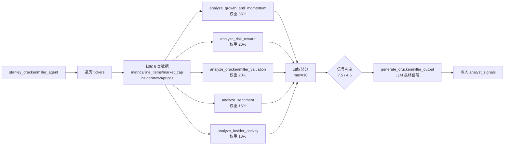
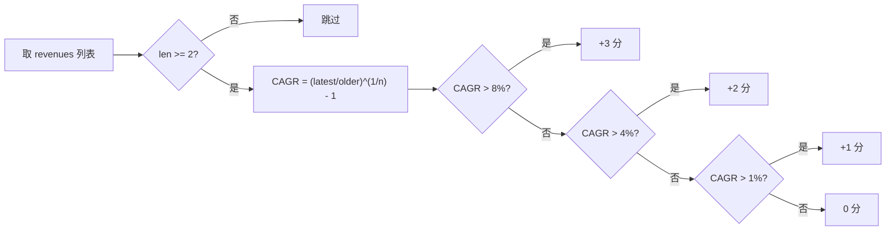

# Stanley Druckenmiller Agent 技术文档

## 1. 模块概述

Stanley Druckenmiller Agent 是 AI 对冲基金系统中的宏观动量投资分析代理，模拟 Stanley Druckenmiller 的投资理念：追求非对称风险收益机会、强调增长与动量、关注市场情绪、愿意在高确信度时大举投入、同时注重资本保全。

**源文件**: `src/agents/stanley_druckenmiller.py`

**输入**: `AgentState` 类型字典，关键字段：
- `state["data"]["tickers"]` - 股票代码列表 (`list[str]`)
- `state["data"]["start_date"]` - 起始日期 (`str`, YYYY-MM-DD)
- `state["data"]["end_date"]` - 截止日期 (`str`, YYYY-MM-DD)
- `state["metadata"]["show_reasoning"]` - 是否展示推理（通过 `.get("show_reasoning")` 访问）

注意：本 agent 直接从 `state["data"]["start_date"]` 获取起始日期（与 Michael Burry Agent 动态计算 start_date 不同）。

**输出**: `dict`（非 `AgentState`），包含：
- `"messages"` - 含一条 `HumanMessage` 的列表（JSON 序列化的分析结果）
- `"data"` - 更新后的 `state["data"]`，其中 `analyst_signals["stanley_druckenmiller_agent"]` 写入信号

每只股票最终信号结构（`StanleyDruckenmillerSignal`）：
```python
{
    "signal": "bullish" | "bearish" | "neutral",  # Literal 类型
    "confidence": float,  # 0-100
    "reasoning": str
}
```

**`StanleyDruckenmillerSignal(BaseModel)`**: 仅三个字段 `signal`、`confidence`、`reasoning`。

**不存在的基础设施**: 本模块不包含任何配置字典、`DataCache`、自定义异常类或性能监控类。

## 2. 核心函数

### 2.1 `stanley_druckenmiller_agent(state: AgentState, agent_id: str = "stanley_druckenmiller_agent") -> dict`

主入口函数。函数签名包含 `agent_id` 参数，默认值为 `"stanley_druckenmiller_agent"`。返回类型为 `dict`。

对每只 ticker 循环执行：
1. `get_financial_metrics(ticker, end_date, period="annual", limit=5, api_key=api_key)`
2. `search_line_items(ticker, [...], end_date, period="annual", limit=5, api_key=api_key)` -- 获取 14 项行数据：revenue, earnings_per_share, net_income, operating_income, gross_margin, operating_margin, free_cash_flow, capital_expenditure, cash_and_equivalents, total_debt, shareholders_equity, outstanding_shares, ebit, ebitda
3. `get_market_cap(ticker, end_date, api_key=api_key)`
4. `get_insider_trades(ticker, end_date, limit=50, api_key=api_key)`
5. `get_company_news(ticker, end_date, limit=50, api_key=api_key)` -- **limit=50**
6. `get_prices(ticker, start_date=start_date, end_date=end_date, api_key=api_key)` -- 使用 state 中的 start_date
7. 依次调用五个子分析函数
8. 加权汇总得分，与固定阈值比较生成初步信号
9. `generate_druckenmiller_output(...)` LLM 生成最终信号

### 2.2 `analyze_growth_and_momentum(financial_line_items: list, prices: list) -> dict`

增长与动量分析。参数：`(financial_line_items, prices)`。

**返回值**: `{"score": float, "details": str}`

最高原始分 9 分（3 项各 3 分），最终缩放到 0-10：`final_score = min(10, (raw_score / 9) * 10)`

**营收增长**（CAGR，最高 3 分）：

| 条件 | 得分 |
|------|------|
| CAGR > 8% | +3 |
| CAGR > 4% | +2 |
| CAGR > 1% | +1 |
| 其他 | 0 |

CAGR 公式：`(latest_rev / older_rev) ** (1 / num_years) - 1`，其中 `num_years = len(revenues) - 1`。

**EPS 增长**（CAGR，最高 3 分）：阈值与营收增长完全相同（8%/4%/1%）。

**价格动量**（最高 3 分）：需要 `len(prices) > 30`，按时间排序后计算区间涨跌幅：

| 条件 | 得分 |
|------|------|
| pct_change > 50% | +3 |
| pct_change > 20% | +2 |
| pct_change > 0% | +1 |
| 其他 | 0 |

### 2.3 `analyze_risk_reward(financial_line_items: list, prices: list) -> dict`

风险收益分析。参数：`(financial_line_items, prices)`。

**返回值**: `{"score": float, "details": str}`

最高原始分 6 分（2 项各 3 分），最终缩放到 0-10：`final_score = min(10, (raw_score / 6) * 10)`

**债务权益比**（使用 total_debt / shareholders_equity，最高 3 分）：

| 条件 | 得分 |
|------|------|
| D/E < 0.3 | +3 |
| D/E < 0.7 | +2 |
| D/E < 1.5 | +1 |
| 其他 | 0 |

**价格波动率**（使用 `statistics.pstdev` 计算日收益率的总体标准差，最高 3 分）：

**前置条件**：需要 `len(prices) > 10`，且过滤后 `len(close_prices) > 10`。不满足时跳过此项评分（得 0 分）。

| 条件 | 得分 |
|------|------|
| stdev < 1% | +3 |
| stdev < 2% | +2 |
| stdev < 4% | +1 |
| 其他 | 0 |

### 2.4 `analyze_sentiment(news_items: list) -> dict`

情绪分析。无数据时默认返回 `{"score": 5, ...}`（中性）。

**返回值**: `{"score": int, "details": str}`

使用标题关键词检测（非 sentiment 属性），负面关键词列表：
```python
["lawsuit", "fraud", "negative", "downturn", "decline", "investigation", "recall"]
```

检查 `news.title.lower()` 中是否包含上述关键词。

**评分逻辑**（直接输出 0-10 范围分值）：

| 条件 | 得分 |
|------|------|
| negative_count > 30% 的新闻数量 | 3 |
| negative_count > 0 | 6 |
| 无负面新闻 | 8 |
| 无新闻数据 | 5（默认） |

### 2.5 `analyze_insider_activity(insider_trades: list) -> dict`

内部人交易分析。无数据时默认返回 `{"score": 5, ...}`（中性）。

**返回值**: `{"score": int, "details": str}`

使用 `transaction_shares` 正负号判断买卖方向（正=买入，负=卖出），**按交易笔数统计**（非股数）：
```python
buys, sells = 0, 0
for trade in insider_trades:
    if trade.transaction_shares is not None:
        if trade.transaction_shares > 0:
            buys += 1
        elif trade.transaction_shares < 0:
            sells += 1
buy_ratio = buys / total
```

**评分逻辑**：

| 条件 | 得分 |
|------|------|
| buy_ratio > 70% | 8 |
| buy_ratio > 40% | 6 |
| buy_ratio <= 40% | 4 |
| 无数据 | 5（默认） |

### 2.6 `analyze_druckenmiller_valuation(financial_line_items: list, market_cap: float | None) -> dict`

Druckenmiller 风格估值分析。参数：`(financial_line_items, market_cap)`。

**返回值**: `{"score": float, "details": str}`

评估 4 个估值指标，每项最高 2 分，原始最高 8 分，缩放到 0-10：`final_score = min(10, (raw_score / 8) * 10)`

EV 计算：`enterprise_value = market_cap + recent_debt - recent_cash`

| 指标 | 2 分条件 | 1 分条件 |
|------|---------|---------|
| P/E | < 15 | < 25 |
| P/FCF | < 15 | < 25 |
| EV/EBIT | < 15 | < 25 |
| EV/EBITDA | < 10 | < 18 |

注意：**包含 EV/EBITDA**（最高 2 分），这是本 agent 特有的估值维度。

### 2.7 `generate_druckenmiller_output(ticker, analysis_data, state, agent_id) -> StanleyDruckenmillerSignal`

LLM 推理生成。默认回退：
```python
StanleyDruckenmillerSignal(signal="neutral", confidence=0.0, reasoning="Error in analysis, defaulting to neutral")
```

## 3. 早期退出守卫

各子分析函数在数据不足时的降级行为：

| 函数 | 守卫条件 | 返回值 |
|------|---------|--------|
| `analyze_growth_and_momentum` | `not financial_line_items or len(financial_line_items) < 2` | `{"score": 0, "details": "Insufficient data..."}` |
| `analyze_risk_reward` | `not financial_line_items or not prices` | `{"score": 0, "details": "Insufficient data..."}` |
| `analyze_risk_reward` (波动率) | `len(prices) <= 10` 或 `len(close_prices) <= 10` | 跳过波动率评分（该项得 0 分） |
| `analyze_growth_and_momentum` (动量) | `len(prices) <= 30` | 跳过价格动量评分（该项得 0 分） |
| `analyze_sentiment` | `not news_items` | `{"score": 5, "details": "No news data; default to neutral..."}` |
| `analyze_insider_activity` | `not insider_trades` | `{"score": 5, "details": "No insider trades data..."}` |
| `analyze_druckenmiller_valuation` | `not financial_line_items or market_cap is None` | `{"score": 0, "details": "Insufficient data to perform valuation"}` |
| `generate_druckenmiller_output` | LLM 调用失败 | `StanleyDruckenmillerSignal(signal="neutral", confidence=0.0, reasoning="Error...")` |

## 4. 分析算法

### 4.1 加权评分

```python
total_score = (
    growth_momentum["score"] * 0.35
    + risk_reward["score"] * 0.20
    + valuation["score"] * 0.20
    + sentiment["score"] * 0.15
    + insider_activity["score"] * 0.10
)
max_possible_score = 10
```

**权重分配**：

| 维度 | 权重 | 分值范围 |
|------|------|---------|
| 增长与动量 | 35% | 0-10 |
| 风险收益 | 20% | 0-10 |
| 估值 | 20% | 0-10 |
| 情绪 | 15% | 0-10 |
| 内部人交易 | 10% | 0-10 |

所有子分析均输出 0-10 范围的分值，加权后 total_score 理论最大值为 10。

### 4.2 信号阈值

- `total_score >= 7.5` -> `"bullish"`
- `total_score <= 4.5` -> `"bearish"`
- 其余 -> `"neutral"`

注意：不使用 `0.7 * max_score` 的百分比模式，而是固定阈值 7.5/4.5。

### 4.3 主流程



### 4.4 增长 CAGR 计算



## 5. 信号生成

初步信号基于加权评分生成后，全部分析数据传入 LLM。LLM 以 Druckenmiller 的果断、动量导向、高确信风格生成最终 `StanleyDruckenmillerSignal`。

**LLM 系统提示词关键指令**：
1. 寻找非对称风险收益机会（大上行、有限下行）
2. 强调增长、动量、市场情绪
3. 保全资本、避免重大回撤
4. 愿意为真正的增长领导者支付较高估值
5. 高确信度时大举投入
6. 论点改变时迅速止损

## 6. 依赖关系

### 内部模块

| 导入路径 | 导入内容 | 用途 |
|---------|---------|------|
| `src.graph.state` | `AgentState`, `show_agent_reasoning` | 状态类型、推理展示 |
| `src.tools.api` | `get_financial_metrics`, `get_market_cap`, `search_line_items`, `get_insider_trades`, `get_company_news`, `get_prices` | 金融数据获取（6 个函数） |
| `src.utils.progress` | `progress` | 进度状态更新 |
| `src.utils.llm` | `call_llm` | LLM 统一调用 |
| `src.utils.api_key` | `get_api_key_from_state` | API 密钥提取 |

### 外部包

| 包 | 导入内容 | 用途 |
|---|---------|------|
| `langchain_core.prompts` | `ChatPromptTemplate` | LLM 提示词模板 |
| `langchain_core.messages` | `HumanMessage` | 消息对象 |
| `pydantic` | `BaseModel` | 数据模型 |
| `typing_extensions` | `Literal` | 类型约束 |
| `json` | 标准库 | JSON 序列化 |
| `statistics` | `pstdev` | 价格波动率计算（总体标准差） |

注意：本 agent 是三个中唯一导入 `statistics` 和 `get_prices` 的，因为它需要计算价格动量和波动率。状态模块路径为 `src.graph.state`，非 `src.agents.state`。
